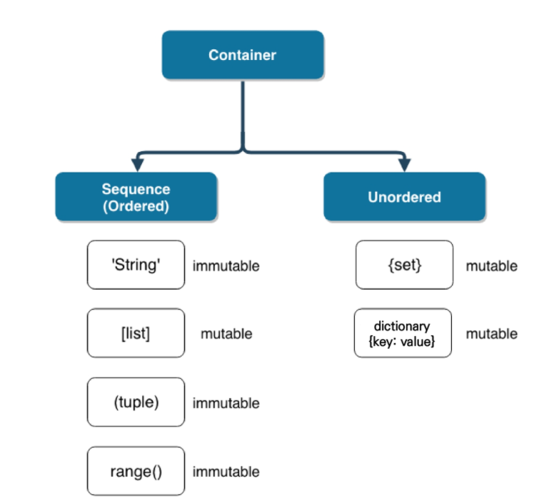

## 컨테이너

* 컨테이너
  * 여러 개의 값을 저장할 수 있는 것(객체)
  * 시퀀스형 : 순서가 있는 데이터
    * 순서가 있다 != 정렬되어 있다
    * 리스트(list), 튜플(tuple), 레이지(range), 문자형(string), 바이너리(binary)
  * 비시퀀스형 : 순서가 없는 데이터
    * 세트(set), 딕셔너리(dictionary)

---

## 컨테이너 특징

* 컨테이너 형변환

  |            | string |   list   |  tuple   | range |   set    | dictionary |
  | :--------: | :----: | :------: | :------: | :---: | :------: | :--------: |
  |   string   |   \    |    o     |    o     |   x   |    o     |     x      |
  |    list    |   o    |    \     |    o     |   x   |    o     |     x      |
  |   tuple    |   o    |    o     |    \     |   x   |    o     |     x      |
  |   range    |   o    |    o     |    o     |   \   |    o     |     x      |
  |    set     |   o    |    o     |    o     |   x   |    \     |     x      |
  | dictionary |   o    | o(key만) | o(key만) |   x   | o(key만) |     \      |

  

* 컨테이너 분류
  * 변경 불가능한 데이터(immutable)
    * 리터럴(literal) - 숫자(Number), 문자열(String), 참/거짓(Bool)
    * `range`
    * `tuple`
    * 변경 불가능한 데이터의 복사
      * `b = a`를 하면 같은 값이 공유되며
      * `b = 10`을 통해 재할당이 발생
  * 변경 가능한 데이터 (mutable)
    * `list`
    * `set`
    * `dictionary`
    * 변경 가능한 데이터의 복사
      * `num2 = num1` 을 하는 경우 **동일한 리스트(객체)의 주소를 참조**하고 있어
      * `num2[0]  = 100` 으로 변경하게 되면 해당 리스트의 첫번째 원소 값이 변경됨
  * 

