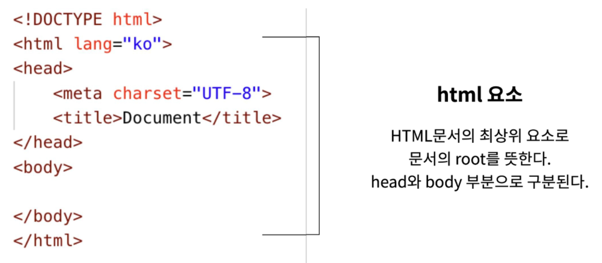
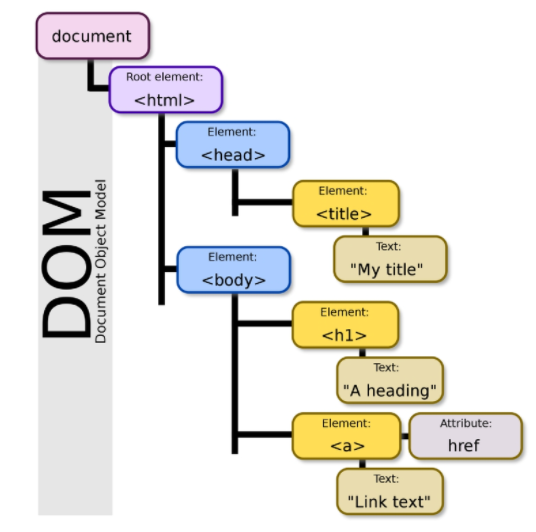

## HTML

* 현재의 웹 표준
  * W3C - `HTML5`
  * WHATWG - `HTML Living Standard`
  * "W3C와의 기술 표준화 주도권 싸움에서 WHATWG 승리"
* HTML
  * `Hyper Text Mark Language`
* Hyper Text
  * Hyper 
    * 텍스트 등의 정보가 동일 선상에 있는 것이 아니라 다중으로 연결되어 있는 상태
  * Hyper Text
    * 참조(하이퍼링크)를 통해 사용자가 한 문서에서 다른문서로 즉시 접근할 수 있는 텍스트
* Markup Language
  * 텍스트 하나하나에 역할을 부여하는 것
  * 태그 등을 이용하여 문서나 데이터의 구조를 명시하는 언어
  * 프로그래밍 언어와는 다르게 단순하게 데이터를 표현하기만 한다
  * 대표적인 예 - `HTML`, `Markdown`
* HTML
  * HTML- 골격 /CSS- 꾸며주는 
  * 웹 페이지를 작성하기 위한(구조를 잡기 위한)언어, 웹 컨텐츠의 의미와 구조를 정의
  * HTML로 작성된 문서 파일 - `.html`

---

## HTML 기본구조

* HTML 기본 구조 - html

  
  * html 요소 
    * HTML문서의 최상위 요소로 문서의 root를 뜻한다. `Head`와 `body`로 구성되어 있다.
    * head 요소 
      * 문서 제목, 문자코드(인코딩)와 같이 해당 문서 정보를 담고 있으며 브라우저에 나타나지 않는다.
      * CSS선언 혹은 외부 로딩 파일 지정 등도 작성한다. 
    * body 요소
      * 브라우저 화면에 나타나는 정보로 실제 내용에 해당한다.
    * 메타 데이터를 표현하는 새로운 규약(Open Graph Protocol)
      * HTML 문서의 메타 데이터를 통해 문서의 정보를 전달
      * 페이스북에서 만들었으며 메타정보에 해당하는 제목, 설명 등을 쓸 수 있도록 정의

* DOM (Document Object Model)트리

  

  * 문서 객체 모델
  * 부모 관계, 형제 관계
  * 하나 하나의 태그를 객체로서 접근할 수 있도록 트리화했다
  * 들여쓰기 중요, `2spaces`를 권장함.
  * DOM은 문서의 구조화된 표현을 제공하며 프로그래밍 언어(자바스크립트)가 DOM구조에 접근할 수 있는 방법을 제공하여 그들이 문서 구조, 스타일 내용 등을 변경할 수 있게 도움
  * DOM은 동일한 문서를 표현하고 저장하고 조작하는 방법을 제공
  * `Web Page`의 객체 지향 표현

* 요소(element)
  * HTML의 요소는 태그와 내용으로 구성되어 있다.
  * < h1> contents < /h1> 
  * (여는/시작)태그 contents (닫는/종료)태그
  * HTML은 프로그래밍 언어가 아니기 때문에 오류가 주어지지 않음. 그냥 출력이 이상해질 뿐- 디버깅이 어려움
  * HTML 요소는 시작 태그와 종료 태그 그리고 태그 사이에 위치한 내용으로 구성
    * 태그(Element, 요소)는 컨텐츠(내용)를 감싸는 것으로 그 정보의 성격과 의미를 정의
  * 내용이 없는 태그들
    * `br, hr, img, input, link, meta`
  * 요소는 중첩될 수 있음
    * 요소의 중첩을 통해 하나의 문서를 구조화
    * 여는 태그와 닫는 태그의 쌍을 잘 확인해야함
    * 오류를 반환하는 것이 아니라 그냥 레이아웃이 깨진 상태로 출력되기 때문에 디버깅이 힘들어 질 수 있음
  * 닫는 태그가 없기도 함

* 속성(attribute)
  * < a href="https://google.com"></a >       
    * a는 하이퍼링크를 연결하는 거
  * `href` = 속성명 / `https~` = 속성값
  * 태그별로 사용할 수 있는 속성이 다르다
  * 공백은 없이 쌍따옴표 사용하기
  * 속성을 통해 태그의 부가적인 정보를 설정할 수 있음
  * 요소는 속성을 가질 수 있으며 경로나 크기가 같은 추가적인 정보를 제공
  * 요소의 시작 태그에 작성하며 보통 이름과 값이 하나의 쌍으로 존재
  * 태그와 상관없이 사용가능한 속성(HTML Global Attribute)들도 있음

* HTML Global Attribute
  * 모든 HTML 요소가 공통으로 사용할 수 있는 속성(몇몇 요소에는 아무 효과가 없을 수 있음)
    * id, class
    * hidden
    * lang
    * style
    * tabindex
    * title

- <!-- --> 은 주석임 컨트롤 슬래시 하면 나옴

* 시맨틱 태그
  * HTML에서 의미론적 요소를 담은 태그의 등장. `div`
  * 대표적인 태그들은 다음과 같다. `div`와 같이 문서의 구조를 잡아줌. `div`의 역할을 나눈 것
    * header: 문서 전체나 섹션의 헤더(머릿말 부분)
    * nav: 내비게이션
    * aside: 사이드에 위치한 공간, 메인 콘텐츠와 관련성이 적은 콘텐츠
    * section: 문서의 일반적인 구분, 컨텐츠의 그룹을 표현
    * article: 문서, 페이지, 사이트 안에서 독립적으로 구분되는 영역
    * footer: 문서 전체나 섹션의 푸터(마지막 부분)
  * 개발자 및 사용자 뿐만 아니라 검색엔진 등에 의미 있는 정보의 그룹을 태그로 표현
  * 단순히 구역을 나누는 것 뿐만 아니라 '의미'를 가지는 태그들을 활용하기 위한 노력
  * `Non semantic` 요소는 `div`, `span` 등이 있으며 `h1`, `table` 태그들도 시맨틱 태그로 볼 수 있음
  * 요소의 의미가 명확해지기 때문에 코드의 가독성을 높이고 유지보수를 쉽게 함.
  * 검색엔진최적화를 위해서 메타태그, 시맨틱 태그 등을 통한 마크업을 효과적으로 할 필요가 있다. 
* 시맨틱 웹(넘어가도 됨)
  * 웹 상에 존재하는 수많은 웹 페이지들에 메타데이터를 부여하여
  * 기존의 단순한 데이터의 집합이었던 웹페이지를 '의미'와 '관련성'을 가지는 거대한 데이터 베이스로 구축하고자 하는 발상

