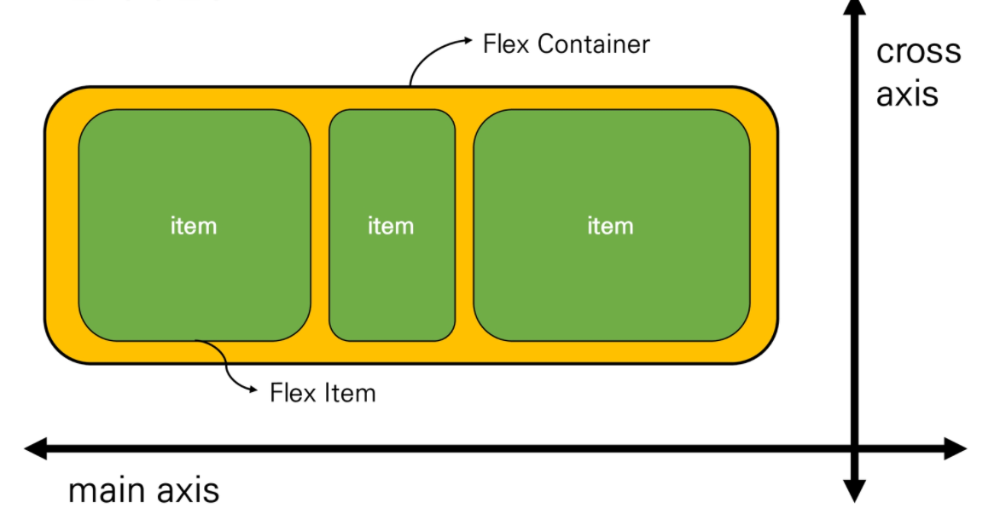

## Flexbox

* CSS Flexible Box Layout

  * 오랫동안 `CSS Layout`을 작성할 수 있는 도구는 `float` 및 `Positioning`뿐이었음

    * 문제가 있는 것은 아니었지만 어떤 면에서는 제한적이고 한계가 있음

  * `flexbox`라 불리는 `flexible box module`은 `flexbox` 인터페이스 내의 아이템 간 "공간배분"과 강렬한 "정렬" 기능을 제공하기 위한1차원 레이아웃 모델로 설계

  * 요소 간 공간 배분과 정렬 기능을 위한 1차원(단방향)레이아웃

  * 크게 딱 2가지만 기억하자. 요소&축

  * 요소

    * `flex container` (부모 요소)
    * `flex item` (자식 요소)

  * 축

    * `main axis`(메인축) : 아무것도 하지 않았을 때 x축이 메인이 됨. x축의 시작점은 왼쪽.

    * `cross axis`(교차축) : y축의 시작점은 위쪽임.

      

* Flexbox 구성 요소

  * `flex container` (부모 요소)
    * `flexbox` 레이아웃을 형성하는 가장 기본적인 모델
    * `flex item`들이 놓여있는 영역
    * 생성하려면 `display` 속성을 `flex` 혹은 `inline-flex`로 지정. `display:flex;` / `inline-flex`는 내부 요소만큼만 너비를 차지함
  * flex item (자식 요소)
    * 컨테이너의 컨텐츠
    * 부모가 얘네를 컨트롤함

* flex에 적용하는 속성

  * 배치 방향 설정
    * `flex - direction` (메인축의 방향을 설정, 4가지 중 하나 설정)

  * 메인축 방향 정렬
    * `justify-content`
  * 교차축 방향 정렬
    * `align-items`, `align-self`, `align-content`
  * 기타
    * `flex-wrap`, `flex-flow`, `flex-grow`, `order, flex`

* flex- direction

  * 메인축(main-axis) 방향만 바뀐다
  * `flexbox`는 단방향 레이아웃이기 때문이다
  * row(default) : 왼쪽에서 오른쪽
  * row-reverse: 오른똑에서 왼쪽
  * column: 위에서 아래
  * column-reverse: 아래에서 위

* justify & align

  * `justify`(메인축 정렬)
  * `align`(교차축 정렬)

* content & items & self

  * content
    * 여러 줄
  * items
    * 한 줄
  * self
    * `flex item` 개별 요소
  * 예시
    * `justify - content` : 메인축 기준 여러 줄 정렬
    * `align-items`: 교차축 기준 한 줄 정렬
    * `align- self` : 교차축 기준 선택한 요소 하나 정렬
  * justify - content
    * flex-start, flex-end, center, space-between, space-around, space-evenly
  * align-items
    * flex-start, flex-end, center, stretch,baseline
  * align-content
    * flex-start, flex-end, center, stretch, space-between, space-around
  * align-self
    * auto, flex-start, flex-end, center, baseline, stretch
  
* 정리

  * display : flex
    * 정렬하려는 부모 요소에 작성
    * `inline-flex : flex` 영역을 블록으로 쓰지 않고 인라인 블록으로 사용
  * flex-direction
    * item이 쌓이는 방향 설정
    * `main-axis` 가 변경됨
  * flex-wrap
    * 요소들이 강제로 한 줄에 배치 되게 할 것인지 여부 설정
    * `nowrap` (기본값) : 모든 아이템들 한 줄에 나타내려고 함 -> 그래서 자리가 없어도 튀어나옴
    * `wrap` : 넘치면 그 다음 줄로
    * `wrap-reverse`: 넘치면 그 윗줄로 (역순)
  * flex-flow
    * `flex-direction` 과 `flex-wrap` 의 `shorthand`
    * `flex-direction` 과 `flex-wrap` 에 대한 설정 값을 차례로 작성
  * justify-content
    * `main` 축 정렬
    * `flex-start` (기본 값) : 시작 지점부터 차례로 쌓임
    * `flex-end` : 쌓이는 방향이 뒤쪽부터 시작 (순서가 역순이 되는게 아니라 아이템들이 뒤로 몰리는 형식)
    * `center` : 정 중 앙
    * `space-between` : 좌우 정렬 (item들 간의 간격이 동일)
    * `space-around` : 균등 좌우 정렬 (내부 요소 여백은 외곽 여백의 2배)
    * `space-evenly` :  균등 정렬 (내부 요소 여백과 외각 여백 모두 동일)
  * align-items
    * `cross` 축 정렬
    * `stretch` (기본 값) : 컨테이너를 가득 채움
    * `flex-start` : 위
    * `flex-end`: 아래
    * `center` : 가운데
    * `baseline` : item 내부의 text에 기준선을 맞춤
  * align-self
    * 개별 item에 적용하는 속성(정렬 방식은 align-items와 동일, 속성이 적용되는 대상이 다름)
    * `auto` (기본 값)
    * `flex-start`
    * `flex-end`
    * `center`
    * `baseline`
    * `stretch` : 부모 컨테이너에 자동으로 맞춰서 늘어남
  * order
    * 작은 숫자일수록 앞(우선 쌓이는 방향)으로 이동
    * 기본 값: 0
  * flex-grow
    * 주축에서 남는 공간을 항목들에게 분배하는 방법
    * 각 아이템의 상대적 비율을 정하는 것은 아님
    * 기본 값: 0
    * 음수 불가능

