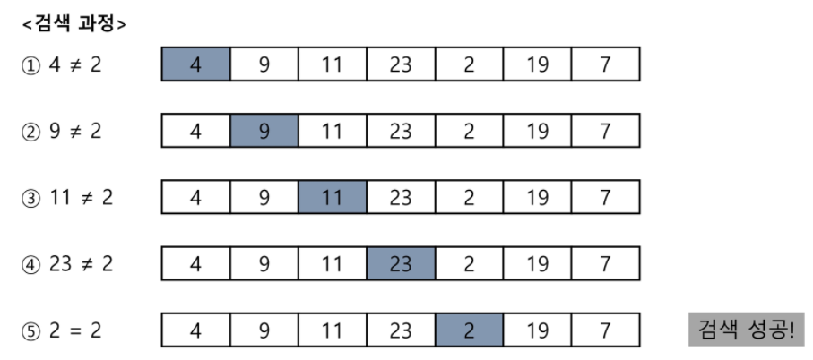
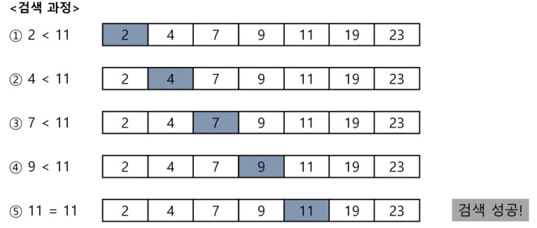

## 검색

+ 저장되어 있는 자료 중에서 원하는 항목을 찾는 작업
+ 목적하는 탐색 키를 가진 항목을 찾는 것
  + 탐색키(`search key`): 자료를 구별하여 인식할 수 있는 키
+ 검색의 종류
  + 순차 검색(`sequential search`)
  + 이진 검색(`binary search`)
  + 해쉬(`hash`)


### 순차 검색

* 일렬로 되어 있는 자료를 순서대로 검색하는 방법
  * 가장 간단하고 직관적인 검색 방법
  * 배열이나 연결 리스트 등 순차구조로 구현된 자료구조에서 원하는 항목을 찾을 때 유용함
  * 알고리즘이 단순하여 구현이 쉽지만 검색 대상의 수가 많은 경우에는 수행시간이 급격히 증가하여 비효율적임

* 2가지 경우
  * 정렬되어 있지 않은 경우
  * 정렬되어 있는 경우
* 정렬되어 있지 않은 경우
  * 검색 과정
    * 첫 번째 원소부터 순서대로 검색 대상과 키 값이 같은 원소가 있는지 비교하며 찾는다
    * 키 값이 동일한 원소를 찾으면 그 원소의 인덱스를 반환한다. 
    * 자료구조의 마지막에 이를 때까지 검색 대상을 찾지 못하면 검색 실패



+ 찾고자 하는 원소의 순서에 따라 비교회수가 결정됨

  + 정렬되지 않은 자료에서의 순차 검색의 평균 비교 회수

    ```
    =(1/n)*(1+2+3+,,,+n) = (n+1)/2
    ```

  + 시간 복잡도: O(n)

```
def search(a,n,key):
	i = 0
	while i < n and a[i] != key:    #순서가 바뀌면 안됨
		i += 1
	if i<n:      # 찾은 경우
		return i
	else:		# 못찾은 경우
	 return -1
```

```
def search(A,N,Key):
 for i in range(N):
 	if A[i] == Key:
 		return i
 return -1
```


+ 정렬되어 있는 경우
  + 검색 과정
    + 자료가 오름차순으로 정렬된 상태에서 검색을 실히한다고 가정하자
    + 자료를 순차적으로 검색하면서 키 값을 비교하여 원소의 키 값이 검색 대상의 키 값보다 크면 찾는 원소가 없다는 것이므로 더 이상 검색하지 않고 검색을 종료한다.



+ 찾고자 하는 원소의 순서에 따라 비교회수가 결정됨
  + 시간 복잡도: O(n)

```
def search(a,n,key):
	i = 0
	i += 1
	while i<n and a[i]<key:
		i += 1
	if i<n and a[i] = key:
		return i
	else:
		return -1
```

```
def search(A,N,Key):
	for i in range(N):
		if A[i] == Key:
			return i
		elif A[i] > Key:
			return -1
	return -1
```

