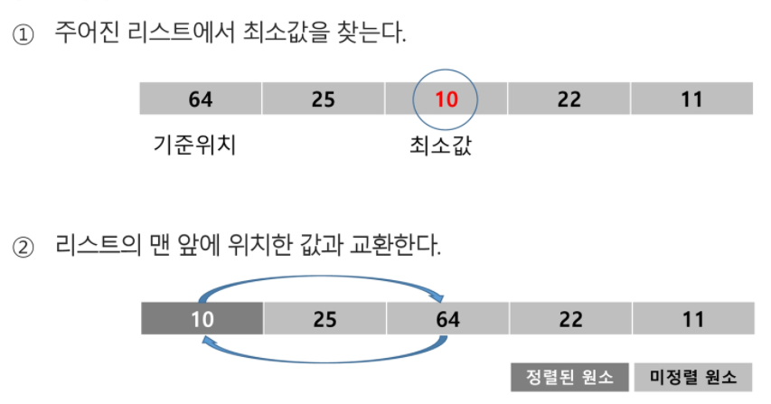
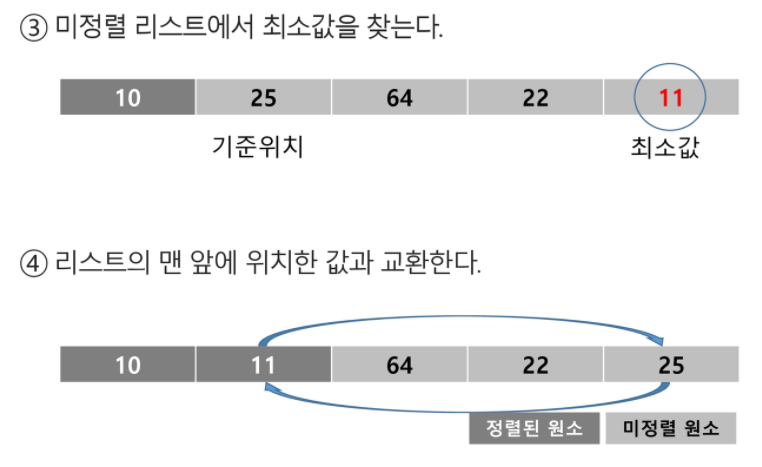

### 인덱스

* 인덱스라는 용어는 `Database`에서 유래했으며 테이블에 대한 동작 속도를 높여주는 자료 구조를 일컫는다. `Database` 분야가 아닌 곳에서는 `Look up table` 등의 용어를 사용하기도 한다.
* 인덱스를 저장하는데 필요한 디스크 공간은 보통 테이블을 저장하는데 필요한 디스크 공간보다 작다. 왜냐하면 보통 인덱스는 키-필드만 갖고 있고 테이블의 다른 세부 항목들은 갖고 있지 않기 때문이다.
* 배열을 사용한 인덱스
  * 대량의 데이터를 매번 정렬하면 프로그램의 반응은 느려질 수 밖에 없다. 이러한 대량 데이터의 성능 저하 문제를 해결하기 위해 배열 인덱스를 사용할 수 있다.


## 선택정렬

+ 주어진 자료들 중 가장 작은 값의 원소부터 차례대로 선택하여 위치를 교환하는 방식
+ 정렬 과정

  + 주어진 리스트 중에서 최소 값을 찾는다
  + 그 값을 리스트의 맨 앞에 위치한 값과 교환한다
  + 맨 처음 위치를 제외한 나머지 리스트를 대상으로 위의 과정을 반복한다.
  + 미정렬원소가 하나 남은 상황에서는 마지막 원소가 가장 큰 값을 갖게 되므로 실행을 종료하고 선택 정렬이 완료된다





+ 시간 복잡도
  + `O(n^2)`

```
def sort(a):
	for i in range(len(a)-1):
		min = i
		for j in range(i+1, len(a)):
			if a[min] > a[j]
				min = j
		a[i], a[min] = a[min], a[i]
```

