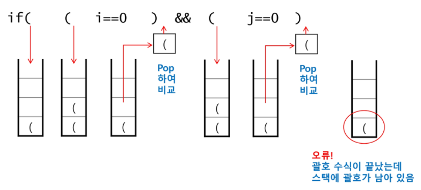

## 괄호검사

* 괄호의 종류: 대괄호, 중괄호, 소괄호

* 조건

  1. 왼쪽 괄호의 개수와 오른쪽 괄호의 개수가 같아야 한다.
  2. 같은 괄호에서 왼쪽 괄호는 오른쪽 괄호보다 먼저 나와야 한다.
  3. 괄호 사이에는 포함 관계만 존재한다.

* 잘못된 괄호 사용의 예

  * `(a(b)`
  * `a(b)c)`
  * `a{b(c[d]e)f}`

* 스택을 이용한 괄호 검사

  

  * `(` 가 나오면 push / `)` 가 나오면 pop
  * 괄호 수식이 끝났는데 스택에 괄호가 남아 있으면 오류
  * `)`가 나왔는데 stack이 비어있는 경우 오류

+ 괄호를 조사하는 알고리즘 개요
  * 문자열에 잇는 괄호를 차례대로 조사하면서 왼쪽 괄호를 만나면 스택에 삽입(`push`)하고 오른쪽 괄호를 만나면 스택에서 top괄호를 삭제(`top`)한 후 오른쪽 괄호와 짝이 맞는지를 검사한다. 
  * 이 때, 스택이 비어 있으면 조건 1또는 조건 2에 위배되고 괄호의 짝이 맞지 않으면 조건3에 위배된다.
  * 마지막 괄호까지를 조사한 후에도 스택에 괄호가 남아있으면 조건 1에 위배된다.