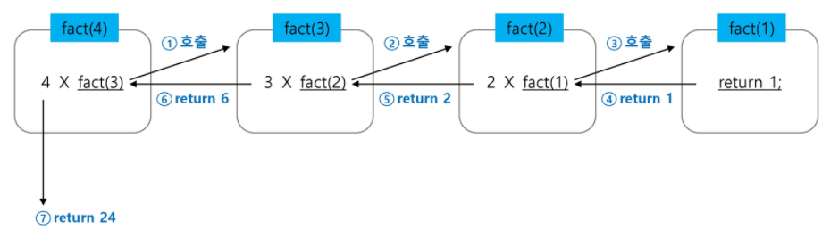

## 재귀호출

* 자기 자신을 호출하여 순환 수행되는 것

* 함수에서 실행해야 하는 작업의 특성에 따라 일반적인 호출방식보다 재귀호출방식을 사용하여 함수를 만들면 프로그램의 크기를 줄이고 간단하게 작성

  * 재귀 호출의 예) `factorial`

    * n에 대한 factorial: 1부터 n까지의 모든 자연수를 곱하여 구하는 연산

      ```
      n! = n x (n-1)!
      ```

      ```
      f(1,k)
      if i ==k:
      	return
      else:
      	print(A[i])
      	f(i+1,k)
      ```

    * 마지막에 구한 하위 값을 이용하여 상위 값을 구하는 작업을 반복
    
    * factorial 함수에서 n=4인 경우의 실행
    
    

+ 0과 1로 시작하고 이전의 두 수 합을 다음 항으로 하는 수열을 피보나치라 한다.

  * 0,1,1,2,3,5,8,13...

  ```
  def fibo(n):
  	if n < 2:
  		return n
  	else:
  		return fibo(n-1) + fibo(n-2)
  ```

  