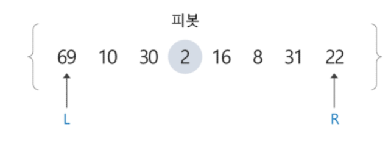
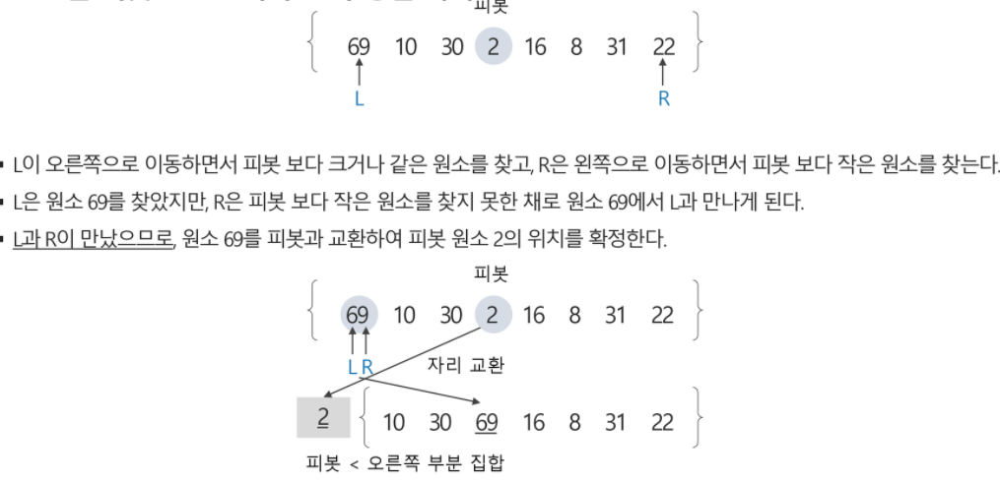
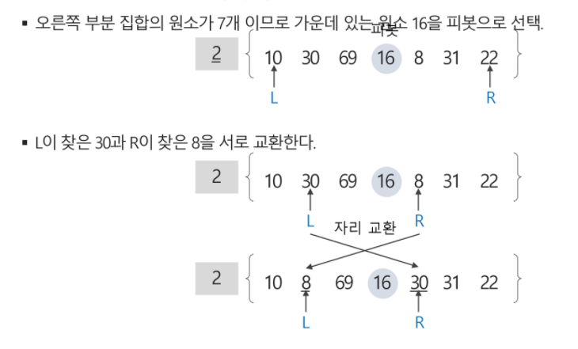
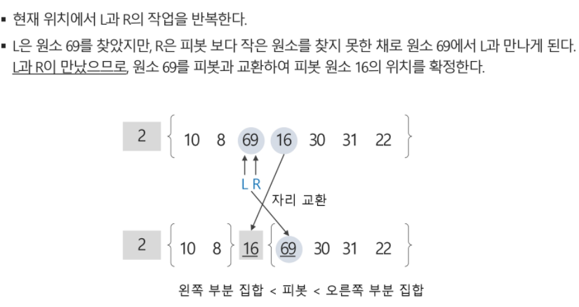
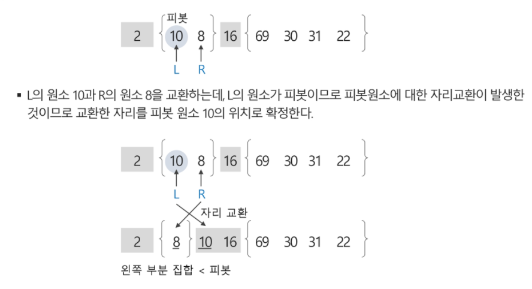
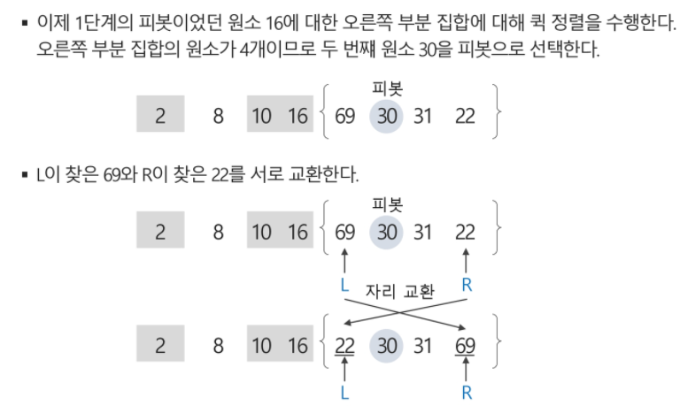
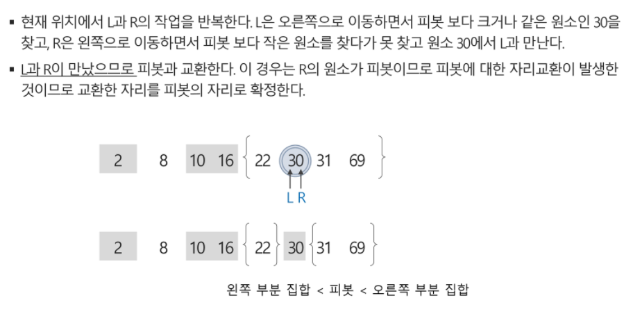
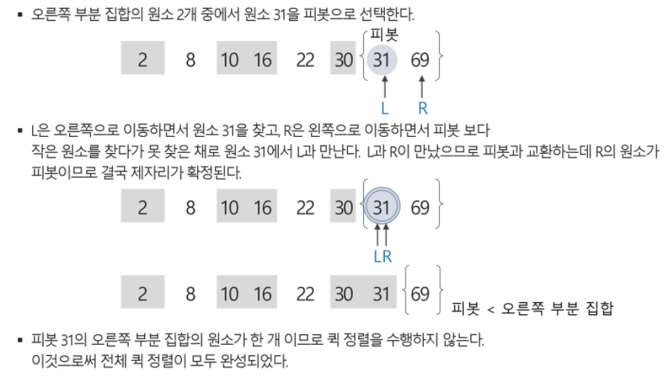

## 퀵 정렬

+ 주어진 배열을 두 개로 분할하고 각각을 정렬한다.
+ 합병정렬과 다른점
  1. 합병정렬은 그냥 두 부분으로 나누는 반면에 퀵정렬은 분할할 때, 기분 아이템 중심으로 이보다 작은 것은 왼편, 큰 것은 오른편에 위치시킨다.
  2. 각 부분 정렬이 끝난 후 합병정렬은 `합볍`이란 후처리 작업이 필요하나 퀵정렬은 필요로 하지 않는다.

```
def quickSort(a, begin, end):
	if begin < end:
		 p = partition(a, begin, end)
		 quickSort(a, begin, p-1)
		 quickSort(a, p+1, end)

def partition(a,begin, end):
	pivot = (begin + end) // 2
	L = begin
	R = end
	while L < R:
		while(a[L]< a[pivot] and L < R): L += 1
		while(a[R]>=a[pivot] and L < R): R -= 1
		if L < R:
			if L==pivot : pivot = R
			a[L], a[R] = a[R], a[L]
	a[pivot], a[R] = a[R],a[pivot]
	return R
```

+ 퀵 정렬 수행 과정

  + 원소의 개수가 8개이므로 네 번째 자리에 있는 원소 2를 첫 번째 피봇으로 선택하고 퀵 정렬 시작

  

+ 원소 2를 피봇으로 선택하고 퀵 정렬 시작



+ 피봇 2의 왼쪽 부분 집합은 공지합이므로 퀵 정렬을 수행하지 않고 오른쪽 부분 집합에 대해서 퀵 정렬 수행





+ 피봇 16의 왼쪽 부분 집합에서 원소 10을 피봇으로 선택하여 퀵 정렬 수행



+ 피봇 10의 확정된 위치에서의 왼쪽 부분 집합은 원소가 한 개이므로 퀵 정렬을 수행하지 않고 오른쪽 부분 집합은 공집합이므로 역시 퀵 정렬을 수행하지 않는다





+ 피봇 30의 확정된 위치에서의 왼쪽 부분 집합의 원소가 한 개 이므로 퀵 정렬을 수행하지않고 오른쪽 부분 집합에 대해서 퀵 정렬 수행



