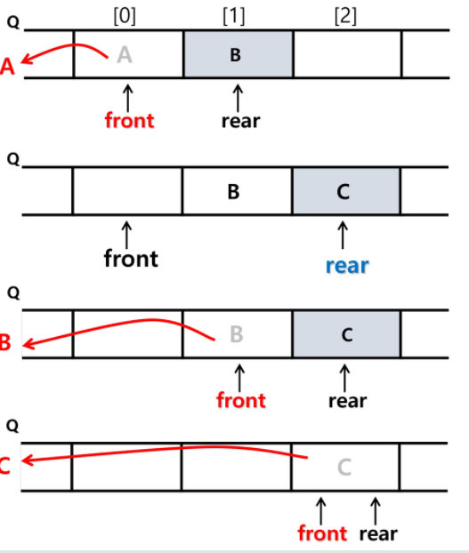

## 큐

* 큐의 특성
  
  * 스택과 마찬가지로 삽입과 삭제의 위치가 제한적인 자료구조
    * 큐의 뒤에서는 삽입만 하고 큐의 앞에서는 삭제만 이루어지는 구조
  * 선입선출구조
    * 큐에 삽입한 순서대로 원소가 저장되어 가장 먼저 삽입된 원소는 가장 먼저 삭제된다.
  * 큐의 선입선출 구조
    * 머리(Front) : 저장된 원소 중 첫 번째 원소(또는 삭제된 위치)
    * 꼬리(Rear) : 저장된 원소 중 마지막 원소
  * 큐의 기본 연산
    * 삽입 : `enQueue`
    * 삭제: `deQueue`

* 큐의 주요 연산
  
  | 연산            | 기능                               |
  | ------------- | -------------------------------- |
  | enQueue(item) | 큐의 뒤쪽에 원소를 삽입하는 연산               |
  | deQueue()     | 큐의앞쪽에서 원소를 삭제하고 반환하는 연산          |
  | createQueue() | 공백 상태의 큐를 생성하는 연산                |
  | isEmpty()     | 큐가 공백상태인지를 확인하는 연산               |
  | isFull()      | 큐가 포화상태인지를 확인하는 연산               |
  | Qpeek         | 큐의 앞쪽(front)에서 원소를 삭제 없이 반환하는 함수 |
+ 큐의 연산 과정
  
  1) 공백 큐 생성 : `createQueue()`
     
     * front=  rear = -1
  
  2) 원소 A 삽입 : `enQueue(A)`
     
     * rear += 1
     * Q[rear] = 'A' # 요게 enQ
     * front = -1 그대로고 rear은 'A'를 나타내면서 rear = 0
  3. 원소 반환 / 삭제 : `deQueue()`
     
     * front += 1
     * data = Q[front]
     * front = 1 
     
     > front 와 rear가 만나면 큐가 비었다라는 의미

