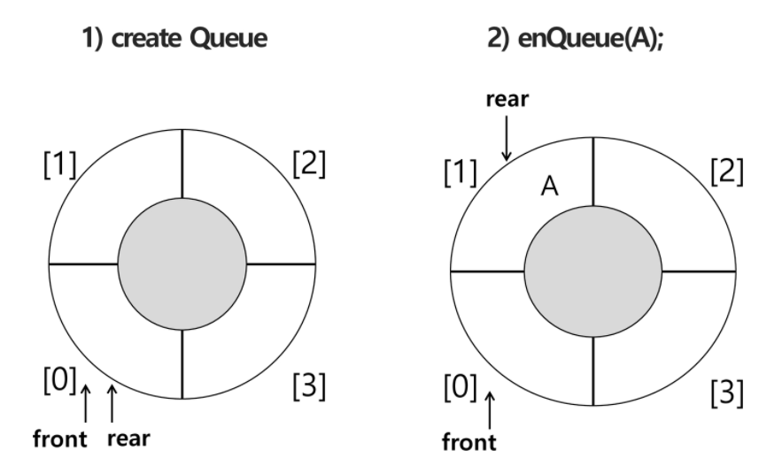
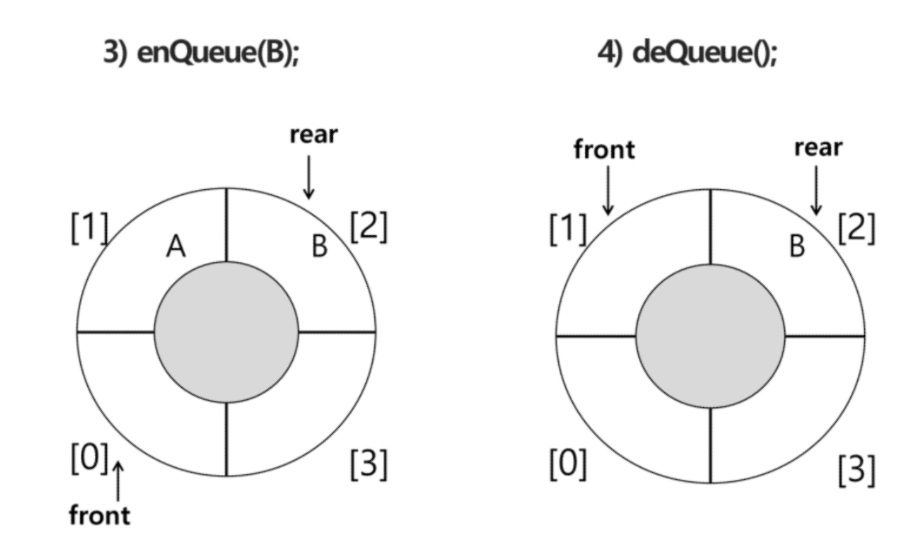

## 원형큐

* 초기 공백 상태

  * front = rear = 0

* index의 순환

  * `front` 와 `rear`의 위치가 배열의 마지막 인덱스인 n-1를 가르킨 후, 그다음에는 논리적 순환을 이루어 배열의 처음 인덱스인 0으로 이동해야 함

  * 이를 위해 나머지 연산 `mod`를 사용함

    ```
    (rear + 1) % 
    ```

* front 변수

  * 공백 상태와 포화 상태 구분을 쉽게 하기 위해 `front`가 있는 자리는 사용하지 않고 항상 빈자리로 둠

  |        | 삽입 위치               | 삭제 위치                |
  | ------ | ----------------------- | ------------------------ |
  | 선형큐 | rear = rear + 1         | front = front + 1        |
  | 원형큐 | rear = (rear + 1) mod n | front = (front +1) mod n |





+ 초기 공백 큐 생성

  + 크기 n인 1차원 배열 생성
  + `fron`와 `rear`를 0으로 초기화

+ 공백상태 및 포화상태 검사 : isEmpty(), isFull()

  * 공백상태 : `front` = `rear`
  * 포화상태 : 삽입할 rear의 다음 위치 = 현재 `front`
  * (rear + 1) mod n = front

  ```
  def isEmpty():
  	return front == rear
  	
  def isFull():
  	return (rear+1) % len(cQ) == front
  	# 다음 칸이 front이면 포화상태
  ```

+ 삽입 : enQueue(item)

  * 마지막 원소 뒤에 새로운 원소를 삽입하기 위해

  1. `rear` 값을 조정하여 새로운 원소를 삽입할 자리를 마련함: rear <- (rear + 1) mod n;
  2. 그 인덱스에 해당하는 배열원소 cQ[rear]에 item을 저장

  ```
  def enQueue(item):
  	global rear
  	if isFUll():
  		print("")
  	else:
  		rear = (rear + 1) % len(cQ)
  		cQ[rear] = item
  ```

+ 삭제 : deQueue(), delete()

  + 가장 앞에 있는 원소를 삭제하기 위해

  1. `front` 값을 조정하여 삭제할 자리를 준비함
  2. 새로운 `front` 원소를 리턴 함으로써 삭제와 동일한 기능함

  ```
  def deQueue():
  	global front
  	if isEmpty():
  		print("")
  	else:
  		front = (front + 1) % len(cQ)
  		return cQ[front]
  ```

  

  