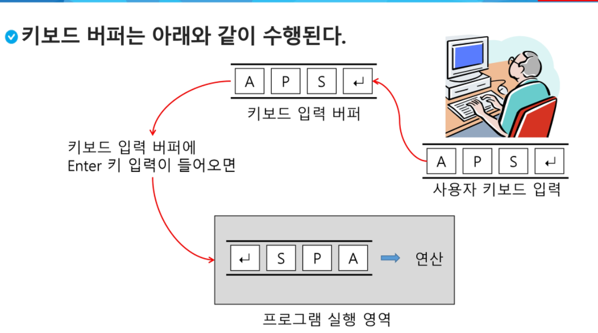

## 연결 큐

* 연결 큐의 구조
  * 단순 연결 리스트를 이용한 큐
    * 큐의 원소 : 단순 연결 리스트의 노드
    * 큐의 원소 순서 : 노드의 연결 순서. 링크로 연결되어 있음
    * `front` : 첫 번째 노드를 가리키는 링크
    * `rear` : 미지막 노드를 가리키는 링크
  * 상태 표현
    * 초기 상태 : front = rear = null
    * 공백 상태 : front = rear = null

## 우선순위 큐

* 우선 순위 큐의 특성
  * 우선순위를 가진 항목들을 저장하는 큐
  * `FIFO` 순서가 아니라 우선 순위가 높은 순서대로 먼저 나가게 된다.
* 우선순위 큐의 적용 분야
  * 시뮬레이션 시스템
  * 네트워크 트래픽 제어
  * 운영체제의 테스크 스케줄링
* 우선 순위 큐의 구현
  * 배열을 이용한 우선순위 큐
  * 리스트를 이용한 우선순위 큐
* 우선순위 큐의 기본 연산
  * 삽입: `enQueue`
  * 삭제: `deQueue`
* 배열을 이용하여 우선순위 큐 구현
  * 배열을 이용하여 자료 저장
  * 원소를 삽입하는 과정에서 우선순위를 비교하여 저절한 위치에 삽입하는 구조
  * 가장 앞에 최고 우선순위의 원소가 위치하게 됨
* 문제점
  * 배열을 사용하므로 사입이나 삭제 연산이 일어날 때 원소의 재배치가 발생함
  * 이에 소요되는 시간이나 메모리 낭비가 큼

## 큐의 활용 :버퍼

* 버퍼
  * 데이터를 한 곳에서 다른 한 곳으로 전송하는 동안 일시적으로 그 데이터를 보관하는 메모리의 영역
  * 버퍼링 : 버퍼를 활용하는 방식 또는 버퍼를 채우는 동작을 의미한다.
* 버퍼의 자료 구조
  * 버퍼는 일반적으로 입출력 및 네트워크와 관련된 기능에서 이용된다.
  * 순서대로 입력/출력/전달되어야 하므로 `FIFO` 방식의 자료구조인 큐가 활용된다.

