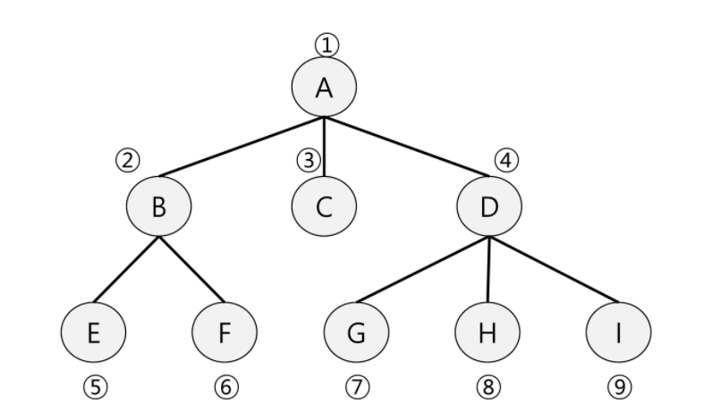

## BFS

* 그래프를 탐색하는 방법에는 크게 두 가지가 있음
  * 깊이 우선 탐색 (DFS)
  * 너비 우선 탐색 (BFS
* 너비우선탐색은 탐색 시작점의 인접한 정점들을 먼저 모두 차례로 방문한 후에 방분했던 정점을 시작점으로 하여 다시 인접한 정점들을 차례로 방문하는 방식
* 인접한 정점들에 대해 탐색을 한 후 차례로 다시 너비우선탐색을 진행해야 하므로 선입선출 형태의 자료구조인 큐를 활용함



+ BFS 알고리즘

  ```
  def BFS(g, v):  # 그래프 G, 탐색 시작점 v
  	visitted = [0] * (n+1) # n: 정점의 개수
  	queue = [] # 큐 생성
  	queue.append(v)  # 시작점 v를 큐에 삽입 enQ(v)
  	while queue : # 큐가 비어잇지 않은 경우
  		i = queue.pop(0) # 큐의 첫번째 원소 반환
  		if not visited[t] : # 방문되지 않은 곳이라면
  			visited[t] = True # 방문한 것으로 표시
                  visit(t) # 정점 t에서 할 일
              for i in G[t] # t와 연결된 모든 정점에 대해
                  if not visited[i]: # 방문되지 않은 곳이라면
                      queue.append(i) # 큐에 넣기
                      visited[i] = visited[t] + 1 # n으로부터 1만큼 이동 (출발점으로부터 어느만큼 떨어져있는지, 어느 그룹인지)
  ```

  ```
  while Q:
  	v - deQ()
  	do(v)
  	if v에 인접 and 미방문인 모든 w
  		enQ(w)
  		visited[w] = 1
  ```

  > 초반에 할 거 : 방문표시 배열 생성, 큐 생성,  시작점 인큐
  >
  > while Q : v를 deQ 하고 visited 에 방문표시, v의 인접인 w를 enQ(w)
  >
  > 중복이 있을 수 있음 q를 미리 확정하기에는 애매할 수도 있음

  ```
  7 8
  1 2 1 3 2 4 2 5 46 5 6 6 7 3 7
  
  def bfs(s, V):
  	q = [] # 큐생성
  	visited = [0] * (V+1)  # visited 생성
  	q.append(s)   # 시작점 인큐
  	visited[s] = 1  # 시작점 visited 표시
  	while q:  # 큐가 비어있지 않으면 (처리할 정점이 남아있으면)
  		t = q.pop(0)  # 디큐 (꺼내서)해서 t에 저장
  		print(t)  # t에 대한 처리
  		for i in range(1, V+1):
  			if adj[t][i] == 1 and visited[i] ==0:# t에 인접이고 미방무인 모든 i대해
  			q.append(i) # enqueue(i)
  			visitied[i] = visited[t] + 1 # i visited로 표시
  
  V, E = map(int, input().split())
  edge = list(map(int,input().split()))
  adj = [[0] * (V+1) for _ in range(V+1)] #v번까지 인덱스가 있어야하니까, 인접행렬
  for i in range(E):
  	n1, n2 = edge[2*i] , edge[2*+1] # 2개씩 잘라야하니까
  	adj[n1][n2] = 1
  	adj[n2][n1] = 1  #방향이 없는 그래프니까 방향이 없는 그래프라면 이거 지우면 됨
  	
  bfs(1, V)
  ```

  ```
  def bfs2(s, V):
  	q = [] # 큐생성
  	visited = [0] * (V+1)  # visited 생성
  	q.append(s)   # 시작점 인큐
  	visited[s] = 1  # 시작점 visited 표시
  	while q:  # 큐가 비어있지 않으면 (처리할 정점이 남아있으면)
  		t = q.pop(0)  # 디큐 (꺼내서)해서 t에 저장
  		print(t)  # t에 대한 처리
  		for i in adjList[t]:
  			if visited[i] ==0: # 당연히 인접임 미방문인 모든 i대해
  			q.append(i) # enqueue(i)
  			visitied[i] = visited[t] + 1 # i visited로 표시
  
  
  인접 리스트 (작은숫자에서 큰숫자로 그래프를 주어진 경우에만)
  adjList = [[] for _ in range(V+1)]
  adjList[n1].append(n2)
  adjList[n2].append(n1)
  ```

  ```
  def bfs(s, V):
  	q = [0] * V   # 큐생성
  	front = -1
  	rear = -1
  	visited = [0] * (V+1) # visited 생성
  	rear += 1  # 시작점 인큐
  	q[rear] = s
  	visited[s] = 1 # 시작점 visited
  	while front != rear :# 큐가 비어잇지 않으면
  		front += 1 # 디큐해서 t에 저장
  		t = q[front]
  		print(t)
  		for i in range(q, V+1): # t에 인접하고 미방문인 모든 i에 대해
  			if adj[t][i] == 1 and visited[i] == 0:
  				rear += 1 # 인큐 i
  				q[rear] = i
  				visited[i] = visited[t] + 1 # i 방문표시
  ```

  > 최단거리를 다 더하면?
  >
  > 시작점에서 얼마나 떨어진지(그룹) -1 하면 몇개의 엣지를 거쳐서 도착하는지와 같음

  ```
  dfs로 최단거리
  f(i,g,c): # i는 시작 위치, g는 도착지, c는 거리수?
  	if i == g:
  		if minV > c:
  			minV = c  # 최단거리 갱신
  	else:
  		v[i] = 1 # 방문한 곳 표시 
  		for j in adjList[i]
  			f(j, g, c+1)  # 인접행렬에서 재귀
  		v[i] = 0 # 중복허용을 위해 다시 v 초기화
  ```

  > 원상복구

  ```
  visited[next]=1
  def(next)
  vistied[next] = 0 #리턴받고 돌아갈 때 복구
  ```

  