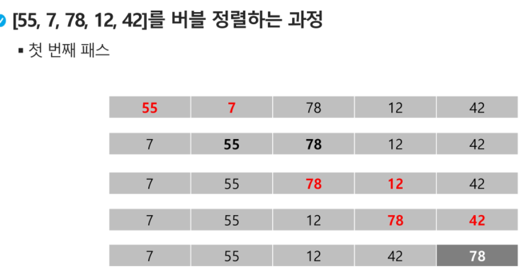
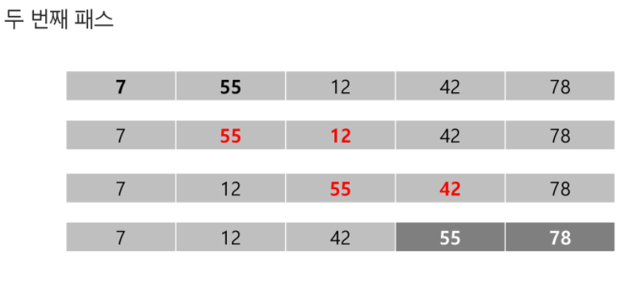
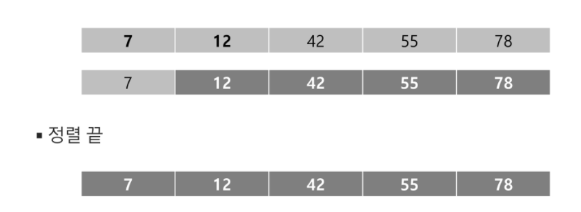

## 정렬

* 정렬
  *  2개 이상의 자료를 특정 기준에 의해 작은 값부터 큰 값(오름차순: ascending) 혹은 그 반대의 순서대로(내림차순:descending) 재배열하는 것
* 키
  * 자료를 정렬하는 기준이 되는 특정 값
* 대표적인 정렬 방식의 종류
  * 버블 정렬
  * 카운팅 정렬
  * 선택 정렬
  * 퀵 정렬
  * 삽입 정렬
  * 병합 정렬


### 버블 정렬

* 인접한 두 개의 원소를 비교하며 자리를 계속 교환하는 방식
* 정렬 과정
  * 첫 번째 원소부터 인접한 원소끼리 계속 자리를 교환하면서 맨 마지막 자리까지 이동한다.
  * 한 단계가 끝나면 가장 큰 원소가 마지막 자리로 정렬된다.
* 시간 복잡도
  * `O(n^2)`
* 정렬 예시







+ 버블 정렬 코드

```
def BubbleSort(a):  # 정렬할 list
	for i in range(len(a)-1, 0, -1):  # 범위의 끝 위치
		for j in range(0, i):
			if a[j] > a[j+1]:
				a[j], a[j+1] = a[j+1], a[j]
```

