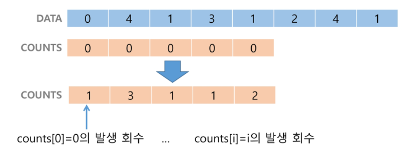
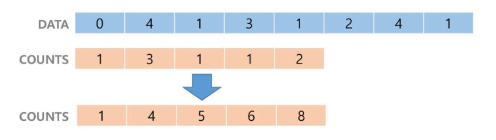
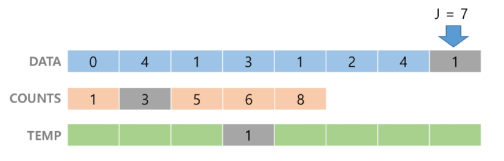

## 카운팅 정렬

+ 항목들의 순서를 결정하기 위해 집합에 각 항목이 몇 개씩 있는지 세는 작업을 하여 선형 시간에 정렬하는 효율적인 알고리즘
+ 제한 사항
  * **정수나 정수로 표현할 수 있는 자료에 대해서만 적용 가능**: 각 항목의 발생 회수를 지록하기 위해 정수 항목으로 인덱스 되는 카운트들이 배열을 사용하기 때문이다
  * 카운트들을 위한 충분한 공간을 할당하려면 집합 내의 **가장 큰 정수**를 알아야 한다.
+ 시간 복잡도
  + `O(n+k)`: n은 리스트 길이, k는 정수의 최대값
+ 정렬 과정
  + Data에서 가 항목들의 발생 회수를 세고 정수 항목들로 직접 인덱스 되는 카운트 배열 counts에 저장한다.
  + 빈 리스트의 인덱스에 해당하는 숫자들의 개수를 저장한다.



+  정렬된 집합에서 각 항목의 앞에 위치할 항목의 개수를 반영하기 위해 counts의 원소를 조정한다.
+ 숫자들을 누적합한다. 



+ counts[1]을 감소시키고 Temp에 1을 삽입한다.
+ 기존 리스트 맨 뒤의 숫자에 해당하는 인덱스를 찾아 -1한다. 
+ -1한 숫자에 해당하는 인덱스에 숫자를 넣는다. 



+ 반복

```
def Counting_Sort(A, B, k):
# A[]: 입력 배열(1 to k)
# B[]: 정렬된 배열
# C[]: 카운트 배열

	C = [0] * (k+1)
	
	for i in range(0, len(B 혹은 A #크기 자체는 둘이 같음)):
		C[A[i]] += 1        #개수를 카운트
		
	for i in range(1, len(C)):
		C[i] += C[i-1]
	
	for i in range(len(B)-1, -1, -1):
		C[A[i]] -= 1
		B[C[A[i]]] = A[i]
```

