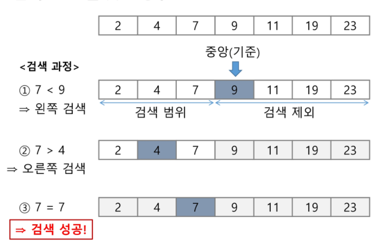

## 이진검색

+ 자료의 가운데에 있는항목의 키 값과 비교하여 다음 검색의 위치를 결정하고 검색을 계속 진행하는 방법
  + 목적 키를 찾을 때까지 이진 검색을 순환적으로 반복 수행함으로써 검색 범위를 반으로 줄여가면서 보다 빠르게 검색을 수행함
+ **이진 검색을 하기 위해서는 자료가 정렬된 상태여야 한다.**

+ 검색 과정
  + 자료의 중앙에 있는 원소를 고른다
  + 중앙 원소의 값과 찾고자 하는 목표 값을 비교한다.
  + 목표 값이 중앙 원소의 값보다 작으면 자료의 왼쪽 반에 대해서 새로 검색을 수행하고 크다면 자료의 오른쪽 바네 대해서 새로 검색을 수행한다.
  + 찾고자 하는 값을 찾을 때까지 과정을 반복한다.



+ 검색 범위의 시작점과 종료점을 이요하여 검색을 반복 수행한다.
+ 이진 검색의 경우 자료에 삽입과 삭제가 발생했을 때 배열의 상태를 항상 정렬 상태로 유지하는 추가 작업이 필요하다.

```
def search(a, key):
	start = 0
	end = len(a)-1
	while start <= end:
		middle = (start + end) // 2
		if a[middle] == key:
			return True
		elif a[middle] > key:
			end = middle - 1
		else:
			start = middle +1
	return False
```

+ 재귀함수로 이진검색하기

```
def search(a, low, high, key):
	if low > high:
		return False
	else:
		middle = (low + high) // 2
		if key == a[middle]:
			return True
		elif key < a[middle]:
			return search(a, low, middle-1, key)
		elif a[middle] < key:
			return search(a, middle+1, high, key)
```

