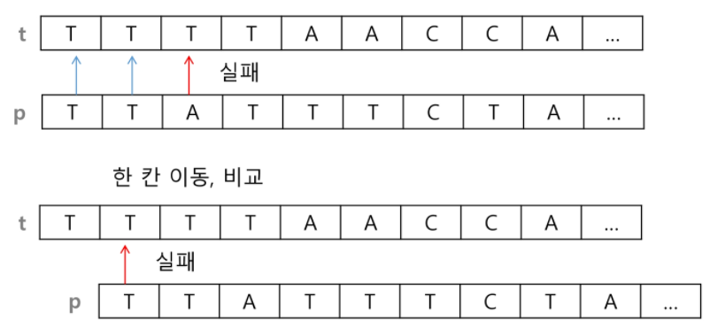

## 문자열

+ 패턴 매칭에 사용되는 알고리즘
  + 고지식한 패턴 검색 알고리즘
  + 카프-라빈 알고리즘
  + KMP 알고리즘
  + 보이어-무어 알고리즘


## 고지식한 알고리즘 (Brute Force)

+ 본문 문자열을 처음부터 끝까지 차례대로 순회하면서 패턴 내의 문자들을 일일이 비교하는 방식으로 동작



```
p = "is" #찾을 패턴
t = "This is a book~!"
M = len(p)
N = len(t)

def force(p,t):
	i = 0 # t의 인덱스
	j = 0 # p의 인덱스
	while j < M and i < N:
		if t[i] != p[j]:
		 	i = i - j
			j = -1
		i = i + 1
		j = j + 1
	if j ==M:
		return i - M #검색 성공
    else:
    	return -1
```

```
for i in range(N-M):
	for j in range(M-1):
		if p[j] != t[j+j]
			break
		if j = M-1
			return i
return -1
```


+ 시간 복잡도
  + 최악의 경우 시간 복잡도는 텍스트의 모든 위치에서 채턴을 비교해야 하므로 O(MN)이 됨