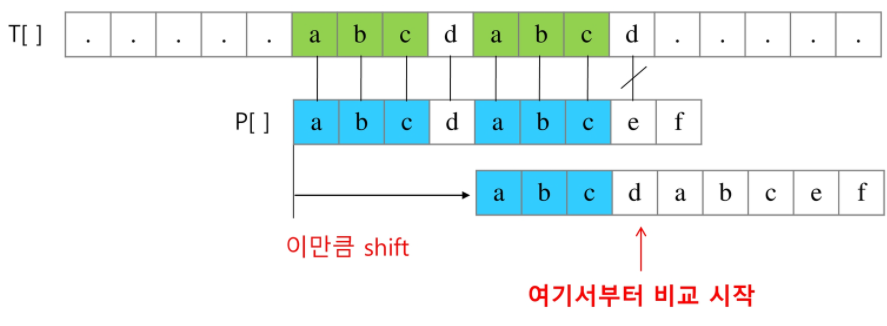
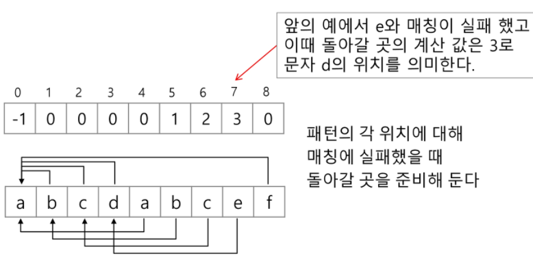

## KMP 알고리즘

- 불일치가 발생한 텍스트 스트링의 앞 부분에 어떤 문자가 있는지를 미리 알고 있으므로 불일치가 발생한 앞 부분에 대하여 다시 비교하지 않고 매칭을 수행
- 패턴을 전처리하여 배열 next[M]을 구해서 잘못된 시작을 최소화함
  - next[M]: 불일치가 발생했을 경우 이동할 다음 위치
- 시간 복잡도: O(M+N)
- 진행과정
  - 텍스트에서 abcdabc까지는 매치되고 e에서 실패한 상황 패터의 맨 앞의 abc와 실패 직전의 abc는 동일함을 이용할 수 있다.





```
next = [o] * M
cnt = 0 #일치한 개수
i = 1
while i < M:
    if p[i] == p[cnt]:
        cnt += 1
        next[i] = cnt
        i += 1
    else:
        if cnt != 0:
            cnt = next[cnt-1]
        else:
            next[i] = 0
            i += 1
```