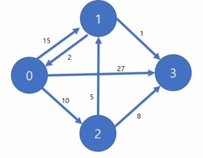

## 큐

* 큐의 특성

  * 스택과 마찬가지로 삽입과 삭제의 위치가 제한적인 자료구조
    * 큐의 뒤에서는 삽입만 하고 큐의 앞에서는 삭제만 이루어지는 구조
  * 선입선출구조
    * 큐에 삽입한 순서대로 원소가 저장되어 가장 먼저 삽입된 원소는 가장 먼저 삭제된다.
  * 큐의 선입선출 구조
    * 머리(Front) : 저장된 원소 중 첫 번째 원소(또는 삭제된 위치)
    * 꼬리(Rear) : 저장된 원소 중 마지막 원소
  * 큐의 기본 연산
    * 삽입 : enQueue
    * 삭제: deQueue

* 큐의 주요 연산

  | 연산          | 기능                                                |
  | ------------- | --------------------------------------------------- |
  | enQueue(item) |                                                     |
  | deQueue()     |                                                     |
  | createQueue() |                                                     |
  | isEmpty()     |                                                     |
  | isFull()      |                                                     |
  | Qpeek         | 큐의 앞쪽(front)에서 원소르 삭제 없이 반환하는 함수 |

* 큐의 연산 과정

  1) 공백 큐 생성 : createQueue()

     * front=  rear = -1

  2) 원소 A 삽입 : enQueue(A)

     * rear += 1
     * Q[rear] = 'A' # 요게 enQ
     * front = -1 그대로고 rear은 'A'를 나타내면서 rear = 0

  3) 원소 반호나 / 삭제 : deQueue()

     * front += 1
     * data = Q[front]
     * front = 1 

     > front 와 rear가 만나면 큐가 비었다라는 의미

* 큐의 구현

  * 1차원 배열을 이용한 큐
    * 큐의 크기 = 배열의 크기
    * front : 저장된 첫 번째 원소의 인덱스
    * rear : 저장된 마지막 원소의 인덱스
  * 상태 표현
    * 초기 상태 : front = rear = -1
    * 공백 상태 : front = rear
    * 포화 상태 : rear = n -1 (n: 배열의 크기, n-1: 배열의 마지막 인덱스)
  * 초기의 공백 큐를 생성

* 삽입 : enQueue(item)

  * 마지막 원소 뒤에 새로운 원소를 삽입하기 위해
    1) rear 값

  ```
  def enQueue(item):
  	global rear
  	if isFull():
  		print('Queue_Full')
  	else:
  		rear += 1
  		Q[rear] = item
  ```

* 삭제 : deQueue()

  * 가장 앞에 있는 원소를 삭제하기 위해
    1. front 값을 하나 증가시켜 큐에 남아있게 될 첫 번째 원소 이동
    2. 새로운 첫 번째 원소를 리턴 함으로써 삭제와 동일한 기능함

  ```
  def deQueue()
  	if isEmpty():
  		print('Queue_Empty')
  	else:
  		front += 1
  		return Q[front]
  ```

* 공백상태 및 포화상태 검사 : isEmp(), isFull()

  * 공백상태 : front = rear
  * 포화상태 : rear = n-1

  ```
  def isEmpty():
  	return front == rear
  	
  def isFull():
  	return rear == len(Q) -1
  ```

* 검색 : Qpeek()

  ```
  def Qpeek():
  	if isEmpty():
  		print()
  	else:
  		return Q[front+1]
  ```

* 연습문제

  * 1,2,3 삽입하고 출력하기

  ```
  Q = [0] * 10
  
  rear += 1
  Q[rear] = 1
  .
  .
  .
  while front != rear:
  	front += 1 
  	print(Q[front])
  ```

  ```
  listQ = []
  listQ.append(1)
  .
  .
  .
  while listQ:
  	print(listQ.pop(0))
  	
  # append는 더 오래걸림
  ```

  ```
  # 
  from collections import deque
  
  # enqueue -> append
  q = deque()
  q.append(1)
  q.append(2)
  q.append(3)
  
  # dequeue -> popleft
  while q:
  	print(q.popleft())
  ```

  

* 선형 큐 이용시 문제점
  * 잘못된 포화상태 인식
    * 선형 큐를 이용하여 원소의 삽입과 삭제를 계속할 경우, 배열의 앞부분에 활용할 수 있는 공간이 있음에도 불구하고 rear=n-1인 상태, 즉 포화상태로 인식하여 더 이상의 삽입을 수행하지 않게 됨
  * 해결방법 1
    * 매 연산이 이루어질 때마다 저장된 원소들을 배열의 앞부분으로 모두 이동시킴
    * 원소 이동에 많은 시간이 소요되어 큐의 효율성이 급격히 떨어짐
  * 해경방법 2
    * 1차원 배열을 사용하되 논리적으로는 배열의 처음과 끝이 연결되어 원형 형태의 큐를 이룬다고 가정하고 사용
    * 원형규


* 원형 큐의 구조

  * 초기 공백 상태

    * front = rear = 0

  * index의 순환

    * front 와 rear의 위치가 배열의 마지막 인덱스인 n-1를 가르킨 후, 그다음에는 논리적 순환을 이루어 배열의 처음 인덱스인 0으로 이동해야 함

    * 이를 위해 나머지 연산 mod를 사용함

      ```
      (rear + 1) % 
      ```

  * front 변수

    * 공백 상태와 포화 상태 구분을 쉽게 하기 위해 front가 있는 자리는 사용하지 않고 항상 빈자리로 둠

  |        | 삽입 위치               | 삭제 위치                |
  | ------ | ----------------------- | ------------------------ |
  | 선형큐 | rear = rear + 1         | front = front + 1        |
  | 원형큐 | rear = (rear + 1) mod n | front = (front +1) mod n |

* 원형 큐의 구현

  * 공백상태 및 포화상태 검사 : isEmpty(), isFull()
    * 공백상태 : front = rear
    * 포화상태 : 삽입할 rear의 다음 위치 = 현재 front
    * (rear + 1) mod n = front

  ```
  def isEmpty():
  	return front == rear
  	
  def isFull():
  	return (rear+1) % len(cQ) == front
  	# 다음 칸이 front이면 포화상태
  ```

  * 삽입 : enQueue(item)
    * 마지막 원소 뒤에 새로운 

  ```
  def enQueue(item):
  	global rear
  	if isFUll():
  		print("")
  	else:
  		rear = (rear + 1) % len(cQ)
  		cQ[rear] = item
  ```

  * 삭제

  ```
  def deQueue():
  	global front
  	if isEmpty():
  		print("")
  	else:
  		front = (front + 1) % len(cQ)
  		return cQ[front]
  ```


## 연결 큐

* 연결 큐의 구조
  * 단순 연결 리스트를 이용한 큐
    * 큐의 원소 : 단순 연결 리스트의 노드
    * 큐의 원소 순서 : 노드의 연결 순서. 링크로 연결되어 있음
    * front : 첫 번째 노드를 가리키는 링크
    * rear : 미지막 노드를 가리키는 링크
  * 상태 표현
    * 초기 상태 : front = rear = null
    * 공백 상태 : front = rear = null

(세부과정 생략)


## 우선순위 큐

* 우선 순위 큐의 특성
  * 우선순위를 가진 항목들을 저장하는 큐
  * FIFO 순서가 아니라 우선 순위가 높은 순서대로 먼저 나가게 된다.
* 우선순위 큐의 적용 분야
  * 시뮬레이션 시스템
  * 네트워크 트래픽 제어
  * 운영체제의 테스크 스케줄링
* 우선 순위 큐의 구현
  * 배열을 이용한 우선순위 큐
  * 리스트를 이용한 우선순위 큐
* 우선순위 큐의 기본 연산
* 배열을 이용하여 우선순위 큐 구현
  * 배열을 이용하여 자료 저장
  * 원소를 삽입하는 과정에서 우선순위를 비교하여 저절한 위치에 삽입하는 구조


## 큐의 활용 :버퍼

* 버퍼
  * 데이터를 한 곳에서 다른 한 곳으로 전송하는 동안 일시적으로 그 데이터를 보관하는 메모리의 영역
  * 버퍼링 : 버퍼를 활용하는 방식 또는 버퍼를 채우는 동작을 의미한다.
* 버퍼의 자료 구조
  * 버퍼는 일반적으로 입출력 및 네트워크와 관련된 기능에서 이용된다.
  * 순서대로 입력/출력/전달되어야 하므로 FIFO 방식의 자료구조인 큐가 활용된다.


## BFS

* 그래프를 탐색하는 방법에는 크게 두 가지가 있음
  * 깊이 우선 탐색 (DFS)
  * 너비 우선 탐색 (BFS
  
* 너비우선탐색은 탐색 시작점의 인접한 정점들을 먼저 모두 차례로 방문한 후에 방분했던 정점을 시작점으로 하여 다시 인접한 정점들을 차례로 방문하는 방식

* 인접한 정점들에 대해 탐색을 한 후 차례로 다시 너비우선탐색을 진행해야 하므로 선입선출 형태의 자료구조인 큐를 활용함

* BFS 알고리즘

  ```
  def BFS(g, v):  # 그래프 G, 탐색 시작점 v
  	visitted = [0] * (n+1) # n: 정점의 개수
  	queue = [] # 큐 생성
  	queue.append(v)  # 시작점 v를 큐에 삽입 enQ(v)
  	while queue : # 큐가 비어잇지 않은 경우
  		i = queue.pop(0) # 큐의 첫번째 원소 반환
  		if not visited[t] : # 방문되지 않은 곳이라면
  			visited[t] = True # 방문한 것으로 표시
                  visit(t) # 정점 t에서 할 일
              for i in G[t] # t와 연결된 모든 정점에 대해
                  if not visited[i]: # 방문되지 않은 곳이라면
                      queue.append(i) # 큐에 넣기
                      visited[i] = visited[t] + 1 # n으로부터 1만큼 이동 (출발점으로부터 어느만큼 떨어져있는지, 어느 그룹인지)
  ```

  ```
  while Q:
  	v - deQ()
  	do(v)
  	if v에 인접 and 미방문인 모든 w
  		enQ(w)
  		visited[w] = 1
  ```

  > 초반에 할 거 : 방문표시 배열 생성, 큐 생성,  시작점 인큐
  >
  > while Q : v를 deQ 하고 visited 에 방문표시, v의 인접인 w를 enQ(w)
  >
  > 중복이 있을 수 있음 q를 미리 확정하기에는 애매할 수도 있음

  ```
  7 8
  1 2 1 3 2 4 2 5 46 5 6 6 7 3 7
  
  def bfs(s, V):
  	q = [] # 큐생성
  	visited = [0] * (V+1)  # visited 생성
  	q.append(s)   # 시작점 인큐
  	visited[s] = 1  # 시작점 visited 표시
  	while q:  # 큐가 비어있지 않으면 (처리할 정점이 남아있으면)
  		t = q.pop(0)  # 디큐 (꺼내서)해서 t에 저장
  		print(t)  # t에 대한 처리
  		for i in range(1, V+1):
  			if adj[t][i] == 1 and visited[i] ==0:# t에 인접이고 미방무인 모든 i대해
  			q.append(i) # enqueue(i)
  			visitied[i] = visited[t] + 1 # i visited로 표시
  
  V, E = map(int, input().split())
  edge = list(map(int,input().split()))
  adj = [[0] * (V+1) for _ in range(V+1)] #v번까지 인덱스가 있어야하니까, 인접행렬
  for i in range(E):
  	n1, n2 = edge[2*i] , edge[2*+1] # 2개씩 잘라야하니까
  	adj[n1][n2] = 1
  	adj[n2][n1] = 1  #방향이 없는 그래프니까 방향이 없는 그래프라면 이거 지우면 됨
  	
  bfs(1, V)
  ```

  ```
  def bfs2(s, V):
  	q = [] # 큐생성
  	visited = [0] * (V+1)  # visited 생성
  	q.append(s)   # 시작점 인큐
  	visited[s] = 1  # 시작점 visited 표시
  	while q:  # 큐가 비어있지 않으면 (처리할 정점이 남아있으면)
  		t = q.pop(0)  # 디큐 (꺼내서)해서 t에 저장
  		print(t)  # t에 대한 처리
  		for i in adjList[t]:
  			if visited[i] ==0: # 당연히 인접임 미방문인 모든 i대해
  			q.append(i) # enqueue(i)
  			visitied[i] = visited[t] + 1 # i visited로 표시
  
  
  인접 리스트 (작은숫자에서 큰숫자로 그래프를 주어진 경우에만)
  adjList = [[] for _ in range(V+1)]
  adjList[n1].append(n2)
  adjList[n2].append(n1)
  ```

  ```
  def bfs(s, V):
  	q = [0] * V   # 큐생성
  	front = -1
  	rear = -1
  	visited = [0] * (V+1) # visited 생성
  	rear += 1  # 시작점 인큐
  	q[rear] = s
  	visited[s] = 1 # 시작점 visited
  	while front != rear :# 큐가 비어잇지 않으면
  		front += 1 # 디큐해서 t에 저장
  		t = q[front]
  		print(t)
  		for i in range(q, V+1): # t에 인접하고 미방문인 모든 i에 대해
  			if adj[t][i] == 1 and visited[i] == 0:
  				rear += 1 # 인큐 i
  				q[rear] = i
  				visited[i] = visited[t] + 1 # i 방문표시
  ```

  최단거리를 다 더하면?

  시작점에서 얼마나 떨어진지(그룹) -1 하면 몇개의 엣지를 거쳐서 도착하는지와 같음

  ```
  dfs로 최단거리
  f(i,g,c): # i는 시작 위치, g는 도착지, c는 거리수?
  	if i == g:
  		if minV > c:
  			minV = c  # 최단거리 갱신
  	else:
  		v[i] = 1 # 방문한 곳 표시 
  		for j in adjList[i]
  			f(j, g, c+1)  # 인접행렬에서 재귀
  		v[i] = 0 # 중복허용을 위해 다시 v 초기화
  ```

  원상복구 o vs 원상복구 x
  
  

visited 원상복구 이야기하는거였네..경로 한번 탐색하면 visited 초기화하고 탐색하고 초기화하고..

```
visited[next]=1
def(next)
vistied[next] = 0 #리턴받고 돌아갈 때 복구
```

