## 비트 연산

* 비트 연산자

  * 비트 : 저장할 수  있는 최소 단위

  * 비트 연산 : 같은 비트 번호끼리만 연산

  * & 

    1. 특정 비트를 0으로 만드는 연산
    2. 특정 비트를 검사하는 연산

    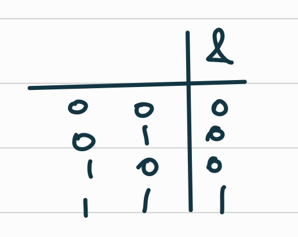

  ```
  a = 2
  b = 3
  print(a&1)
  print(b&1)  # 짝,홀을 알기 위함
  
  0이면 짝수 / 1이면 홀수
  ```

  ```\
  if a & 0x01 # 0이 아니면
  	print('홀수')
  else:
  	print('짝수')
  ```

  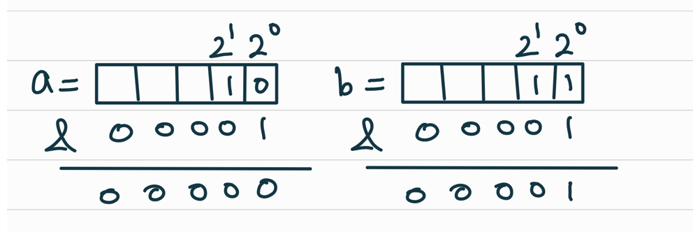

  * |

    1. 특정 비트를 1로 만드는 연산

    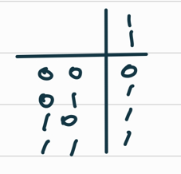

  * ^

    1. 비교
    2. 비트 토글 (특정 비트를 반전)

    * 숫자가 다르면 1, 같으면 0 이라고 생각할 수도 있고
    * 1이랑 ^하면 토글된다고 생각할 수 있음

  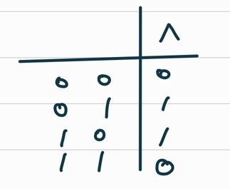

  ```
  a = 2
  b = 3
  c = 3
  
  print(a^b)
  print(b^c)
  
  # 1
  # 0
  ```

  ```
  a = 102
  b = 331
  c = 331
  
  print(a^b) # 다르면 0이 아니고
  print(b^c) # 같으면 0
  
  # 301
  # 0 
  ```

  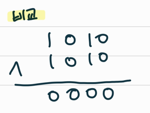

  ```
  # a 배열에서 b의 원소를 인덱스로 0->1, 1->0 바꾸기
  
  [1]
  a = [1, 0, 0, 1, 1, 0, 0, 0]
  b = [0, 1, 2, 7]
  
  for i in b:
  	if a[i]:  # 1 -> 0
  		a[i] = 0
  	else:    # 0 -> 1
  		a[i] = 1		
  		
  # [0, 1, 1, 1, 1, 0, 0, 1]
  ```

  ```
  [2]
  a = [1, 0, 0, 1, 1, 0, 0, 0]
  b = [0, 1, 2, 7]
  
  for i in b:  
  	a[i] ^= 1
  	
  # [0, 1, 1, 1, 1, 0, 0, 1]
  ```

  * ~

    1. 비트 토글 (모든 비트를 반전)

  * <<

    * *2^n와 동일한 효과가 있음

    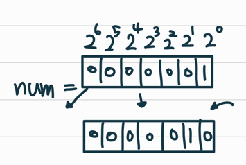

  * `>>`

    * 나누는 효과

* 비트 연산

  * 1 << n

    * 2^n의 값

    * 원소가 n개일 경우의 모든 부분집합의 수를 의미한다

      ```
      # 0 ~ 2^n-1 을 만들어야 한다면
      for i in range(1<<N)-1
      ```

  * i & (1<<j)

    * 계산 결과는 i의 j번째 비트가 1인지 아닌지를 의미한다

    * 4번 비트가 1인지 알고 싶다면?

      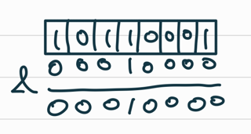

      => 4번 비트만 1인 값을 넣어 & 연산 => 4번 비트가 1이면 결과가 0이 아님

    * 4번 비트가 1인 값을 만드는 법: 1 << 4

    ```
    for i in range(1<<3): #2^3이니까 0~7
    	if i & (1<<0): # 0이 아니면
    		print(f'{i}의 0번 비트는 1')
    	else:
    		print(f'{i}의 0번 비트는 0')
    ```

    ```
    for i in range(1<<3):
    	print(f'{i}의 2번 비트는 {(i&(1<<2))>>2}')
    	
    # 위에와 같음
    # 비트 검사한 것을 또 다시 오른쪽으로 밀어버림
    ```

    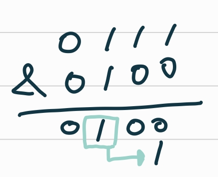

* 비트연산

  * 비트 연산 예제1

  ```
  def Bbit(i):
  	output = ""
  	for j in range(7, -1, -1): # 7인 이유는 n개의 비트로 표현가능한 범위 = 2^n개 / 7개면 충분히 큰 범위라서 ㄱㅊ음
  		output += "1" if i & (1 << j) else "0"
  	print(output)
  	
  for i in range(-5, 6): # -5~5
  	print("%3d = " %i, end='')  #%d => 3칸을 유지하라는 거
  	Bit(i)
  ```

  * <연습문제1>

  ```
  str_bin = input()
  
  a = 0
  while a < len(str_bin):
      temp = str_bin[a+0: a+7]
      print(int(temp, 2),end = ',')
      a += 7
  ```

  * 비트 연산 예제2

  ```
  def Bbit(i): # 2진수로 바꿔주는 함수라고 생각하면 됨
  	output = ""
  	for j in range(7, -1, -1):
  		output += "1" if i & (1 << j) else "0"
  	print(output, end=' ')
  	
  a = 0x10   # 16진수
  x = 0x01020304
  print('%d = ' % a, end='') # %d =>10진수로 
  Bbit(a)  # 16이면 2진수에서 4번 비트가 1임
  print()
  print("0%X = " x, end='')
  for i in range(0,4):
  	Bbit((x >> i*8) & 0xff) # 04 먼저 들어가고 다음 턴에선 03, >>오른쪽으로 8칸 쉬프트하니까
  ```

  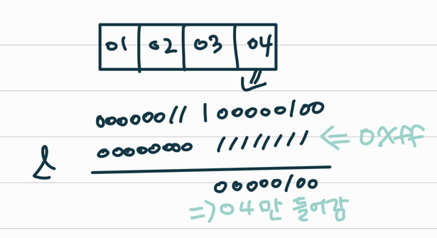

  * 10진수 : 0 ~ 9
  * 16진수 : 0 ~ 9  A ~ F (A=10/ F =15)
    * 16진수 한 자리는 2진수 4자리
    * 2진수: 0 ~ 15 (= 0000 ~~ 1111)
    * 16진수에서 2개씩 자르면 1Byte

* 엔디안

  * ex) x = 0x01020304 이라면 이것을 1000~1003에 해당하는 메모리에 어떤 방식으로 저장할 지 결정하는 방법
  * 빅 엔디안
    * 큰 단위가 먼저 앞에 나옴
  * 리틀 엔디안
    * 작은 단위가 앞에 나옴

  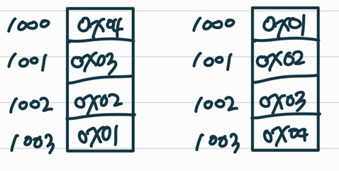

  * 비트 연산 예제3

  ```
  def ce(n): # change endian
  	p = []
  	for i in range(0, 4):
  		p.append((n >> (24 - i*8)) & 0xff) # 0->24번 쉬프트, 1 -> 16번, ...
  	return p
  ```

  ```
  x = 0x01020304
  p = []
  for i in range(0,4):
  	p.append((x >> (i*8)) & 0xff)
  	
  print("x = %d%d%d%d" % (p[0], p[1], p[2], [3]))
  p = ce(x)
  print("x = %d%d%d%d" % (p[0], p[1], p[2], [3]))
  
  # x = 4321
  # x = 1234
  ```

  

  * 비트 연산 예제4

  ```
  def ce1(n):
  	return (n << 24 & 0xff000000) | (n<< 8 0xff0000)
  	| (n >> 8 & 0xff00) | (n >> 24 & 0xff)
  	
  # 비트 순서를 바꿈 배열에 넣지 않고 비트 그대로 유지하고 순서 바꿈
  ```

  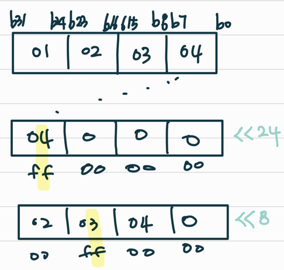

  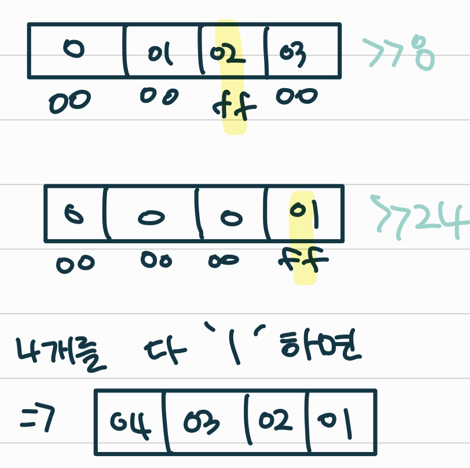

  * 비트 연산 예제5
    * 비트 연산자 ^를 두 번 연산하면 처음 값을 반환한다

  ```
  def Bbit(i): 
  	output = ""
  	for j in range(7, -1, -1):
  		output += "1" if i & (1 << j) else "0"
  	print(output)
  	
  a = 0x86
  key = 0xAA
  
  print("a   ==> ", end='')
  Bbit(a)
  
  print("a^=key   ==> ", end='')
  a ^= key
  Bbit(a)
  
  print("a^=key   ==> ", end='')
  a ^= key
  Bbit(a)
  
  # AA = 10101010 (1자리는 4비트를 나타낼 수 있으니까)
  ```

  