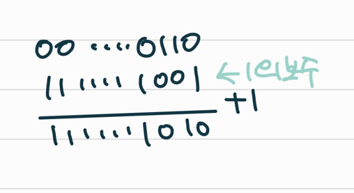

## 진수

* 진수

  * `MSB` 1 0 0 1 `LSB`
  * 큰 쪽이 MSB , 작은 쪽이 LSB

* 컴퓨터에서의 음의 정수 표현 방법

  * 1의 보수 : 1인 자리빼고 다 1이어야 함, 반전 시키기

    * 단점: 1이상인 경우는 괜찮지만 0의 경우 -0이 생김

  * 2의 보수 : 1의 보수로 만들고 +1

    

    * -0이 생기지 않음

    * 2의 부호에서는 그냥 덧셈을 하면 따로 부호를 관리하지 않아도 덧셈의 결과 얻을 수 있음

      

* <연습문제2>

```
# 2진수를 10진수로 바꾸는 법
[1]
print(int('0000111',2))

[2]
s='0000111'
sum = 0
for i in range(len(s)):
	sum *= 2
	sum += int(s[i])
```


----

## 실수

* 실수를 저장하기 위한 형식
  * 000.00001 =  0.0000001 x 2^2 (양수면 오른쪽으로 이동)
  * 0.0001 = 000.01 x 2^-2 (음수면 왼쪽으로 이동)
* <연습문제3>

```
amho = {
    '001101' : 0,
    '010011' : 1,
    '111011' : 2,
    '110001' : 3,
    '100011' : 4,
    '110111' : 5,
    '001011' : 6,
    '111101' : 7,
    '011001' : 8,
    '101111' : 9
}
MAP = {
    '0' : '0000',
    '1' : '0001',
    '2' : '0010',
    '3' : '0011',
    '4' : '0100',
    '5' : '0101',
    '6' : '0110',
    '7' : '0111',
    '8' : '1000',
    '9' : '1001',
    'A' : '1010',
    'B' : '1011',
    'C' : '1100',
    'D' : '1101',
    'E' : '1110',
    'F' : '1111',
}


s = '0269FAC9A0'
new_s = '' # 이진수로 만들기
for i in range(len(s)):
    new_s += MAP[s[i]]

a = 0
while a < len(new_s):
    key = new_s[a : a + 6]
    if key in amho :
        print(amho[key], end = ',')
        a += 6
    else :
        a += 1
```

