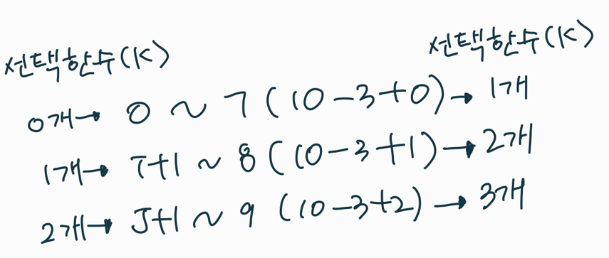

## 조합적 문제

* 순열

  * 서로 다른 것들 중 몇 개를 뽑아서 한 줄로 나열하는 것

  * 서로 다른 n개 중 r개를 택하는 순열 : nPr

  * ```
    nPr = n * (n-1) * (n-2) *...* (n-r+1) = n! / (n-r)!
    ```

  * 단순하게 순열을 생성하는 방법

* 순열 생성 방법

  * 재귀 호출을 통한 순열 생성

```
# p[] : 데이터가 저장된 배열
# n : 원소의 개수, i : 선택된 원소의 수
def perm(n,k):
	if k ==n:
		print(p) # 원하는 작업 수행
		return
	else:
		for i in range(k, n):
			p[k], p[i] = p[i], p[k]
			perm(n, k+1)
			p[k], p[i] = p[i], p[k]
			
p = [1,2,3]
perm(3,0)
```

```
# 사전순으로 출력
# used[n-1] : 사용여부, p:결과 저장 배열

def perm(n,k):
    if n == k:
        print(p)

    else:
        for i in range(n):
            if u[i] == 0:
            	u[i] = 1
                p[k] = arr[i]
                f(n, k+1)
                u[i] = 0
        
p = [0] * 3
arr = [1,2,3]
u = [0] * 3
f(3,0)
```

```
# 5개의 숫자 중 3개를 뽑아 순열로 만들기

def perm(n,m,k):
    if n == k:
        print(p)

    else:
        for i in range(m): # 주어진 숫자의 개수만큼
            if u[i] == 0:
            	u[i] = 1
                p[k] = arr[i]
                f(n,m,k+1)
                u[i] = 0
        
p = [0] * 3
arr = [1,2,3,4,5]
u = [0] * 5
f(3,5,0)
```

* 주사위 N개 던져서 나올 수 있는 경우의 수 (중복순열)

```
def func(level):
    # 현재 level 에서 눈금을 선택한 후 다음 level 재귀호출
    # path[level] = 1
    # func(level + 1)
    # path[level] = 2
    # func(level + 1)
    # path[level] = 3
    # func(level + 1) 이걸 반복문으로 처리

    if level == N :   # 0 1 2 3 ...N-1 / 총 N 개 선택
        # 하나의 경우의 수가 만들어짐
        for i in range(N):
            print(path[i], end=' ')
        print()
        return

    for i in range(1, 6+1):
        path[level] = i
        func(level + 1)
        path[level] = 0 # 원상복구


N = int(input())
path = [0,0,0,0,0,0,0,0,0,0,]
func(0)
```

* 부분집합
  * 바이너리 카운팅을 통한 부분집합 생성코드

```
arr = [3,6,7,1,5,4]
n = len(arr)

for i in range(1, (1 <<n)): # 1<< n :부분집합의 개수, 0~2^n -1
	for j in range(0,n): # 원소의 수만큼 비트를 비교함
		if i & (1<<j):  # i의 j번째 비트가 1이면 j 번째 원소 출력
			print(arr[j], end='')
	print()
```

* 조합

  * 서로 다른 n개의 원소 중 r개를 순서없이 골라낸 것을 조합이라고 한다.
  * 조합의 수식

  ```
  nCr = n! / (n-r)!r! (n>=r)
  nCr = (n-1)C(r-1) + n-1Cr
  nC0 = 1
  ```

  * 재귀 호출을 이용한 조합 생성 알고리즘 (nCr)

  ```
  an[] : n개의 원소를 가지고 있는 배열
  tr[] : r개의 크기의 배열, 조합이 임시 저자될 배열
  
  comb(n,r):
  	if r==0 : print(arr)
  	elif n < r : return
  	else:
  		tr[r-1] = an[n-1]
  		comb(n-1, r-1)
  		comb(n-1, r)
  ```

  * 10개의 원소 중 3개를 고르는 조합

    * i<j<k 라고 하면

    ```
    for i in range(8) # j,k로 선택될 원소를 남김
    	for j in range(i+1, 9): # k로 선택될 원소를 남김
    		for k in range(j+1,10):
    			print(i, j, k)			
    ```

    

  * n개에서 r개를 고르는 조합(재귀)  (nCr)

    ```
    def nCr(n,r,s,k): # n개에서 r개를 고르는 조합, s선택할 수 있는 구간의 시작, k 고른개수
    	if k==r:
    		print(*comb)
    	else:
    		for i in range(n, n-r+k+1): #+1은 range라서
    		comb[k] = i
    		nCr(n,r,i+1,k+1) # k가 고른 개수도 될 수 있지만 리스트의 인덱스 역할도 함. 0번 인덱스에 올 거를 고르고 그 다음 1번 인덱스에 올 거를 고름
    		
    N = 10
    R = 3
    comb = [0]*R
    nCr(N,R,0,0)
    ```

* <연습문제3>

```
def func(level):
    global cnt
    if level == 10:
        #print(subset)
        #cnt += 1
        sum = 0
        for i in range(len(subset)):
            sum += subset[i]
        if sum == 0 :
            cnt += 1
        return

    subset.append(arr[level])
    func(level + 1) # 현재 level 원소 선택 O
    subset.pop()

    func(level + 1) # 현재 level 원소 선택 X


subset = []
arr = [-1,3,-9,6,7,-6,1,5,4,-2]

cnt = 0
func(0)
print(cnt)
```

