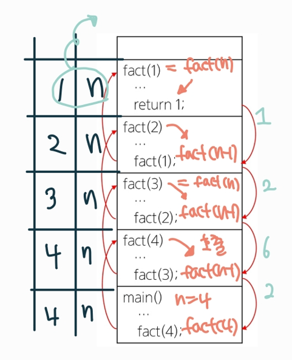
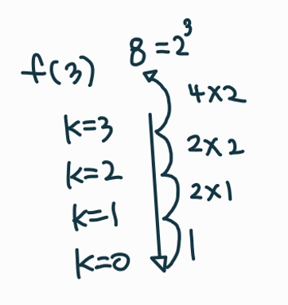

## 반복과 재귀

* 반복과 재귀
  * 반복은 수행하는 작업이 완료될 때까지 계속 반복
    * 루프(for, while 구조)
  * 재귀는 주어진 문제의 해를 구하기 위해 동일하면서 더 작은 문제의 해를 이용하는 방법
    * 하나의 큰 문제를 해결할 수 있는 더 작은 문제로 쪼개고 결과들을 결합
    * 재귀 함수로 구현
* 반복을 이용한 선택정렬

```
def Selection(A):
	n = len(A)
	for i in range(0,n-1):
	minI = i
	for j in range(i+1, n):
		if A[j] < A[minI]:
			minI = j
	A[minI], A[i] = A[i], A[minI] # 주어진 구간에서 최소값을 구간의 맨 앞으로
```

* <연습문제1> 재귀를 이용한 선택정렬

```
def selection_sort(s,e):
    if s == e :
        return
    # [s] <- 에 제일 작은 값을 swap
    min_idx = s
    for i in range(s,e+1):
        if arr[min_idx] > arr[i] :
            min_idx = i
    arr[min_idx], arr[s] = arr[s] , arr[min_idx]

    selection_sort(s + 1, e)


arr = [1,3,2,5,6,30,22,19]
selection_sort(0,len(arr) - 1)
print(arr)
```

* 팩토리얼 재귀 함수

  * n! 에 대한 재귀함수

  ```
  def fact(n):
  	if n<= 1:
  		return 1 
  	else:
  		return n * fact(n-1)
  ```

  

  * 자기자신을 호출하는 것이지만 다른 함수를 호출한다고 생각하면 편함
  * 자신을 호출했던 자리에 값을 줌
  * 호출을 하면 사진 상 왼쪽을 n의 값을 저장한 메모리들이 사라짐

  ```
  # 다른 모양의 재귀함수
  f(n,k):
  	if n == k  # k는 배열의 크기
  		return
  	else:
  		f(n+1,k)
  ```

* 2^k 연산에 대한 재귀와 반복

```
# 재귀
Power2(k) #output: 2^k
	if k ==0:  # k == 1일때 1리턴하면 하나 덜 곱해져서 안됨, 하는 작업의 횟수를 유지하고 그것을 벗어나면 return
		return 1
		
	else:
		return 2 * Power2(k-1)
```



```
# 반복
Power2(k): #output: 2^k
	i = 0
	power = 1
	while i < k:
		power = power * 2
		i = i+1
		
		return power
```


