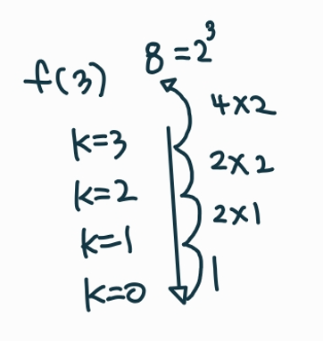

## 반복과 재귀

* 반복과 재귀
  * 반복은 수행하는 작업이 완료될 때까지 계속 반복
    * 루프(for, while 구조)
  * 재귀는 주어진 문제의 해를 구하기 위해 동일하면서 더 작은 문제의 해를 이용하는 방법
    * 하나의 큰 문제를 해결할 수 있는 더 작은 문제로 쪼개고 결과들을 결합
    * 재귀 함수로 구현
* 반복을 이용한 선택정렬

```
def Selection(A):
	n = len(A)
	for i in range(0,n-1):
	minI = i
	for j in range(i+1, n):
		if A[j] < A[minI]:
			minI = j
	A[minI], A[i] = A[i], A[minI] # 주어진 구간에서 최소값을 구간의 맨 앞으로
```

* 재귀를 이용한 선택정렬

```
def selection_sort(s,e):
    if s == e :
        return
    # [s] <- 에 제일 작은 값을 swap
    min_idx = s
    for i in range(s,e+1):
        if arr[min_idx] > arr[i] :
            min_idx = i
    arr[min_idx], arr[s] = arr[s] , arr[min_idx]

    selection_sort(s + 1, e)


arr = [1,3,2,5,6,30,22,19]
selection_sort(0,len(arr) - 1)
print(arr)
```


* 팩토리얼 재귀 함수

  * n! 에 대한 재귀함수

  ```
  def fact(n):
  	if n<= 1:
  		return 1 
  	else:
  		return n * fact(n-1)
  ```

  

  * 자기자신을 호출하는 것이지만 다른 함수를 호출한다고 생각하면 편함
  * 자신을 호출했던 자리에 값을 줌
  * 호출을 하면 사진 상 왼쪽을 n의 값을 저장한 메모리들이 사라짐

  ```
  # 다른 모양의 재귀함수
  f(n,k):
  	if n == k  # k는 배열의 크기
  		return
  	else:
  		f(n+1,k)
  ```

* 2^k 연산에 대한 재귀와 반복

```
# 재귀
Power2(k) #output: 2^k
	if k ==0:  # k == 1일때 1리턴하면 하나 덜 곱해져서 안됨, 하는 작업의 횟수를 유지하고 그것을 벗어나면 return
		return 1
		
	else:
		return 2 * Power2(k-1)
```



```
# 반복
Power2(k): #output: 2^k
	i = 0
	power = 1
	while i < k:
		power = power * 2
		i = i+1
		
		return power
```

* <연습문제 1>
* f(i,n) i = 시작 구간 , n = 끝 구간
* if ~~:
* else: f(i+1)


## 완전 검색 기법

* 고지식한 방법
  * Brute-force 탐색 
    * 자료들의 리스트에서 키 값을 찾기 위해 첫 번째 자료부터 비교하면서 진행한다.

```
Sequential(A[0,..n], k)  # 맨뒤에 k를 넣고 앞에서 부터 차례대로 비교해온다
	A[n] = k
	i = 0
	while A[i] != k
		i += 1
	if i < n :return i # 반복문 종료 후 i의 값이 배열의 길이보다 작다면 찾은 거
	else: return -1 # 길다면 실패
```

```
search(A,n,k)
	for i in range(n-1):
		if A[i] == k
			return i
	return -1
```


## 조합적 문제

* 순열

  * 서로 다른 것들 중 몇 개를 뽑아서 한 줄로 나열하는 것

  * 서로 다른 n개 중 r개를 택하는 순열 : nPr

  * ```
    nPr = n * (n-1) * (n-2) *...* (n-r+1) = n! / (n-r)!
    ```

  *  단순하게 순열을 생성하는 방법

* 순열 생성 방법

  * 재귀 호출을 통한 순열 생성

```
# p[] : 데이터가 저장된 배열
# n : 원소의 개수, i : 선택된 원소의 수
def perm(n,k):
	if k ==n:
		print(p) # 원하는 작업 수행
		return
	else:
		for i in range(k, n):
			p[k], p[i] = p[i], p[k]
			perm(n, k+1)
			p[k], p[i] = p[i], p[k]
			
p = [1,2,3]
perm(3,0)
```

```
# 사전순으로 출력
# used[n-1] : 사용여부, p:결과 저장 배열

def perm(n,k):
    if n == k:
        print(p)

    else:
        for i in range(n):
            if u[i] == 0:
            	u[i] = 1
                p[k] = arr[i]
                f(n, k+1)
                u[i] = 0
        
p = [0] * 3
arr = [1,2,3]
u = [0] * 3
f(3,0)
```

```
# 5개의 숫자 중 3개를 뽑아 순열로 만들기

def perm(n,m,k):
    if n == k:
        print(p)

    else:
        for i in range(m): # 주어진 숫자의 개수만큼
            if u[i] == 0:
            	u[i] = 1
                p[k] = arr[i]
                f(n,m,k+1)
                u[i] = 0
        
p = [0] * 3
arr = [1,2,3,4,5]
u = [0] * 5
f(3,5,0)
```

* 부분집합
  * 바이너리 카운팅을 통한 부분집합 생성코드

```
arr = [3,6,7,1,5,4]
n = len(arr)

for i in range(1, (1 <<n)): # 1<< n :부분집합의 개수, 0~2^n -1
	for j in range(0,n): # 원소의 수만큼 비트를 비교함
		if i & (1<<j):  # i의 j번째 비트가 1이면 j 번째 원소 출력
			print(arr[j], end='')
	print()
```

* 조합

  * 서로 다른 n개의 원소 중 r개를 순서없이 골라낸 것을 조합이라고 한다.
  * 조합의 수식

  ```
  nCr = n! / (n-r)!r! (n>=r)
  nCr = (n-1)C(r-1) + n-1Cr
  nC0 = 1
  ```

  * 재귀 호출을 이용한 조합 생성 알고리즘 (nCr)
  
  ```
  an[] : n개의 원소를 가지고 있는 배열
  tr[] : r개의 크기의 배열, 조합이 임시 저자될 배열
  
  comb(n,r):
  	if r==0 : print(arr)
  	elif n < r : return
  	else:
  		tr[r-1] = an[n-1]
  		comb(n-1, r-1)
  		comb(n-1, r)
  ```
  
  * 10개의 원소 중 3개를 고르는 조합
  
    * i<j<k 라고 하면
  
    ```
    for i in range(8) # j,k로 선택될 원소를 남김
    	for j in range(i+1, 9): # k로 선택될 원소를 남김
    		for k in range(j+1,10):
    			print(i, j, k)			
    ```
  
    
  
  * n개에서 r개를 고르는 조합(재귀)  (nCr)
  
    ```
    def nCr(n,r,s,k): # n개에서 r개를 고르는 조합, s선택할 수 있는 구간의 시작, k 고른개수
    	if k==r:
    		print(*comb)
    	else:
    		for i in range(n, n-r+k+1): #+1은 range라서
    		comb[k] = i
    		nCr(n,r,i+1,k+1) # k가 고른 개수도 될 수 있지만 리스트의 인덱스 역할도 함. 0번 인덱스에 올 거를 고르고 그 다음 1번 인덱스에 올 거를 고름
    		
    N = 10
    R = 3
    comb = [0]*R
    nCr(N,R,0,0)
    ```


## 탐욕 알고리즘

활동 선택 문제 이해 안됨

* 탐욕 기법을 통한 Baby-gin 문제 해결

```
i = inp = tri = run = 0
inp = 여섯자리 숫자
c = [0] * 12 # 2개는 더미, 9까지 탐색해야함, 인덱스 에러때문에

while i < 6: # 카운트 배열 만들기
	c[inp % 10] += 1
	inp /= 10
	i += 1
	
i = 0
while i < 10 (and tri + run >= 2):
	if c[i] >= 3
		c[io] -= 3
        tri += 1
        continue
    if c[i] >= and c[i+1] >= 1 and c[i+2] >= 1:
    	c[i] -= 1
    	c[i+1] -= 1
		c[i+2] -= 1
        run += 1
        continue
   	
   	i += 1
```


---


* 웹엑스

```
주사위 N개 던져서 나올 수 있는 경우의 수 (중복순열)


def func(level):
    # 현재 level 에서 눈금을 선택한 후 다음 level 재귀호출
    # path[level] = 1
    # func(level + 1)
    # path[level] = 2
    # func(level + 1)
    # path[level] = 3
    # func(level + 1) 이걸 반복문으로 처리

    if level == N :   # 0 1 2 3 ...N-1 / 총 N 개 선택
        # 하나의 경우의 수가 만들어짐
        for i in range(N):
            print(path[i], end=' ')
        print()
        return

    for i in range(1, 6+1):
        path[level] = i
        func(level + 1)
        path[level] = 0 # 원상복구


N = int(input())
path = [0,0,0,0,0,0,0,0,0,0,]
func(0)
```

```
연습문제, 부분집합 출력하기(재귀)

def func(level):
	global cnt
	if level == 5:
	
	subset.append(arr[level])
	func(level+1) # 현재 level 원소 선택 o
	func(level+1) # 현재 level 원소 선택 x
	
	
subset = []
```

람다식

