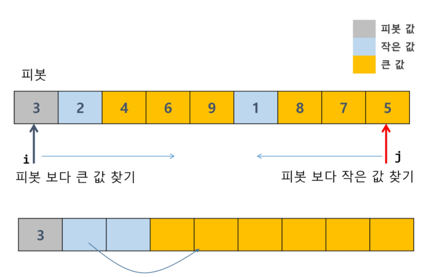
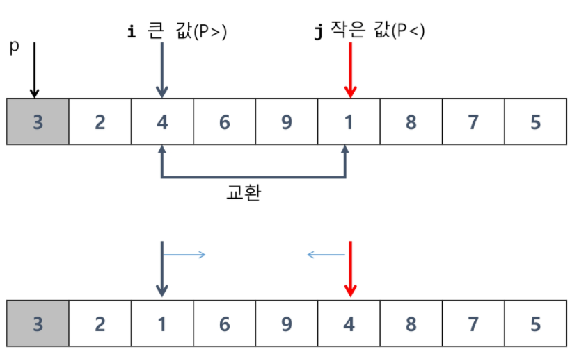
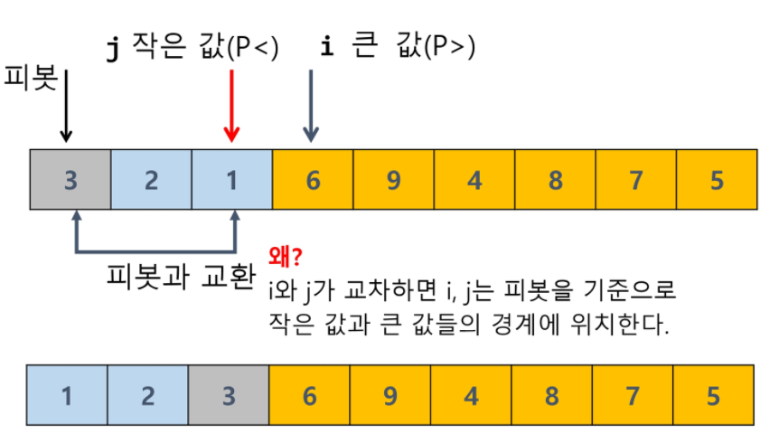

## 퀵 정렬

* 주어진 배열을 두 개로 분할하고 각각을 정렬한다.

* 병합 정렬과 다른 점:
  1. 병합 정렬은 그냥 두 부분으로 나누는 반면에 퀵 정렬은 분할할 때 기준 아이템 중심으로 이보다 작은 것은 왼편, 큰 것은 오른편에 위치시킨다
  2. 각 부분 정렬이 끝난 후 병합 정렬은 **병합**이란 후처리 작업이 필요하나 퀵 정렬은 필요로 하지 않는다.
* 알고리즘

```
def Quick_sort(A, l, r):
	if l< r:
		 s = patition(A,l,r)
		 Quick_sort(A,l,s-1)
		 Quick_sort(A,s+1,r)	
		 
# A는 정렬할 리스트/ l은 시작 / r은 끝
```

* Hoare-Partition 알고리즘

```
def partition(A, l, r):
	p = A[l]  # p: 피봇 값(가장 왼쪽)
	i , j = l, r
	while i <= j:
		while i <= j and A[i] <= p: 
			i += 1
		while i <= j and A[j] >= p : 
			j -= 1
		if i < j : 
			A[i], A[j] = A[j], A[i]
	A[l], A[j] = A[j], A[l]
	return j
```

* Lomuto partition 알고리즘

```
def partition(A,p,r):
	x = A[r] # 피봇 (가장 오른쪽)
	i = p -1 # 시작 구역의 하나 왼쪽
	for j in (p, r):
		if A[j] <= x:
			i += 1
			A[i], A[j] = A[j], A[i]
	A[i+1],A[r] = A[r], A[i+1]
	return i + 1
```

* 정렬 과정





