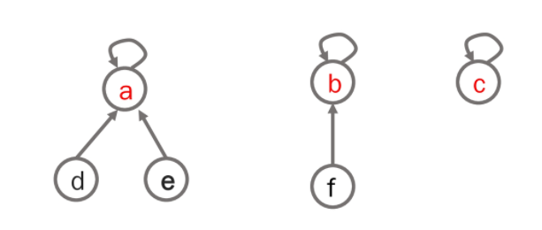

## 서로소 집합

+ 서로소 또는 상호배타 집합들은 서로 중복 포함된 원소가 없는 집합들이다. 다시 말해 교집합이 없다

+ 집합에 속한 하나의 특정 멤버를 통해 각 집합들을 구분한다. 이를 **대표자**(representative)라 한다

+ 상호배타 집합을 표현하는 방법
  + 연결 리스트
  + 트리
  
+ 상호배타 집합 연산
  + Make-Set(x)
  + Find-Set(x)
  + Union(x,y)

+ 상호 배타 집합 표현 - 연결리스트
  + 같은 집합의 원소들은 하나의 연결리스트로 관리한다.
  + 연결리스트의 맨 앞의 원소를 집합의 대표 원소로 삼는다.
  + 각 원소는 집합의 대표원소를 가리키는 링크를 갖는다.
  
+ 상호 배타 집합 표현 - 트리
  
  + 하나의 집합을 하나의 트리로 표현한다.
  + 자식 노드가 부모 노드를 가리키며 루트 노드가 대표자가 된다.
  
+ 연산의 효율을 높이는 방법
  
  + Rank를 이용한 Union
    + 각 노드는 자신을 루트로 하는 subtree의 높이를 rank라는 이름으로 저장한다.
    + 두 집합을 합칠 때 rank가 낮은 집합을 rank가 높은 집합에 붙인다
  + Path compression
    + Find-set을 행하는 과정에서 만나는 모든 노드들이 직접 루트를 가리키도록 포인터를 바꾸어 준다.
  
  
  
  

+ Make-Set(x) : 유일한 멤버 x를 포함하는 새로운 집합을 생성하는 연산

  ```
  Make-Set(x):
  	p[x] = x # 노드 x의 부모 저장
  	rank[x] = 0 # 루트 노드가 x인 트리의 랭크 값 저장
  ```

+ Find-Set(x): x를 포함하는 집합을 찾는 연산

  ```
  # 재귀
  Find-Set(x):
  	if x == p[x]: return x
  	else: return Find-set(p[x])
  ```

  ```
  # 랭크
  Find-Set(x):
  	if x != p[x] # x가 루트가 아닌 경우
  		p[x] = Find-Set(p[x])
  	return p[x]
  	
  # Find-set 연산은 특정 노드에서 루트까지의 경로를 찾아 가면서 노드의 부모 정보를 갱신한다.
  ```

  ```
  # 반복
  Find-set(x):
  	while x != p[x]
  		x = p[x]
  	return x
  ```

+ Union(x,y): x와 y를 포함하는 두 집합을 통합하는 연산

  ```
  Union(x,y):
  	p[Find-Sat(y)](=y의 대표원소) = Find-set(x)(=x의 대표원소)
  ```

  ```
  Union(x,y)
  	LInk(Find-set(x), Find-Set(y))
  ```

  ```
  Link(x,y):
  	if rank[x] > rank[y]: # rank는 트리의 높이
  		p[y] = x
  	else:
  		p[x] = y
  		if rank[x] == rank[y]
  			rank[y] += 1
  ```

* Union-Find

  ```
  parent = dict()
  
  # make - set
  for ch in range(ord('A') , ord('Z') + 1):
      parent[chr(ch)] = chr(ch)
  
  
  def Union(a,b): # a의그룹 <- b그룹 
      pa = Find(a) # a 의 그룹 대표자(최종 부모) 를 찾는다.
      pb = Find(b) # b 의 그룹 대표자(최종 부모) 를 찾는다.
      if pa != pb : 
          parent[pb] = pa
  
  def Find(ch) : # 최종 부모를 찾는다.
      if parent[ch] == ch:
          return ch # 최종부모를 return
      ret = Find(parent[ch])
      parent[ch] = ret
      return ret
  
  # 최종적으로 남은 그룹 수를 확인하려면 Union함수가 한번 돌아갈때마다 전체 개수에서 -1해주면 됨
  ```

  ```
  # 가장 많은 자식 수를 가진 부모를 구하는 법
  
  memo_cnt = [1 for i in range(N+1)]
  
  def Union(a,b): # a <- b
      pa = Find(a) # a 가 속한그룹 대표자 찾기
      pb = Find(b) # b ""
      if pa != pb :
          parent[pb] = pa
          memo_cnt[pa] += mem_cnt[pb]
          memo_cnt[pb] = 0
      return
      
  print(max(memo_cnt))
  ```

  