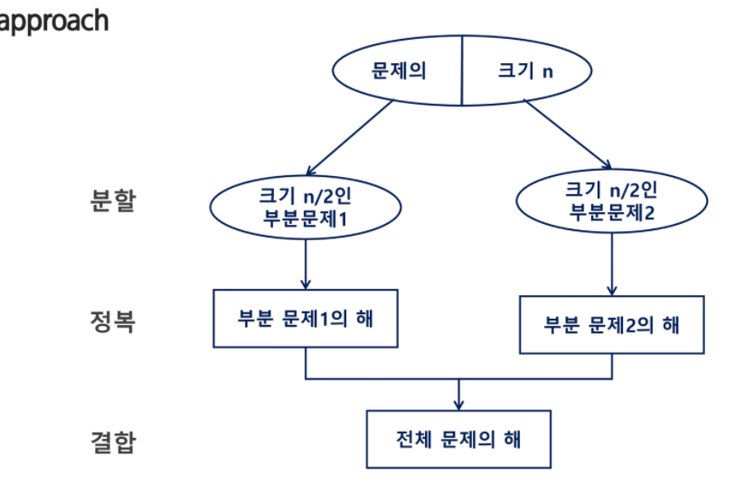

## 분할 정복 기법

* 설계 전략
  * 분할: 해결할 문제를 여러 개의 작은 부분으로 나눈다.
  * 정복: 나누 작은 문제를 각각 해결한다.
  * 통합: (필요하다면) 해결된 해답을 모은다
* Top-down approach



* 거듭제곱

  * 반복 알고리즘 :`O(n)`

  ```
  def iterative_power(x,n):
  	result = 1
  	for i in range(1,n):
  		result *= x
  	return result
  ```

  * 분할 정복 기반의 알고리즘 : `O(log2n)`

  ```
  def Recursive_power(x,n):
  	if n==1: return x
  	if n % 2 ==0:
  		y = power(x,n/2)
  		return y * y
  	else:
  		y = power(x,(n-1)/2)
  		return y * y * x
  ```

  