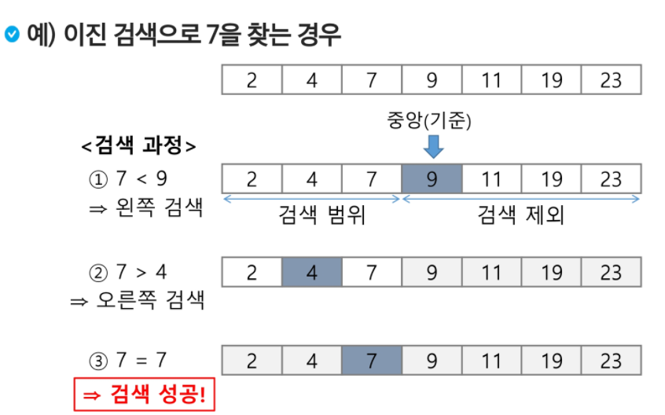

## 이진 검색

* 자료의 가운데에 있는 항목의 키 값과 비교하여 다음 검색의 위치를 결정하고 검색을 계속 진행하는 방법
  * 목적 키를 찾을 때까지 이진 검색을 순환적으로 반복 수행함으로써 검색 범위를 반으로 줄여가면서 보다 빠르게 검색을 수행함

* 이진 검색을 하기 위해서는 자료가 정렬된 상태여야 한다.
* 검색 과정
  1. 자료의 중앙에 있는 원소를 고른다.
  2. 중앙 원소의 값과 찾고자 하는 목표 값을 비교한다.
  3. 목표 값이 중앙 원소의 값보다 작으면 자료의 왼쪽 반에 대해서 새로 검색을 수행하고 크다면 자료의 오른쪽 반에 대해서 새로 검색을 수행한다
  4. 찾고자 하는 값을 찾을 때까지 `1` ~`3` 의 과정을 반복한다.



* 반복 구조 알고리즘

```
def search(n, S, k):
	low = 0
	high = n -1
	while low <= high:
		mid = low + (high - low) / 2
		if S[mid] == key:
			return mid
		elif S[mid] > key:
			high = mid - 1
		else:
			low = mid + 1
	return -1
```

```
def binary_search(lst, target) :
    s = 0
    e = len(lst) - 1

    while s <= e :
        mid = (s + e) // 2

        if target == lst[mid] :
            print("찾았다")
            return mid
        elif target < lst[mid] : # s   target... mid   e
            e = mid - 1
        elif lst[mid] < target : # s   mid...target    e
            s = mid + 1

    return -1# 못찾은 경우
```

* 재귀 구조 알고리즘

```
def search(S, low, high, key):
	if low > high:
		return -1
	else:
		mid = (low + high) / 2
		if key == S[mid]:
			return mid
		elif key < S[mid]:
			return search(S, low, mid -1, key)
		else:
			return search(S, mid+1, high, key)
```

```
ans = 0
def binary_search(s, e, target) :
    global ans
    if s > e :
        ans = - 1
        return
    mid = (s + e) // 2
    if lst[mid] == target :
        ans = mid
        return
    elif target < lst[mid] : # s target mid e
        binary_search(s,mid - 1)
    elif lst[mid] < target : # s mid target e
        binary_search(mid + 1, e)
    return 
```

