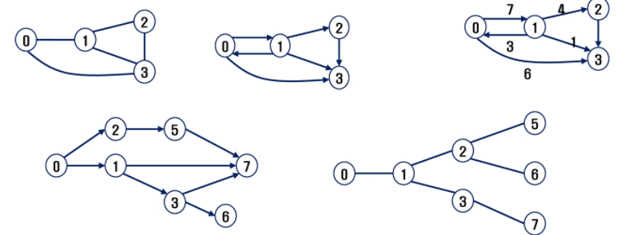
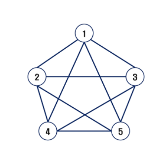
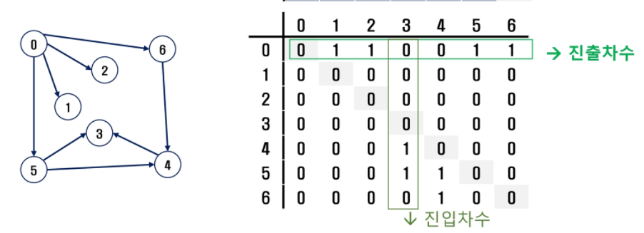
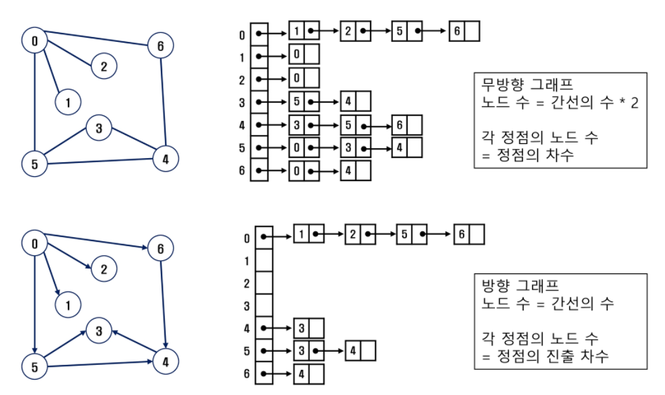

## 그래프

* 그래프는 아이템(사물 또는 추상적 개념)들과 이들 사이의 연결 관계를 표현한다.

* 그래프는 정점들의 집합과 이들을 연결하는 간선들의 집합으로 구성된 구조

* 선형 자료구조나 트리 자료구조로 표현하기 어려운 N:N 관계를 가지는 원소들을 표현하기에 용이하다. 

* 그래프 유형

  * 무향 그래프
  * 유향 그래프
  * 가중치 그래프
  * 사이클 없는 방향 그래프

  

* 그래프 유형

  * 완전 그래프

    * 정점들에 대해 가능한 모든 간선들을 가진 그래프

    

  * 부분 그래프
    * 원래 그래프에서 일부의 정점이나 간선을 제외한 그래프

* 인접

  * 두 개의 정점에 간선이 존재(연결됨)하면 서로 인접해 있다고 한다
  * 완전 그래프에 속한 임의의 두 정점들은 모두 인접해 있다

* 그래프 경로

  * 경로란 간선들을 순서대로 나열한 것
    * 간선들: (0,2),(2,4)
    * 정점들: 0-2-~~
  * 경로 중 한 정점을 최대한 한번만 지나는 경로를 **단순경로**라 한다.
  * 시작한 정점에서 끝나는 경로를 **사이클**이라고 한다.

* 그래프 표현

  * 간선의 정보를 저장하는 방식, 메모리나 성능을 고려해서 결정
  * 인접 행렬
    * 2차원 배열을 이용해서 간선 정보를 저장
    * 배열의 배열(포인터 배열)
    * 행 번호와 열 번호는 그래프의 정점에 대응
    * 두 정점이 인접되어 있으면 1, 그렇지 않으면 0으로 표현
    * 무향 그래프
      * i번째 행의 합 = i번째 열의 합 = v의 차수
    * 유향 그래프
      * 행 i의 합 = V의 집출 차수
      * 열 i의 합 = V의 집인  차수

  

  * 인접 리스트
    * 각 정점마다 해당 정점으로 나가는 간선의 정보를 저장
    * 각 정점에 대한 인접 정점들을 순차적으로 표현
    * 하나의 정점에 대한 인접 정접들을 각각 노드로 하는 연결 리스트로 저장

  

  * 간선의 배열
    * 간선을 배열에 연속적으로 저장

```
마지막 정점번호, 간선 수
6 8
0 1 0 2 0 5 0 6 4 3 5 3 5 4 6 4

V,E = map(int,input().split())
edge = list(map(int, input().split()))

adjM = [[0]*(V+1) for _ in range(V+1)]
for i in range(E):
	n1,n2 = edge[2*1] edge[2*i+1]
	adjm[n1][n2]= 1
	adjm[n2][n1]= 1  # 무방향그래프인 경우 이 한 줄 추가해야 함
```

```
adjL = [[] for _ in range(V+1)]
for i in range(E):
	n1,n2 = edge[2*1] edge[2*i+1]
	adjL[n1].append(n2)
	adjL[n2].append(n1) # 무방향그래프인 경우
```

