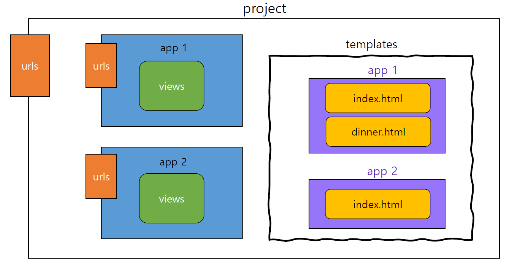

## Namespace

* namespace (이름공간)

  * 이름공간 또는 네임스페이스는 객체를 구분할 수 있는 범위를 나타내는 말로 일반적으로 하나의 이름 공간에서는 하나의 이름이 단 하나의 객체만을 가리키게 된다

  1. 서로 다른 app 의 같은 이름을 가진 `url name` 은 이름공간을 설정해서 구분
  2. templates, static 등 django 는 정해진 경로 하나로 모아서 보기 때문에

* URL namespace

  * URL namespace 를 사용하면 서로 다른 앱에서 동일한 URL 이름을 사용하는 경우에도 이름이 지정된 URL 을 고유하게 사용 할 수 있음

  * urls.py 에 `app_name` attribute 값 작성

  * 참조

    * `:` 연산자를 사용해서 지정

      ```
      app_name='articles'
      ```

      ```
      <a href="">home</a>
      ```

* Template namespace

  * Django 는 기본적으로 app_name / templates/경로에 있는 `templates` 파일들만 찾을 수 있으며 , INSTALLED_APPS 에 작성한 app 순서로 tamplate 을 검색 후 렌더링 함
  
  * 그래서 임의로 templates 의 폴더 구조를 app_name / app_name 형태로 변경해 임의로 이름 공간을 생성 후 변경된 추가 경로로 수정
  
    ```
    def index(request):
    	return render(request, 'articles/index.html')
    ```
  
    

