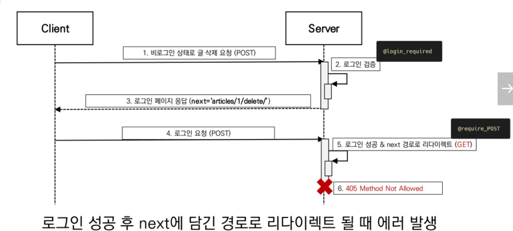

## 로그인 사용자에 대한 접근 제한

* Limiting access to logged-in users

  * 로그인 사용자에 대한 엑세스 제한 2가지 방법
    1. `The raw way`
       * **is_authenticated** attribute
    2. `The login_required decorator`

* 1. is_authenticated 속성
     *  User model의 속성(attributes) 중 하나
     * 모든 User 인스턴스에 대해 항상 True인 읽기 전용 속성 (AnonymousUser에 대해서는 항상  False)
     * 사용자가 인증 되었는지 여부를 알 수 있는 방법
     * 일반적으로 request.user에서 이 속성을 사용하여, 미들웨어의 `django.contrib.auth.middleware.AuthenicationMiddleware`를 통과 했는지 확인
     * 단, 권한(permission)과는 관련이 없으며 사용자가 활성화 상태(active)이거나 유효한 세션(valid session)을 가지고 있는지도 확인하지 않음

* is_authenticated 적용

  ```
  # html
  
  
  ...
  
  ...
  
  ```

  * 로그인과 비로그인 상태에서 출력되는 링크를 다르게 설정

  ```
  # views.py
  
  @require_http_methods(['GET','POST'])
  def loging(request):
  	if request.user.is_authenticated:
  		return redirect('articles:index')
  ```

  * 인증된 사용자(로그인 상태)라면 로그인 로직을 수행할 수 없도록 처리

  ```
  # views.py
  
  #require_POST
  def logout(request):
  	if request.user.is_authenticated:
  		auth_logout(request)
  	return redirect('articles:index')
  ```

  * 인증된 사용자(로그인 상태)만 로그아웃 로직을 수행할 수 있도록 처리

* 2. login_required decorator

     * 사용자가 로그인되어 있지 않으면, **settings.LOGIN_URL**에 설정된 문자열 기반 절대 경로로 redirect 함
       * LOGIN_URL의 기본 값은 '/accounts/login/'
     * 사용자가 로그인되어 있으면 정상적으로 view 함수를 실행
     * 인증 성공 시 사용자가 redirect 되어야 하는 경로는 "next"라는 쿼리 문자열 매개 변수에 저장됨
       * 예시) /accounts/login/**?next=/articles/create/**

     ```
     from django.contrib.auth.decorators import login_required
     
     @login_required
     def my_view(request):
     	pass
     ```

* "next" query string parameter

  * 로그인이 정상적으로 진행되면 기존에 요청했던 주소로 redirect 하기 위해 마치 주소를 keep 해주는 것
  * 단, 별도로 처리 해주지 않으면 우리가 view에 설정한 redirec 경로로 이동하게 됨

  ```
  # views.py
  
  @require_http_methods(['GET', 'POST'])
  def login(requst):
  	if request.method == 'POST':
  		if form.is_valid():
  			return redirect(request.GET.get('naxt') of 'articles:index')
  ```

  ```
  # html
  
  <form action="" method="POST">
  ...
  </form>
  ```

  현재 URL로 (next parameter가 있는) 요청을 보내기 위해 action 값 비우기

* 두 데코레이터로 인해 발생하는 구조적 문제와 해결

  * @require_POST 작성된 함수에 @login_required를 함께 사용하는 경우 **에러 발생**
  * 로그인 이후 `next` 매개 변수에 따라 해당 함수로 다시 redirect 되는데 이 때 @require_POST 때문에 405에러가 발생하게 됨
  * 두 가지 문제 발생
    1. redirect 과정에서 POST 데이터의 손실
    2. redirect 요청은 POST 방식이 불가능하기 때문에 GET 방식으로 요청됨

  

  ```
  # views.py
  
  @require_POST
  def delete(request, pk):
  	if request.user.is_authenticated:
  		article = get_object_or_404(Article, pk=pk)
  		article.delete()
  	return redirect('articles:index')
  ```

  * login_required는 **GET method request**를 처리할 수 잇는 view함수에서만 사용해야 함