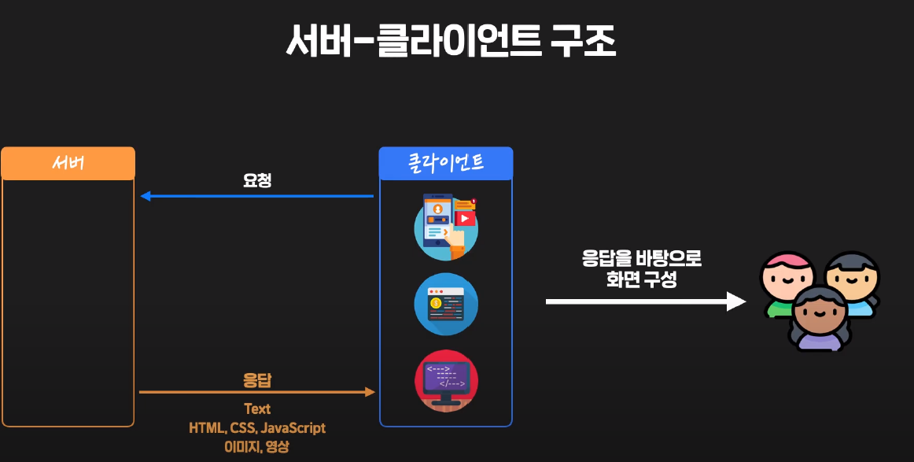
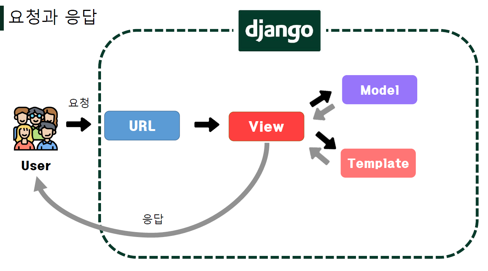

## 요청과 응답

* 서버-클라이언트 구조

  

  

* URLS

  * HTTP 요청(request)을 알맞은 `view`로 전달

* View

  * HTTP 요청을 수신하고 HTTP응답을 반환하는 함수 작성

  * Model을통해 요청에 맞는 필요 데이터에 접근

  * Template에게 HTTP응답서식을 맡김

    > return 은 응답이라고 보면 됨
    >
    > request에는 사용자 요청 정보가 들어있는데 이건 따로 신경 안써도 됨

* templates

  * 실제 내용을 보여주는데 사용되는 파일

  * 파일의 구조나 레이아웃을 정의 (ex. `HTML`)

  * templates 파일 경로의 기본 값은 app 폴더 안의 templates 폴더로 지정되어 있음

    > `__init__`이 있어서 article 폴더를 모듈로 이용할수있음

> view에서 실행될 모든 함수는 request를 매개변수로 받음
>
> render 는 templates를 보여주기 위한 것, render도 처음 인자로 request사용해야함

* 추가 설정
  * LANGUAGE_CODE
    * 모든 사용자에게 제공되는 번역을 결정
    * 이 설정이 적용 되려면 `USE_I18N `이 활성화되어 있어야 함
  * TIME_ZONE
    * 데이터베이스 연결의 시간대를 나타내는 문자열 지정
    * USE_TZ 가 True 이고 이 옵션이 설정된 경우 데이터베이스에서 날짜 시간을 읽으면 UTC 대신 새로 설정한 시간대의 인식 날짜 시간이 반환 됨
    * USE_TZ 이 False 인 상태로 이 값을 설정하는 것은 error 가 발생하므로 주의
  * USE_I18N
    * Django 의 번역 시스템을 활성화해야 하는지 여부를 지정
  * USE_L10N
    * 데이터의 지역화 된 형식 (localized formatting)을 기본적으로 활성화할지 여부를 지정
    * True 일 경우 , Django 는 현재 locale 의 형식을 사용하여 숫자와 날짜를 표시
  * USE_TZ
    * datetimes 가 기본적으로 시간대를 인식하는지 여부를 지정
    * True 일 경우 Django 는 내부적으로 시간대 인식 날짜 / 시간을 사용