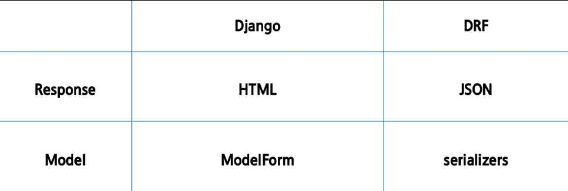

## Response

1. Response - HTML
   
   * HTML을 응답하는 서버
   
   ```
   # article/urls.py
   urlpatterns = [
       path('html/', views.article_html),
   ]
   ```
   
   ```
   # views.py
   def article_html(request):
       articles = Article.objects.all()
       context = {
           'articles':articles
       }
       return render(reqeust,' articles/article.html', context)
   ```

2. Response - JsonResponse
   
   * JsonResponse 객체를 활용한 JSON 데이터 응답
   
   ```
   urlpatterns = [
       path('json-1', views.article_json_1)
   ]
   ```
   
   ```
   def article_json_1(request):
       articles = Article.objects.all()
       articles_json = []
       for article in articles:
           articles_json.append(
               {
                   'id': article.pk,
                   'title':article.title,
                   'content':article.content,
               }
           )
       return JsonResponse(articles_json, safe=False)
   ```
   
   * **Content - Type** entity header
     
     * 데이터의 `media type`(MIME type, content type)을 나타내기 위해 사용됨
     
     * 응답 내에 있는 컨텐츠의 컨텐츠 유형이 실제로 무엇인지 클라이언트에게 알려줌
   
   * **JsonResponse** objects
     
     * `JSON-encoded response`를 만드는 HttpResponse의 서브 클래스
     
     * "safe" parameter
       
       * True(기본값)
       
       * dict 이외의 객체를 직렬화(Serialization)하려면 False로 설정해야 함
       
       ```
       # JsonResponse 예시
       response = JsonResponse({'foo':'bar'})
       response = JsonResponse([1,2,3],safe=False)
       ```
* Serialization
  
  * **"직렬화"**
  
  * 데이터 구조나 객체 상태를 동일하거나 다른 컴퓨터 환경에 저장하고 나중에 재구성할 수 있는 포맷으로 변환하는 과정
  
  * Serializers in Django
    
    * Queryset 및 Model Instance와 같은 복잡한 데이터를 `JSON, XML` 등의 유형으로 쉽게 변환 할 수 있는 Python 데이터 타입으로 만들어 줌
3. Response - Django Serializer
   
   * Django의 내장 `HttpResponse`를 활용한 JSON 응답
     
     ```
     urlpatterns = [
         path('json-2/', views.article_json_2)
     ]
     ```
   
   * Django의 내장 `HttpResponse`를 활용한 JSON 응답 객체
   
   * 주어진 모델 정보를 활용하기 때문에 이전과 달리 필드를 개별적으로 직접 만들어 줄 필요 없음
     
     ```
     def article_json_2(request):
         articles = Article.objects.all()
         data = serializers.serialize('json', articles)
         return HttpResponse(data,content_type='application/json')
     ```

4. Response - Django REST Framework
   
   * `Django REST framework(DRF) `라이브러리를 사용한 JSON 응답
   
   ```
   $ pip install djangorestframework
   ```
   
   ```
   # settings.py
   INSTALLED_APPS = [
       ...
       'rest_framework',
   ]
   ```
   
   * DRF 라이브러리를 사용한 JSON 응답 url 확인
   
   ```
   urlpattenrs = [
       path('json-3/', views.article_json_3)
   ]
   ```
   
   * Article 모델에 맞춰 자동으로 필드를 생성해 serialize 해주는 `ModelSerializer` 확인
   
   ```
   # serializers.py
   from rest_framework import serializers
   from .models import Article
   
   class ArticleSerializer(serializers.ModelSerializer):
       class Meta:
           model = Article
           fields = '__all__'
   ```
   
   * DRF의 `Response()`를 활용해 **Serialize 된 JSON** 객체 응답
   
   ```
   def article_json_3(request):
       articles = Article.objects.all()
       serializer = ArticleSerializer(articles, many=True)
       reutrn Response(serializer.data)
   ```
* Django REST Framework(DRF)
  
  * Web API 구축을 위한 강력한 Toolkit을 제공하는 라이브러리
  
  * DRF의 Serializer는 Django의 **Form 및 ModelForm 클래스와 매우 유사**하게 구성되고 작동함
  
  * Web API
    
    * 웹 애플리케이션 개발에서 다른 서비스에 요청을 보내고 응답을 받기 위해 정의된 명세

* Django ModelForm vs DRF Serializers
  
  
