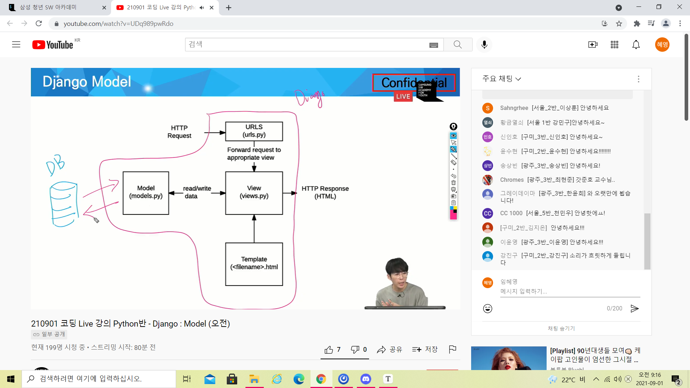
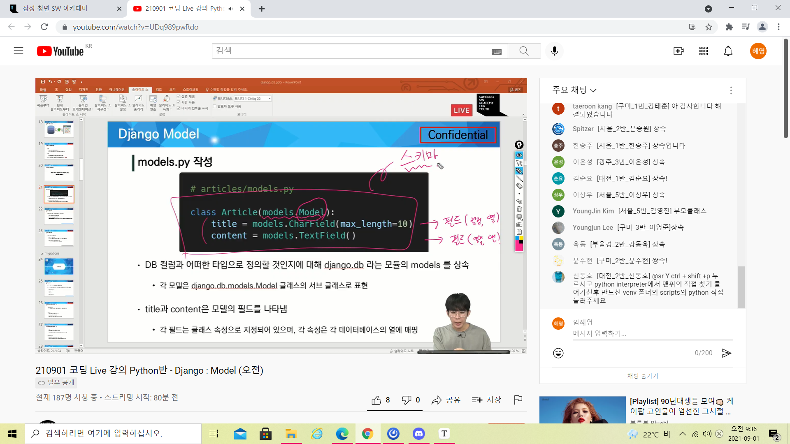
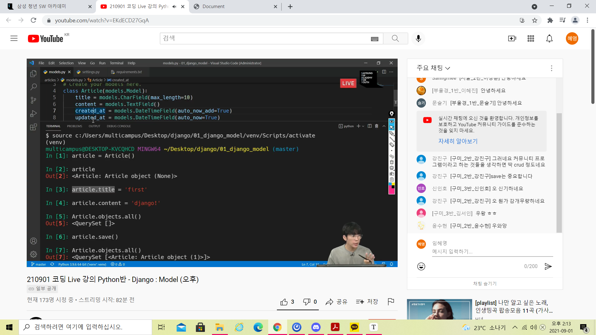
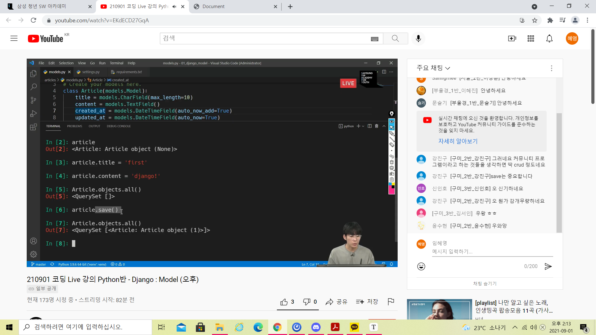

## Model

* Model
  * 단일한 데이터에 대한 정보를 가짐
    * 사용자가 저장하는 데이터들의 필수적인 필드들과 동작들을 포함
  * 저장한 데이터베이스의 구조(layout)
  * django는 model을 통해 데이터에 접속하고 관리
  * 일반적으로 각각의 모델은 하나의 데이터베이스 테이블에 매핑 됨
  * 모델 == 데이터베이스 (x)
* Database
  * 데이터베이스
    * 체계화된 데이터의 모임
  * 쿼리
    * 데이터를 조회하기 위한 명령어
    * 조건에 맞는 데이터를 추출하거나 조작하는 명령어
    * "쿼리를 날린다" =>데이터베이스를 조작한다
  * 스키마
    * 데이터베이스에서 자료의 구조, 표현방법, 관계 등을 정의한 구조
  * 테이블
    * 열(컬럼): 필드 or 속성, 각 열에는 고유한 데이터 형식이 지정된다. integer, text, null 등
    * 행: 레코드 or 튜플, 테이블의 데이터는 행에 저장된다. 
    * PK(기본키): 각 행(레코드)의 고유값으로 Primary Key로 불린다. 반드시 설정하여야 하며며 데이터베이스 관리 및 관계 설정시 주요하게 활용된다.
* Model 정리
  * 


## ORM

* orm
  * object-Relaional-Mapping
  * 객체 지향 프로그래밍 언어를 사용하여 호환되지 않는 유형의 시스템 간에 (Django - SQL)데이터를 변환하는 프로그래밍 기술
  * OOP 프로그래밍에서 RDBMS을 연동할 때 데이터베이스와 객체 지향 프로그래밍 언어 간에 호환되지 않는 데이터를 변환하는 프로그래밍 기법
  * Django
* ORM의 장점과 단점
  * 장점
    * SQL을 잘 알지 못해도 DB 조작이 가능
    * SQL의 절차적인 접근이 아닌 객체 지향적 접근으로 인한 높은 생산성
  * 단점
    * ORM 만으로 완전한 서비스를 구현하기 어려운 경우가 있음
  * 현대 웹 프레임워크의 요점은 웹 개발의 속도를 높이는 것(생산성)
* 왜 ORM을 사용할까?
  * "우리는 DB를 객체(object)로 조작하기 위해 ORM을 사용한다"
  * models.py
  * 


## Migrations

* MIgrations

  * "django가 model에 생긴 변화를 DB에 반영하는 방법"
  * Migration 실행 및 DB 스키마를 다루기 위한 몇가지 명령어
    * makemigrations
    * migrate

* migrations commands - 1

  > migrations = 설계도/ 모델이 설계도(마이그레이션스)를 지나서 DB로 감 / 마이그레이션은 설계도가 쌓이는 공간

  1. makemigrations
     * model을 변경한 것에 기반한 새로운 마이그레이션(like 설계도)을 만들 때 사용
  2. migrate
     * 마이그레이션을 DB에 반영하기 위해 사용
     * 설계도를 실제 DB에 반영하는 과정
     * 모델에서의 변경 사항들과 DB의 스키마가 동기화를 이룸

* Migrations Commands - 2

  3. sqlmigrate
     * 마이그레이션에 대한 SQL 구문을 보기 위해 사용

* DateFiled's options

  * auto_now_add
    * 최초 생성 일자
    * django ORM이 최초 insert(데이블에 데이터 입력)시에만 현재 날짜와 시간으로 갱신(테이블에 어떤 값을 최초로 넣을 때)
  * auto_now
    * 최종 수정 일자
    * django ORM이 save를 할 때마다 현재 날짜와 시간으로 갱신


## Database API

* DB API 

  > 파이썬으로 씀

  * "DB를 조작하기 위한 도구"

* Making Queries

  ```
  Article.objects.all() (모든 게시글 조회하는 명령어)
  ```

* DB API
  * manager
    * django 모델에 데이터베이스 query 작업이 제공되는 인터페이스
    * 기본적으로 모든 django 모델 클래스에 objects라는 manager를 추가
  * QuerySet
    * 데이터베이스로부터 전달받은 객체 목록


## CRUD

* crud
  * 대부분의 컴퓨터 소프트웨어가 가지는 기본적인 데이터 처리 기능인 Create(생성), Read(읽기), update(갱신), delete(삭제)를 묶어서 일컫는 말

1번째 방식





2번째 방식

articel = Article(title = 'second', content ='django')

article.save


3번째방식

Article.object.create(title='third', content='django')

* create 관련 메서드
  * save() method
    * Saving objects
    * 객체를 데이터베이스에 저장함
    * 데이터 생성 시 save()를 호출하기전에는 객체의 id 값이 무엇인지 알 수 없음
      * id값은 django


* READ
  * QuerySet API method를 사용해 다양한 조회를 하는 것이 중요
  * QUerySet API method는 크게 2가지로 분류
    1. Method that return new querysets ex)all()
    2. Method that do not retuen querysets ex)create()
* get()
  * 주어진 lookup 매개변수와 일치하는 객체를 반환
  * 객체를 찾을 수 없으면 DoesNotExist 예외를 발생시키고 둘 이상의 객체를 찾으면 MultipleObjectReturned 예외를 발생시킴
  * 위와 같은특징을 가지고 있기 때문에
* filter()
  * 주어진 lookup 매개변수와 일치하는 객체를 포함하는 **새 QuerySet**을 반환
  * 없는걸 필터해도 에러 안뜸 pk가 아닌것을 필터하는것이 더 나음
* update()
  * 먼저 수정할 글은 선택하고(get=pk1) 변수에 저장
* delete
  * 장고에서 삭제된 것은 재사용되지않음

> get은 하나의 객체를 반환 filter 은 퀴러셋을 반환
>
> get - 게시글 목록 좀 줘
>
> post  - 게시글 좀 작성해줘

> get 요청 
>
> 브라우저 url창에 치는 것도 get
>
> a 태그 link도 get으로 처리
>
> redirect()도 get

filter로 만든 결과물은 queryset임 쿼리셋은 유사 리스트라서 리스트에 접근하듯이해야됨


302는 rediect에 대한 코드


python manage.py createsuperuser
