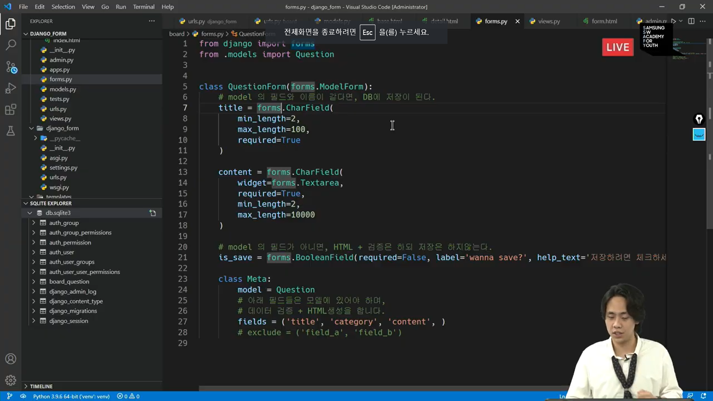

## Static files

* Static file

  * 정적 파일
  * 응답할 때 별도의 처리엇이 파일 내용 그래도 보여주면 되는 파일
    * 사용자의 요청에 따라 내용이 바뀌는 것이 아니라 요청한 것을 그래로 보여주는 파일
  * 예를 들어 웹 사이트는 일반적으로

> 개발자가 서비스 제공을 위해 만드는 파일

* Static file 구성

  1. django.contrib.staticfiles가 INSTALLED_APPS에 포함되어 있는지 확인
  2. setting.py에서 STATIC_URL을 정의
  3. 템플릿에서 static 템플릿 태그를 사용하여 지정된 상대경로에 대한 URL을 빌드
  4. 앱의 static 폴더에 정적 파일을 저장
     * 예시) my_app/static/my_app/example.jpg

* Django template tag

  * load
    * 사용자 정의 템플릿 태그 세트를 로드
    * 로드하는 라이브러리, 패키지에 등록된 모든 태그와 필터를 로드
  * static
    * STATIC_ROOT에 저장된 정적 파일에 연결

* The staticfiles app

  * STATIC_ROOT

    * collectstatic이 배포를 위해 정적 파일을 수집하는 디렉토리의 절대 경로

    * django 프로젝트에서 사용하는 모든 정적 파일을 한 곳에 모아 넣는 경로

    * 개발 과정에서 setting.py의 DEBUG 값이 True로 설정되어 있으면 해당 값은 적용되지 않음

      * 직접 작성하지 않으면 django 프로젝트에서는 setting.py에 작성되어 있지 않음

    * 실 서비스 환경(배포 환경)에서 django의 모든 정적 파일을 다른 웹 서버가 직접 제공하기 위함

      > 배포단계에서 필요하지 개발단계에서는 필요하지 않음

  * STATIC_URL

    * STATIC_ROOT에 있는 정적 파일을 참조할 때 사용할 URL
      * 개발 단계에서는 실제 정적 파일들이 저장되어 있는 app/static/경로 (기본 경로) 및 STATICFILES_DIRS에 저장된 추가 경로들을 탐색함
      * 실제 파일이나 디렉토리가 아니며 URL로만 존재
      * 비어 있지 않은 값으로 설정한다면 반드시 slash(/)로 끝나야 함

  * STATICFILES_DIRS

    * app/static/디렉토리 경로를 사용하는 것(기본 경로) 외에 추가적인 정적 파일 경로 목록을 정의하는 리스트
    * 추가 파일 디렉토리에 대한 전체 경로를 포함하는 문자열 목록으로 작성되어야 함

* Media file

  * 미디어 파일
  * 사용자가 웹에서 업로드하는 정적 파일
  * 유저가 업로드 한 모든 정적 파일

* Model field

  * ImageField

    * 이미지 업로드에 사용하는 모델 필드

    * FileField를 상속받는 서브 클래스이기 때문에 FileField의 모든 속성 및 메서드를 사용 가능하며 더래서 사용자에 의해 업로드 된 객체가 유효한 이미지인지 검사함

    * ImageField 인스턴스는 최대 길이가 100자인 문자열로 DB에 생성되며 max_length 인자를 사용하여 최대 길이를 변경 할 수 있음

      > 이미지의 경로가 문자열로 들어가서 그런 거임

    * [주의] 사용하려면 반드시 Pilow 라이브러리가 필요

  * FileField

    * 파일 업로드에 사용하는 모델 필드
    * 2개의 

* upload_to argument

  * 업로드 디렉토리와 파일 이름을 설정하는 2가지 방법을 제공
    1. 문자열 값이나 경로 지정
    2. 함수 호출

* ImageField 작성

  * upload_to='images/'
    * 실제 이미지가 저장되는 경로를 지정
  * blank=True
    * 이미지 필드에 빈 값(빈 문자열)이 허용되도록 설정(이미지를 선택적으로 업로드 할 수 있도록)

* Model field option = "blank"

  * 기본 값: False
  * True인 경우 필드를 비워 둘 수 있음
    * DB에는 ''(빈 문자열)이 저장됨
  * 유효성 검사에서 사용 됨(is_valid)
    * 필드에

* Model field option - "null"

  * 기본 값: False

  * True면 django는 빈 값을 DB에 NULL로 저장

  * 주의 사항

    * CharField, TextField와 같은 문자열 기반 필드에는 사용하는 것을 피해야 함

    * > 이미지 필드도 문자열 필드임 경로니까

    * 문자열 기반 필드에 True로 설정 시 '데이터 없음(no data)'에 '빈 문자열(1)'과 'NULL(2)'의 2가지 가능한 값이 있음을 의미하게 됨

    * 대부분의 경우 "데이터 없음"에 대해 두 개의 가능한 값을 갖는 것은 중복되며 Django는 NULL이 아닌 빈 문자열

* blank & null 비교

  * blank 

    * Validation-re

    * > 유효성과 관련됨  유효성에서 걸림

  * null

    > DB와 관련

  * > form 자체를 빈값으로 주고 싶으면 blank를 true로 해야함

* input 요소 - accept 속성
  * 입력 허용할 파일

> 파이썬은 1급객체라서 함수를 

가상환경 python select interpreter - venv sctips > python

파일 삭제하면 미디어 폴더에도 사진 삭제되게 하기

pip install django-cleanup

installedapps에  django_cleanup 쓰면됨

Form 의 역할 2가지

1 유효성검사

2 HTML  input 생성

파이썬 장고 가상환경 비주얼 윈도우 맥

linebreakbr

