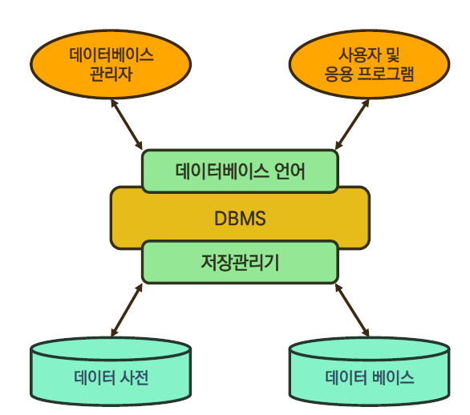

## Database

* 데이터베이스(DB)

  * 데이터베이스는 **체계화된 데이터**의 모임이다
  * 여러 사람이 공유하고 사용할 목적으로 통합 관리되는 정보의 집합이다
  * 논리적으로 연관된 (하나 이상의) 자료의 모음으로 그 내용을 고도로 구조화 검색과 생산의 효율화를 꾀한 것이다
  * 즉, 몇 개의 자료 파일을 조직적으로 통합하여 자료 항목의 중복을 없애고 자료를 구조화하여 기억 시켜 놓은 자료의 집합체

* 데이터베이스로 얻는 장점들

  * 데이터 중복 최소화
  * 데이터 무결성(정확한 정보를 보장)
  * 데이터 일관성
  * 데이터 독립성(물리적/ 논리적)
  * 데이터 표준화
  * 데이터 보안 유지

  