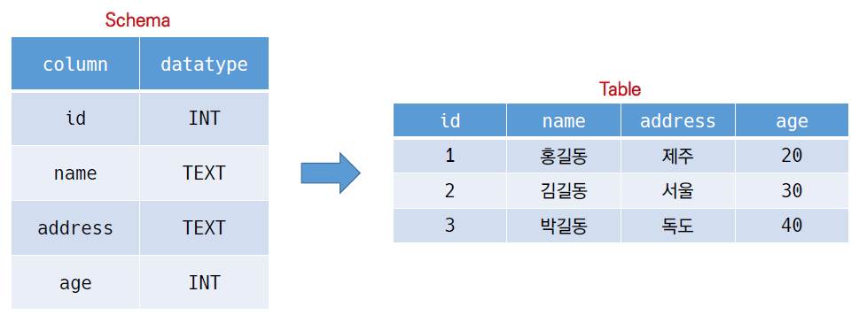

## RDB

* 관계형 데이터베이스(RDB)

  * Relational Database
  * 키(key) 와 값(value) 들의 간단한 관계(relation) 를 표(table) 형태로 정리한 데이터베이스
  * 관계형 모델에 기반

* 관계형 데이터베이스 용어 정리

  * 스키마(schema) : 데이터베이스에서 자료의 구조 , 표현방법 , 관계등 **전반적인 명세**를 기술 한 것
  * 테이블(table) :열(컬럼/필드)과 행(레코드/값)의 모델을 사용해 조직된 데이터 요소들의 집합

  

  * 열 (Column) : 각 열에는 고유한 데이터 형식이 지정됨