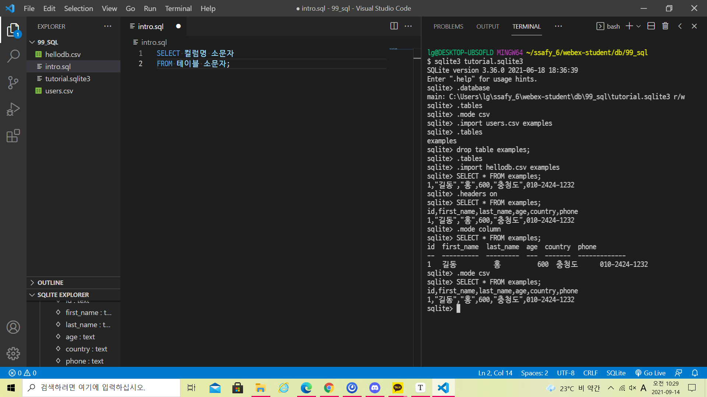
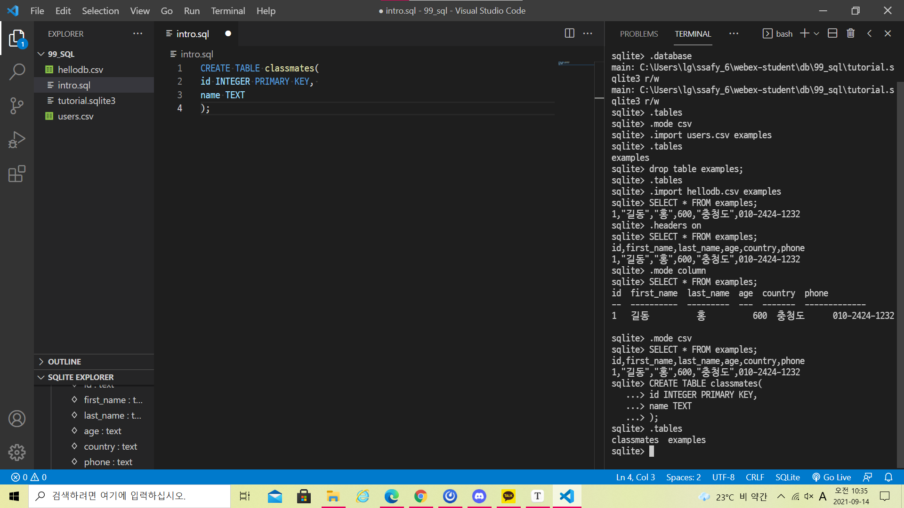

DB는 시험범위가 적어서 어려움 달달 외우기

* 데이터베이스(DB)
  * 데이터베이스는 체계화된 데이터의 모임이다
  * 여러 사람이 공유하고 사용할 목적으로 통합 관리되는 정보의 집합이다
  * 논리적으로 연관된 (하나 이상의) 자료의 모음으로 
* 데이터베이스로 얻는 장점들(많이 보기)
  * 데이터 중복 최소화
  * 데이터 무결성(정확한 정보를 보장)
  * 데이터 일관성
  * 데이터 독립성 (물리적 /논리적)
  * 데이터 표준화
  * 데이터 보안 유지

## RDB

* 관계형 데이터베이스
  * Relational Database
  * 키와 값들의 간단한 관계를 표 형태로 정리한 데이터베이스
  * 관계형 모델에 기반
* 관계형 데이터베이스 용어 정리
  * 스키마: 데이터베이스에서 자료의 구조, 표현방법, 관계 등을 전반적인 명세를 기술한 것
  * 테이블: 열(컬럼/필드)과 행(레코드/값)의 모델을 사용해 조직된 데이터 요소들의 집합
  * 열: 각 열에는 고유한 데이터 형식이 지정됨
  * 아래의 예시에는 name이란 필드에 고객의 이름 정보가 저장됨
  * 행: 실제 데이터가 저장되는 형태
  * 키본키: 각 행의 고유 값
  * 반드시 설정해야 하며 데이터 베이스 관리 및 관계 설정 시 주요하게 활용됨

## RDBMS

* 관계형 데이터베이스 관리 시스템
* SQLite
  * 서버 형태가 아닌 파일 형식으로 응용 프로그램에 넣어서 사용하는 비교적 가벼운 데이터베이스
  * 구글 안드로이드 운영체제에 기본적으로 탑재된 데이터베이스이며 임베디드 소프트웨어에도 많이 활용됨
  * 로컬에서 간단한 DB 구성을 할 수 있으며 오픈소스 프로젝트이기 때문에 자유롭게 사용가능

## SQL

* SQL
  * 관계형 데이터베이스 관리시스템의 데이터관리를 위해 설계된 특수 목적으로 프로그래밍 언어
  * 데이터베이스 스키마 생성 및 수정
  * 자료의 검색 및 관리
  * 데이터베이스 객체 접근 조정 관리
* DDL 테이블을 정의할때 사용 (스키마를 정의할때사용)
* DML 

. 붙여서 쓰는 명령어는 sqlite에서 사용하는 명령어 이 명령어는 ㄴ외우지 않아도 됨 sql에 관한것만 나옴

누가 봐도 동일한 단어라면 대문자 SELECT FROM 스타일 가이드에서 정의함

테이블 컬럼 조건은 소문자 명렁어는 대문자 SQL은 대소문자 구분하진 않지만 그냥 컨벤션

.붙은건 시험 x shell clear 

CREATE TABLE 테이블명 (컬럼명 데이터타입 옵션 혹은 제약 조건 ,로 구분 

sqlite datatype

BLOB- img나 wav,mp4같은 형태를 저장할때 사용하는 데이터타입

데이터타입도 한 번 보기

limit 3 -> 3개만 보여줘 (offset3 limit 3 => 앞에 3개 버리고 3개 보여줘)

where age = 20;

select distinct 

SQLite는 id 재사용하지만 쟝고느 재사용하지 않음

장고처럼하려면 autoincrement 설정

aggreagate Function : 전체의 값을 계산해서 보여주는 함수

order by 컬럼 1 (오름차순정렬함), 컴럼2 DESC(내림차순)ㅉ

GROUP BY :중복값제거

테이블이름:

앱이름_모델명의 소문자

in contain gt gte li lie startswith

endswith isnull

import Q는 파워쉘은 그냥 되고 코드로 쓸라면 import 해야됨

장고어그리게이션 중요함

어그리게이ㄷ트  반환은 딕셔너리로 됨

annotate(num_contries=count())

별명짓는거임 알리아스

python manage.py shell_plus --print-sql

delete는 잡히는대로 삭제라서 filter든 get이든 all이든 다 삭제함

save는 get 해야됨 QUerySet은 유사리스트라서 ? save는 개별데이터 별로 저장해야해서 get임 아니면 반복문 돌려서 일일이 하면됨