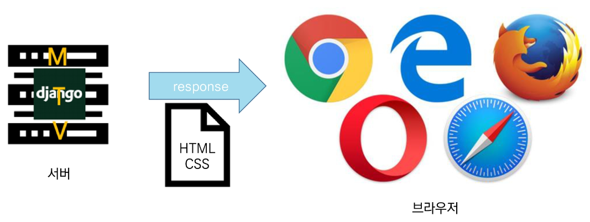

## JavaScript Intro

* 동작 방식

* 브라우저(browser)
  
  * 웹 서저에서 이동하며 클라이너트와 서버 간 양방향으로 통신하고 `HTML` 문서나 파일을 출력하는 `GUI` 기반의 소프트 웨어
  
  * 인터넷의 컨텐츠를 검색 및 열람하도록 함
  
  * **"웹 브라우저"** 라고도 함

* JsvaScript의 필요성
  
  * 브라우저 화면을 '동적'으로 만들기 위함
  
  * 브라우저를 조작할 수 있는 유일한 언어
