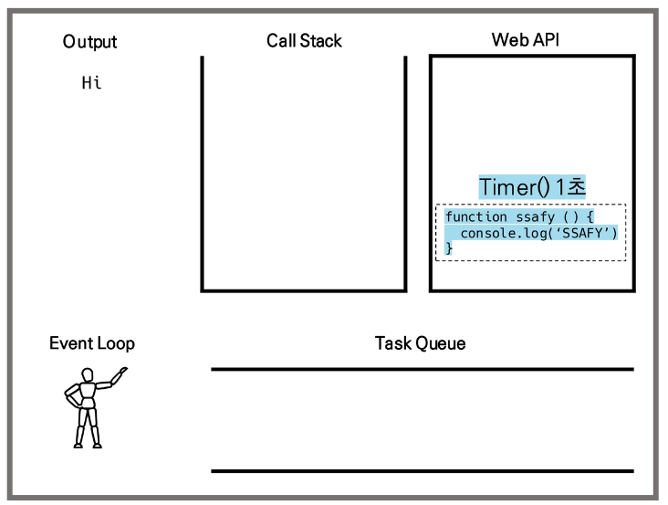

## Asychronous JavaScript

* 동기식
  
  * 순자척, 직렬적 Task 수행
  
  * 요청을 보낸 후 응답을 받아야만 다음 동작이 이루어짐(blocking)
  
  * 버튼 클릭 후 alert 메시지의 확인 버튼을 누를 때까지 문장이 만들어지지 않음
  
  * 즉 alert 이후의 코드는 alert의 처리가 끝날 때까지 실행되지 않음
  
  * 왜 이런 현상이 발생할까?
    
    * **"JavaScript는 single threaded"**
  
  ```
  <button>버튼</button>
  
  
  <script>
      const btn = document.querySelector('button')
      btn.addEventListener('click', function() {
          alert('clicked!')
          const pElem = document.createElement('p')
          pElem.innerText = 'sample text'
          document.body.appendChile(pElem)
      })
  </script>
  ```
  
  

* 비동기식
  
  * 병렬적 Task 수행
  
  * 요청을 보낸 후 응답을 기다리지 않고 다음 동작이 이루어짐 (non-blocking)
  
  * 요청을 보내고 응답을 기다리지 않고 다음 코드가 실행됨
  
  * 결과적으로 변수 todo에는 응답 데이터가 할당되지 않고 빈 문자열이 출력
  
  * 그렇다면 JS는 왜 기다려 주지 않는 방식으로 동작하는가?
    
    * **"JavaScript는 single threaded"**
  
  ```
  const request = new XMLHttpRequest()
  const URL = 'https://~~'
  
  request.open('GET', URL)
  request.send() # XMLHttpRequest 요청
  
  const todo = request.response # 빈 응답 값을 todo에 할당
  console.log(`data: ${todo}`) # console.log 실
  ```
  
  

*  왜 비동기 (Asynchronous)를 사용하는가?
  
  * "사용자 경험"
    
    * 매우 큰 데이터를 동반하는 앱이 있다고 가정
    
    * 동기식 코드라면 데이터를 모두 불러온 뒤 앱이 실행됨
      
      * 즉, 데이터를 모두 불러올 때 까지는 앱이 모두 멈춘 것 처럼 보임
      
      * 코드 실행이 차단하여 화면이 멈추고 응답하지 않는 것 같은 사용자 경험을 제공
    
    * 비동기식 코드라면 데이터를 요청하고 응답받는 동안 앱 실행을 함께 진행함
      
      * 데이터를 불러오는 동안 지속적으로 응답하는 화면을 보여줌으로써 더욱 쾌적한 사용자 경험을 제공
    
    * 때문에 많은 웹 API 기능은 현재 비동기 코드를 사용하여 실행됨

* [참고] Treads
  
  * 프로그램이 작업을 완료하기 위해 사용할 수 있는 단일 프로세스
  
  * 각 thread(스레드)는 한 번에 하나의 작업만 수행할 수 있음
  
  * 예시) Task A -> Task B -> Task C
    
    * 다음 작업을 시작하려면 반드시 앞의 작업이 완료되어야 함
    
    * 컴퓨터 CPU는 여러 코어를 가지고 있기 때문에 한 번에 여러 가지 일을 처리할 수 있음

* Blocking vs Non-Blocking
  
  * Blocking
    
    ```
    # Python
    import reqeusts
    
    response = requests.get('https://~~')
    todo = response.json()
    
    print(todo)
    ```
    
    ```
    {'userId':1, 'id':1, 'title':'~~', 'completed':False}
    ```
  
  * Non-Blocking
    
    ```
    # JavaScript
    const request = new XMLHttpRequest()
    const URL = 'https://~~'
    
    request.open('GET', URL)
    request.send()
    
    const todo = request.response
    console.log(todo)
    ```
    
    ```
    아무 것도 안찍힘
    ```

* **"JavaScript는 single threaded 이다"**
  
  * 컴퓨터가 여러 개의 CPU를 가지고 잇어도 main thread라 불리는 단일 스레드에서만 작업 수행
  
  * 즉 이벤트를 처리하는 **Call Stack**이 하나인 언어라는 의미
  
  * 이 문제를 해결하기 위해 `JavaScript`는
    
    1. 즉시 처리하지 못하는 이벤트들을 **다른 곳(Web API**)으로 보내서 처리하도록 하고
    
    2. 처리된 이벤트들은 처리된 순서대로 **대기실(Task queue)** 에 줄을 세워 놓고
    
    3. Call Stask이 비면 **담당자(Event Loop)** 가 대기 줄에서 가장 오래된(제일 앞의) 이벤트를 Call Stack으로 보냄

* Concurrency model
  
  * **Event loop** 를 기반으로 하는 동시성 모델(Councurrency model)
  1. Call Stack
     
     * 요청이 들어올 때마다 해당 요청을 순차적으로 처리하는 `Stack(LIFO)` 형태의 자료 구조
  
  2. Web API (Browser API)
     
     * JavaScript 엔진이 아닌 브라우저 영역에서 제공하는 API
     
     * setTimeOut(), DOM events 그리고 AJAX로 데이터를 가져오는 시간이 소요되는 일들을 처리
  
  3. Task Queue (Event Queue, Message Queue)
     
     * 비동기 처리된 callback 함수가 대기하는 `Queue(FIFO)` 형태의 자료 구조
     
     * `main thread` 가 끝난 후 실행되어 후속 JavaScript 코드가 차단되는 것을 방지
  
  4. Event Loop
     
     * Call Stack이 비어 있는지 확인
     
     * 비어 있는 경우 `Task Queue`에서 실행 대기 중인 `callback` 함수가 있는지 확인
     
     * `Task Queue`에 대기 중인 callback 함수가 있다면 가장 앞에 잇는 callback 함수를 `Call Stack`으로 push

* Runtime
  
  ```
  console.log('Hi')
  setTimeout(function example () {
      console.log('hello')
  }, 3000)
  console.log('Bye')
  ```
  
  

       





* Zero delays
  
  
  
  * 실제로 0ms 후에 callback 함수가 시작된다는 의미가 아님
  
  * 실행은 Task Queue에 대기 중인 작업 수에 따라 다르며 해당 예시에서는 callback 함수의 메시지가 처리되기 전에 'Hi'와 'Bye'가 먼저 출력됨
  
  * 왜냐하면 delay(지연)sms JavaScript가 요청을 처리하는 데 필요한 최소 시간이디 때문 (보장된 시간이 아님)
  
  * 기본적으로 `setTimeout` 함수에 특정 시간제한을 설정했더라도 대기 중인 메시지의 모든 코드가 완료될 때까지 대기해야 함

* 순차적인 비동기 처리하기
  
  * `Web API`로 들어오는 순서는 중요하지 않고 어떤 이벤트가 **먼저** 처리되느냐가 중요(즉, 실행 순서 불명확)
  
  * 이를 해결하기 위해 순차적인 비동기 처리를 위한 2가지 작성 방식
  1. **Async callbacks**
     
     * 백그라운드에서 실행을 시작할 함수를 호출할 때 인자로 지정된 함수
     
     * 예시) addEventListener()의 두 번째 인자
  
  2. **promise-style**
     
     - `Modern Web APIs`에서의 새로운 코드 스타일
     
     - `XMLHttpReqeust`객체를 사용하는 구조보다 조금 더 현대적인 버전
