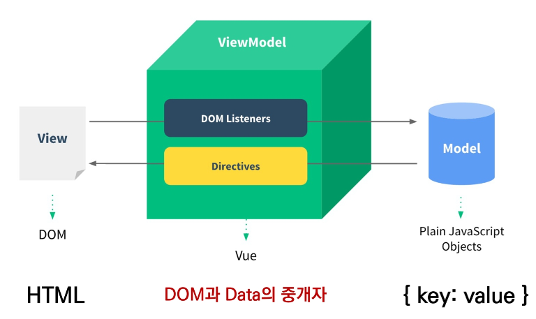

## Concepts of Vue.js

* MVVM Pattern
  * 애플리케이션 로직을 UI로부터 분리하기 위해 설계된 디자인 패턴
  * 구성 요성
    1. `Model`
    
    2. `View`
    
    3. `View Model`

* MVVM Pattern in Vue.js

  

* **MV**VM
  * `Model`
    * "Vue에서 Model은 JavaScript Object다."
    * JavaScript의 Object 자료 구조
    * 이 Object는 Vue Instance 내부에서 data로 사용되는데 이 값이 바뀌면 View(DOM)가 반응
  * `View`
    * "Vue에서 View는 DOM(HTML)이다"
    
    * Data의 변화에 따라서 바뀌는 대상
* MV**VM**
  * `ViewModel`
    
    * "Vue에서 ViewModel은 모두 Vue Instance이다."
    
    * View와 Model 사이에서 Data와 DOM에 관련된 모든 일을 처리
    
    * ViewModel을 활용해 Data를 얼마만큼 잘 처리해서 보여줄 것인지(DOM)를 고민하는 것
