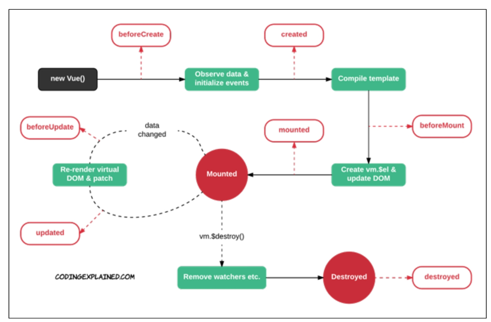

## Lifecycle Hooks

* LifeCycle Hooks
  
  * 각 Vue 인스턴스는 생성될 때 일련의 초기화 단계를 거침
    
    * 예를 들어 데이터 관찰 설정이 필요한 경우, 인스턴스를 DOM에 마운트하는 경우, 데이터가 변경되어 DOM를 업데이트하는 경우 등
  
  * 그 과정에서 사용자 정의 로직을 실행할 수 있는 Lifecycle Hooks도 호출됨
  
  * 공식문서를 통해 각 라이프사이클 훅의 상세 동작을 참고

* Lifecycle Hooks 예시
  
  * 예를 등어 **created** hook은 vue 인스턴스가 생성된 후에 호출됨
  
  ```html
  <script>
      new Vue({
          data: {
              a:1
          },
          created: function() {
              console.oog('hello')
          }
      })
  </script>
  ```
  
  * created를 사용해 애플리케이션의 초기 데이터를 API요청을 통해 불러올 수 있음
  
  ```html
  <div id="app">
      
  </div>
  <script>
      const API_URL = 'https://~'
      const app = new Vue({
          el: '#app',
          data: {
              imgSrc:'',
          },
          methods: {
              getImg:function() {
                  axios.get(API_URL)
                  .then(response => {
                      this.imgSrc = response.data.message})
                  }
              },
              created: function() {
                  this.getImg()
              }
          })
  <script>
  ```
  
  

## lodash library

- `lodash` library
  
  - 모듈성, 성능 및 추가 기능을 제공하는 JavaScript 유틸리티 라이브러리
  
  - array, object 등 자료구조를 다룰 때 사용하는 유용하고 간편한 유틸리티 함수들을 제공
  
  - 함수 예시
    
    - `reverse`, `sortBy`, `range`, `random` ...
