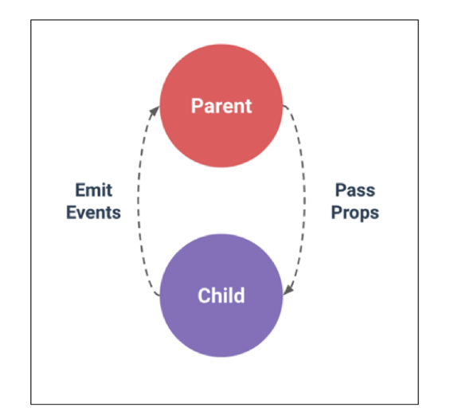

## Pass Props & Emit Events

* 컴포넌트 작성
  
  * Vue app은 자연스럽게 중첩된 컴포넌트 트리로 구성됨
  
  * 컴포넌트간 부모-자식 관계가 구성되며 이들 사이에 필연적으로 의사소통이 필요함
  
  * 부모는 자식에게 데이터를 전달(Pass props)하며 자식은 자신에게 일어난 일을 부모에게 알림(Emit event)
    
    * 부모와 자식이 명확하게 정의된 인터페이스를 통해 격리된 상태를 유지할 수 있음
  
  * **"props는 아래로 events는 위로"**
  
  * 부모는 props를 통해 자식에게 '데이터'를 전달하고 자식은 events를 통해 부모에게 '메시지'를 보냄

* 컴포넌트 구조
  
  * 템플릿(HTML)
    
    * HTML의 body 부분
    
    * 각 컴포넌트를 작성
  
  * 스크립트 (JavaScript)
    
    * JavaScript가 작성되는 곳
    
    * 컴포넌트 정보, 데이터, 메서드 등 vue인스턴스를 구성하는 대부분이 작성됨
  
  * 스타일 (CSS)
    
    * CSS가 작성되며 컴포넌트의 스타일을 담당

* 컴포넌트 등록 3단계
  
  1. 불러오기
  
  2. 등록하기
  
  3. 보여주기
  
  ```html
  <template>
      <div id="app">
      <about></about>
      </div>
  </template>
  <script>
  import About from './components/About.vue'
  
  export default {
      name:'App'
      components: {
          About
      }
  }
  </script>
  ```

* Pass Props & Emit Events
  
  

* Props
  
  * props는 부모(상위) 컴포넌트의 정보를 전달하기 위한 사용자 지정 특성
  
  * 자식(하위) 컴포넌트는 props 옵션을 사용하여 수신하는 props를 명시적으로 선언해야 함
  
  * 즉, 데이터는 props 옵션을 사용하여 자식 컴포넌트로 전달됨
  
  * 주의
    
    * 모든 컴포넌트 인스턴스에는 자체 격리된 범위가 있음
    
    * 즉, 자식 컴포넌트의 템플릿에서 상위 데이터를 직접 참조할 수 없음

* Static Props 작성
  
  * 자식 컴포넌트 (About.vue) 에 보낼 prop 데이터 선언
  
  * 작성법
    
    * prop-data-name="value"
  
  ```html
  // App.vue
  <template>
      <div id="app">
      <about my-message="This is prop data"></about>
      </div>
  </template>
  ```
  
  * 수신 할 prop 데이터를 명시적으로 선언 후 사용
  
  ```html
  // About.vue
  <template>
      <div>
      <h2>{{myMessage}}</h2>
      </div>
  </template>
  <script>
      export default {
          name:'About',
          props: {
              myMessage:String,
          }
      }
  </script>
  ```

* Dynamic Props 작성
  
  * v-bind directive를 사용해 부모의 데이터의 props를 동적으로 바인딩
  
  * 부모에서 데이터가 업데이트 될 때마다 자식 데이터로도 전달 됨
  
  ```html
  // App.vue
  <template>
      <div id="app">
      <about 
          my-message="This is prop data"
          :parent-data="parentData">
      </about>
      </div>
  </template>
  <script>
  import About from './components/About.vue'
  
  export default {
      name:'App'
      components: {
          About
      },
      data: function () {
          return {
              parentData:'This is parent Data by v-bind'
          }
      },
  }
  </script>
  ```
  
  * 마찬가지로 수신 할 prop 데이터를 명시적으로 선언 후 사용

* Props 이름 컨벤션
  
  * during declaration(선언 시)
    
    * camelCase
  
  * in template(HTML)
    
    * kebab-case

* **컴포넌트의 'data'는 반드시 함수여야 함**
  
  * 기본적으로 각 인스턴스는 모두 같은 data 객체를 공유하므로 새로운 data 객체를 반환(return)하여야 함
  
  * 그렇지 않으면 각 인스턴스가 모두 같은 data 객체를 공유하게 됨
  
  ```javascript
  data : function () {
      return {
          myData:null,
      }
  }
  ```

* Props 시 자주하는 실수
  
  * Static  구문을 사용하여 숫자를 전달하려고 시도하는 것
  
  * 실제 JavaScript 숫자를 전달하려면 값이 JavaScript 표현식으로 평가되도록 v-bind를 사용해야 함
  
  ```
  // 문자열 1을 전달
  <comp some-prop="1"></comp>
  //숫자를 전달
  <comp :some-prop="1"></comp>
  ```

* 단방향 데이터 흐름
  
  * 모든 props는 하위 속성과 상위 속성 사이에 **단방향** 바인딩을 형성
  
  * 부모의 속성이 변경되면 자식 속성에게 전달되지만 반대 방향으로는 안 됨
    
    * 자식 요소가 의도치 않게 부모 요소의 상태를 변경하여 앱의 데이터 흐름을 이해하기 어렵게 만드는 일을 방지
  
  * 부모 컴포넌트가 업데이트될 때마다 자식 요소의 모든 prop들이 최신 값으로 업데이트 됨

* Emit event
  
  * "Listening to Child Components Events"
  
  * `$emit(eventName)`
    
    * 현재 인스턴스에서 이벤트를 트리거
    
    * 추가 인자는 리스너의 콜백 함수로 전달
  
  * 부모 컴포넌트는 자식 컴포넌트가 사용되는 템플릿에서 v-on 을 사용하여 자식 컴포넌트가 보낸 이벤트를 청취(v-on을 이용한 사용자 지정 이벤트)

* Emit event 작성
  
  * 현재 인스턴스에서 `$emit` 인스턴스 메서드를 사용해 child-input-change 이벤트를 트리거
  
  ```html
  // About.vue
  <template>
      <div>
      <h2>{{myMessage}}</h2>
      <input
          type="text"
          @keyup.enter="childInputChanage"
          v-model="childInputData"
          >
      </div>
  </template>
  <script>
      export default {
          name:'About',
          data: function () {
              return {
                  childInputData:null
              }
          }
          props: {
              myMessage:String,
          },
          methods: {
              childInputChange: function () {
                  this.$emit('child-input-change', this.childInputData)
                  }
              }
      }
  </script>
  ```
  
  * 부모 컴포넌트(App.vue)는 자식 컴포넌트가 (About.vue)가 사용되는 템플릿에서 v-on directive를 사용하여 자식 컴포넌트가 보낸 이벤트(child-input-change)를 청취
  
  ```html
  // App.vue
  <template>
      <div id="app">
      <about 
          my-message="This is prop data"
          :parent-data="parentData"
          @child-input-child="parentGetChange"
          >
      </about>
      </div>
  </template>
  <script>
  import About from './components/About.vue'
  
  export default {
      name:'App'
      components: {
          About
      },
      data: function () {
          return {
              parentData:'This is parent Data by v-bind'
          }
      },
      methods: {
          parentGetChange: function (inputData) {
              console.log('heell;`)
          }
      }
  }
  </script>
  ```

* event 이름 컨벤션
  
  * 컴포넌트 및 props와는 달리 이벤트는 자동 대소문자 변환을 제공하지 않음
  
  * HTML의 대소문자 구분을위해 DOM 템플릿의 v-on 이벤트 리스너는 항상 자동으로 소문자 변환되기 때문에 `v-on:myEvent`는 자동으로 `v-on:myevent`로 변환
  
  * 이러한 이유로 이벤트 이름에는 **항상 kebab-case를 사용하는 것을 권장**
  
  ```
  this.$emit('myEvent')
  ```
  
  ```
  // 이벤트 동작하지 않음
  <my-component @my-event="doSomething"></my-component>
  ```
