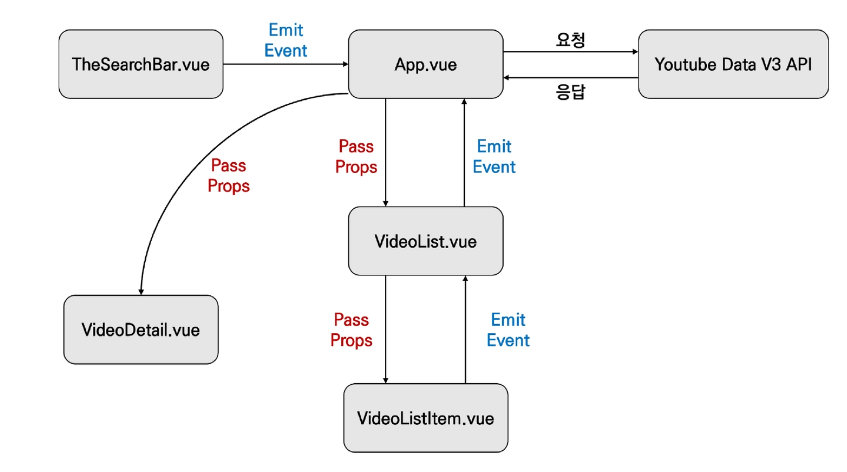

## Youtube Project

* Youtube Project 컴포넌트 관계
  
  
1. 프로젝트 준비
   
   - 프로젝트 생성 및 lodash 설치

2. 유튜브 검색 데이터
   
   - 컴포넌트 등록
   
   ```html
   // App.vue
   <template>
       <div id="app">
       <the-search-bar></the-search-bar>
       </div>
   </template>
   <script>
   import TheSearchBar from '@/components/TheSearchBar'
   
   export default {
       name:'App',
       components: {
           TheSearchBar,
       },
   }
   </script>
   ```
   
   * Emit Event (TheSearchBar.vue -> App.vue)
   
   ```html
   //TheSearchBar.vue
   <template>
       <div>
       <input @keyup.enter="onInputKeyword" type="text">
       </div>
   </template>
   <script>
   export default {
       name:'SearchBar',
       methods :{
           onInputKeyword: function(event) {
               this.$emit('input-change', event.target.value)
           }
       }
   }
   </script>
   ```
   
   * 이벤트 청취 후 함께 전달 된 데이터 할당
   
   ```html
   // App.vue
   <template>
       <div id="app">
       <the-search-bar @input-change="onInputChange"></the-search-bar>
       </div>
   </template>
   <script>
   import TheSearchBar from '@/components/TheSearchBar'
   
   export default {
       name:'App',
       components: {
           TheSearchBar,
       },
       data:function () {
       return {
           inputValue:null
       }
       },
       methods: {
           onInputChange: function (inputText) {
               this.inputValue = inputText
           }
       }
   }
   </script>
   ```

3. 유튜브 요청 & 응답 데이터 처리(App.vue)
   
   - API_KEY, API_URL 할당
   
   - Youtube API 요청 & 응답 데이터를 변수에 할당
   
   ```html
   // App.vue
   <script>
   import axios from 'axios'
   import TheSearchBar from '@/components/TheSearchBar'
   
   const API_KEY =
   const API_URL = 'https://www.googleapix.com~~'
   
   export default {
       name:'App',
       components: {
           TheSearchBar,
       },
       data:function () {
       return {
           inputValue:null,
           vides:[]
       }
       },
       methods: {
           onInputChange: function (inputText) {
               this.inputValue = inputText
               const params = {
                   key:API_KEY,
                   part:'snippet',
                   type:'video',
                   q: this.inputValue,
                   }
               axios({
                methos:'get',
                url:API_URL,
                params.   
               })
               .then(res => {
                   console.log(res)
                   this.videos = res.data.items    
               })
               .catch(err => {
                   console.log(err)
               })
           }
       }
   }
   </script>
   ```
   
   * Pass props (App.vue -> VideoList.vue)
   
   * 할당 한 응답 데이터를 하위 컴포넌트로 전달
   
   ```html
   // App.vue
   <template>
       <div id="app">
       <header>
       <the-search-bar @input-change="onInputChange"></the-search-bar>
       </header>
       <section>
           <video-list :videos="videos"></video-list>
       </section>
       </div>
   </template>
   ```
   
   * 내려받은 prop 데이터  선언 후 사용
   
   ```html
   // VideoList.vue
   <tamplate>
       <ul>
       <li v-for="video in videos" :key="video.id.videoId">
           {{video.snippet.title}}
       </li>
       </ul>
   </template>
   
   <script>
   export default {
       name:'VideoList',
       props: {
           video: {
               type:Array,
               required:true
           }
       }
   }
   </script>
   ```
   
   * Pass props (VideoList.vue -> VideoListItem.vue)
   
   ```html
   // VideoList.vue
   <tamplate>
       <ul>
       <video-list-item
        v-for="video in videos" 
        :key="video.id.videoId"
         :video="video"    
       >
        </video-list-item>
       </ul>
   </template>
   
   <script>
   import VideoListItem from '@/components/VideoListItem'
   
   export default {
       name:'VideoList',
       components:{
           VideoListItem
       },
       props: {
           video: {
               type:Array,
               required:true
           }
       }
   }
   </script>
   ```
   
   * 내려받은 prop 데이터(개별 비디오 객체) 선언 후 사용
   
   ```html
   //VideoListItem.vue
   <template>
       <li>
       
       {{video.snippet.title}}
       </li>
   </template>
   
   <script>
   export default {
       name:'VideoListItem',
       props: {
           video:{
               type:Object,
               required:true,
           }
       }
   }
   </script>
   ```

4. 유튜브 영상 상세 정보 - VideoDetail.vue
   
   - 유튜브 상세 영상 정보 알리기
     
     - VideoListItem.vue -> VideoList.vue
   
   ```html
   // VideoListItem.vue
   <template>
       <li @click="selecVideo">
       ...
       </li>
   </template>
   <script>
   ...
       methods: {
           selectVideo:function() {
               this.$emit('select-video',this.video)
           }
       },
   ...
   ```
   
   ```html
   // VideoList.vue
   <tamplate>
       <ul>
       <video-list-item
        v-for="video in videos" 
        :key="video.id.videoId"
         :video="video"    
           @select-video="onSelectVideo"
       >
        </video-list-item>
       </ul>
   </template>
   
   <script>
   import VideoListItem from '@/components/VideoListItem'
   
   export default {
       name:'VideoList',
       components:{
           VideoListItem
       },
       props: {
           video: {
               type:Array,
               required:true
           }
       },
       methods :{
           onSelectVideo:function (video) {
               this.$emit('select-video', video)
           }
       }
   }
   </script>
   ```
   
   * 유튜브 사세 영상 정보 알리기
     
     * VideoList.vue -> App.vue
   
   ```html
   // App.vue
   <template>
       <div id="app">
       <header>
       <the-search-bar @input-change="onInputChange"></the-search-bar>
       </header>
       <section>
           <video-list :videos="videos" @select-video="onVideoSelect"></video-list>
       </section>
       </div>
   </template>
   
   <script>
   import axios from 'axios'
   import TheSearchBar from '@/components/TheSearchBar'
   
   const API_KEY =
   const API_URL = 'https://www.googleapix.com~~'
   
   export default {
       name:'App',
       components: {
           TheSearchBar,
       },
       data:function () {
       return {
           inputValue:null,
           vides:[],
           selectedVideo:null
       }
       },
       methods: {
           onInputChange: function (inputText) {
               this.inputValue = inputText
               const params = {
                   key:API_KEY,
                   part:'snippet',
                   type:'video',
                   q: this.inputValue,
                   }
               axios({
                methos:'get',
                url:API_URL,
                params.   
               })
               .then(res => {
                   console.log(res)
                   this.videos = res.data.items    
               })
               .catch(err => {
                   console.log(err)
               })
           },
           onVideoSelect : function (video) {
           this.selectedVideo = video
           }
       }
   }
   </script>
   ```
   
   * App 컴포넌트에서 내린 데이터가 VideoDetail에 전달 되었는지 확인
   
   ```html
   // App.vue
   <template>
       <div id="app">
       <header>
       <the-search-bar @input-change="onInputChange"></the-search-bar>
       </header>
       <section>
           <video-detail : video="selectedVideo"></video-detail>
           <video-list :videos="videos" @select-video="onVideoSelect"></video-list>
       </section>
       </div>
   </template>
   <script>
   ...
   import VideoDetail from './components/VideoDetail.vue'
   
   export default {
       ...,
       components: {
           SearchBar,
           VideoList,
           VideoDetail
       },
   }
   ...
   ```
   
   * 유튜브 상세 영상 정보 알리기
     
     * App.vue -> VideoDetail.vue
   
   ```html
   //VideoDetail.vue
   <template>
       <div>
       {{video}}
       </div>
   <template>
   <script>
   export defult {
       name:'VideoDetail',
       props: {
           video: {
               type:Object
           }
       }
   }
   </script>
   ```
   
   * VideoDetail 컴포넌트 마무리
   
   ```html
   // VideoDetail.vue
   <template>
       <div>
       <iframe :src="videoURL" frameborder="0"></iframe>
       </div>
   </template>
   <script>
   export default {
       name:'VideoDetail',
       props: {
           video : {
               type:Object
           }
       },
       computed: {
           videoURI: function () {
               const videoId = this.video.id.videoId
               return `https://www.youtube.com/embed/${videoId}`
           }
       }
   }
   </script>
   ```

5. Environment Variable
   
   - API 키 환경변수 설정
     - src 폴더와 같은 위치에 .env.local 파일 생성
     
     ```
     //.env.local
     VUE_APP_YOUTUBE_API_KEY = ...
     ```
     
     ```
     //APP.vue
     const API_KEY = process.env.VUE_APP_YOUTUBE_API_KEY
     ```
   - 프로젝트 최상단에 배치하여 환경 변수를 지정할 수 있음
   - 'NODE_ENV', 'BASE_URL' 및 'VUE_APP_'로 시작하는 변수만 클라이언트 번들에 정적으로 포함됨
   - .env.local에 작성하는 환경 변수는 개발 단계에서 원격 저장소에 노출시키지 않기 위해 git에서 무시되며 모든 경우에 로드하기 위해 사용
   - 단, 환경 변수는 빌드에 포함되므로 누구나 앱 파일을 검사하여 볼 수 있으며 실제 배포 단계에서는 배포 서비스에서 이러한 환경 변수를 설정할 수 있도록 환경을 제공함
   - [참고] 환경 변수
     - 컴퓨터에서 동작하는 방식에 영향을 미치는 동적인 값들의 모임
     - 시스템의 실행 파일이 놓여 있는 디렉터리의 경로 등 운영체제 상에서 동작하는 응용 프로그램이 참조하기 위한 설정이 기록됨
