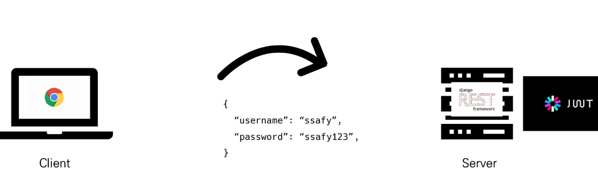

## JWT

* 다양한 인증 방식

  1. Session Based
  2. Token Based
     * JWT
  3. Authentication platform
     * Auth0

* Session Based

  

* JWT

  * "JSON Web Token"
  * JSON 포맷을 활용하여 요소 간 안전하게 정보를 교환하기 위한 표준 포맷
  * 암호화 알고리즘에 의한 디지털 서명이 되어 있기 때문에 JWT 자체로 검증 가능하고 신뢰할 수 있는 정보 교환 체계
  * **JWT 자체기 필요한 정보를 모두 갖기 때문에 (self-contained) 이를 검증하기 위한 다른 검증 수단이 필요 없음**
  * 사용처
    * Authentication, Information Exchange

* JWT 특징

  * 기본 토큰 인증 체계와 달리 JWT 인증 확인은 데이터베이스를 사용하여토큰의 유효성을 검사할 필요가 없음
    * 즉, JWT는 데이터베이스에서 유효성 검사가 필요 없음
    * JWT 자체가 인증에 필요한 정보를 모두 갖기 때문(self-contained)
    * 이는 세션 혹은 기본 토큰을 기반으로 한 인증과의 핵심 차이점

* JWT 활용 이유

  1. (Session에 비해) 상대적으로 HTML, HTTP 환경에서 사용하기 용이
     * Session 방식은 유저의 sesstion 정보를 Server에 보관해야 함
     * 하지만 JWT는 Client Side에 토큰 정보를 저장하고 필요한 요청에 (유효한 토큰을) 같이 넣어 보내면 그 자체가 인증 수단이 됨
  2. (인증 수단) 자체의 보안 수준
     * 특정 요소 하나만 변경되어도 모든 데이터가 바뀌기 때문에 위/변조가 (사실상) 불가능
  3. JSON의 범용성
  4. Server 메모리에 정보를 저장하지 않아 Server의 자원 절약 가능

* JWT 구조

  * .(dot) 연산자를 사용해 크게 3개 파트로 구분

  1. `Header`

  2. `Payload`

  3. `Signature`

     ```
     Header . Payload . Signature
     ```

  * Header

    * 토큰의 유형(type)과 Hashing algorithm으로 구성

      ```
      {
      	"alg" :"HS256",
      	"typ" :"JWT"
      }
      ```

  * Payload

    * 토큰에 넣을 정보

    * `claim`은 정보의 한 조각을 의미하며 `payload`에는 여러 개의 `claim`을 넣을 수 있음

      ```
      {
      	"sub" : "1234567890",
      	"name" : "John Doe",
      	"admin" : true
      }
      ```

  * Signature

    * `Header`와 `Payload`의 `encoding` 값을 더하고 거기에 *private key로 hashing하여 생성*

      ```
      HMACSHA256(
      	base64UrlEncode(header) + "." +
      	base64UrlEncode(payload),
      	secret)
      ```

* JWT 예시

  * 로그인 요청 (회원가입은 되어있다고 가정)

    

  * 서버에서 로그인 정보를 바탕으로 비밀번호 암호화 및 JWT 발급

    

  * 발급한 JWT를 클라이언트에게 응답

    

  * 클라이언트는  서버로부터 받은 JWT를저장 (ex. 브라우저 로컬 스토리지)

    

  * 인증이  필요한 요청 때마다 저장해 두었던 JWT를 함께 보냄

    

  * 받은 JWT를 Decoding하여 유저 정보 추출

    

  * JWT 자체가 `self-contained`하기 때문에 이 값 자체가 인증 정보가 됨

    

    

* JWT 로그아웃 예시
  * 기본적으로 logout 요청을 보내 브라우저에서 토큰 정보를 삭제해서 처리
  * 하지만 로그아웃을 하더라도 (유효한) 토큰이 어딘가에 살아있다면 누군가는 '인증'할 수 있음
  * 그래서 일반적으로 아래와 같은 방식으로 최소한의 안정 장치를 설정
    1. 토큰의  합리적인 만료 시간 설정
    2. 로그아웃 할 때 클라이언트에 저장된 토큰 삭제 (Browser의 Storage)
    3. 블랙 리스트 설정 -> 더 이상 유효하지 않거나 만료되지 않은 모든 토큰을 블랙 리스트 처리

* 정리

  |                         | Sessaion        | JWT                  |
  | ----------------------- | --------------- | -------------------- |
  | 인증 수단의 저장 위치   | Server          | Client               |
  | 인증 수단의 정보 민감성 | Low(session id) | High(self-contained) |
  | 유효 기간               | Y               | Y                    |
  | 확장성                  | 상대적으로 낮음 | 상대적으로 높음      |

  