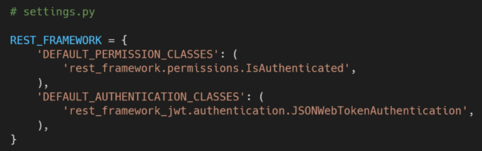

## JWT 실습

#### <u>Sign up</u>

* Client

  * 회원 가입 정보를 Server로 보내기 위한 준비
  * 회원가입을 위해서는 `username`, `password`, `passwordConfirmation` 3가지 정보 필요

  ```vue
  // Signup.vue
  <script>
  export default {
  	name:'Signup',
  	data: function () {
  		return {
  			credentials: {
  				username: null,
  				password: null,
  				passwordConfirmation:null
  			},
  		}
  	},
  }
  ```

  * 3가지 정보는 모두 data와 양방향 바인딩
  * Dev Tools를 통해 확인

  ```vue
  <!-- Signup.vue -->
  <template>
  	<div>
          <h1>Signup</h1>
          <div>
              <label for="username">사용자이름:</label>
              <input
                type="text"
                id="username"
                v-model="credentials.username"
              >
      	</div>
          <div>
              <label for="password">비밀번호:</label>
              <input
                type="password"
                id="password"
                v-model="credentials.password"
              >
      	</div>
          <div>
              <label for="passwordConfirmaion">비밀번호 확인:</label>
              <input
                type="password"
                id="passwordConfirmaion"
                v-model="credentials.passwordConfirmaion"
              >
      	</div>
          <button>회원가입</button>
      </div>
  </template>
  ```

  * data(username, password, passwordConfirmation)가 signup 함수의 인자로 전달
  * Server에서 이 요청을 받아 Token을 생성하고 발급

  ```vue
  <!-- Signup.vue -->
  <template>
  	<div>
          <h1>Signup</h1>
          ...
          <div>
              <label for="passwordConfirmaion">비밀번호 확인:</label>
              <input
                type="password"
                id="passwordConfirmaion"
                v-model="credentials.passwordConfirmaion"
                @keyup.enter="signup"
               >
      	</div>
          <button @click="signup">회원가입</button>
      </div>
  </template>
  ```

  * signup함수를 호출 했을 때, input 데이터의 값을 콘솔에서 확인
  * input 데이터를 입력한 상태에서 button을 누르거나 enter를 입력

  ```
  // Signup.vue
  
  methods: {
  	signup: function () {
  		console.log(this.credentials)
  	}
  }
  ```

* Server

  * User와 Todo 모델의 1:N Relation 설정

  ```django
  # todos/models.py
  
  from django.db import models
  from django.conf import settings
  
  class Todo(models.Model):
  	user = models.ForeignKey(setting.AUTH_USER_MODEL, on_delete=models.CASCADE)
  	title = models.CharField(max_length=50)
  	completed = models.BooleanField(default=False)
  ```

  * 데이터베이스 초기화 후 마이그레이션
  * UserModelSerializer에 추가 필드를 정의하여 기존 password 필드를 오버라이드
  * 오버라이드하지 않으면 응답 데이터로 password 필드 값이 함께 넘어오기 때문

  ```
  # account/serializers.py
  
  from rest_framework import serializers
  from django.contrib.auth import get_user_model
  
  class UserSerializer(serializers.ModelSerializer):
  	password = serializers.CharField(write_only=True)
  	
  	class Meta:
  		model = get_user_model()
  		fields = ('username', 'password',)
  ```

  * signup url 설정

  ```
  # account/urls.py
  
  urlpatterns = [
  	path('signup/', vuews.signup)
  ]
  ```

  * signup view 함수 작성

  ```
  # accounts/views.py
  
  from rest_framework import status
  from rest_framework.decorators import api_view
  from rest_framework.response import Response
  from .serializers import UserSerializer
  
  @api_view(['POST'])
  def signup(request):
  	# 1-1 Client에서 온 데이터를 받아서
  	password = request.data.get('password')
  	password_confirmation = request.data.get('passwordConfirmation')
  	
  	# 1-2 패스워드 일치 여부 체크
  	# 비밀번호 확인 기능은 기존 Django ModelForm에서 지원되었지만 DRF에서는 별도 구현 필요
  	if password != password_confirmation:
  		return Response({'error':'비밀번호가 일치하지 않습니다.'}, status=status.HTTP_400_BAD_REQUEST)
  		
  	# 2. UserSerializer를 통해 데이터 직렬화
  	serializer = UsersSerializer(data=Request.data)
  	
  	# 3. validation (password도 같이 직렬화 작업 진행)
  	if serializer.is_valid(raise_exception=True):
  		user = serializer.save()
  		# 4. 비밀번호 해싱
  		user.set_password(request.data.get('password'))
  		user.save()
  		# password는 직렬화 과정에서 포함 되지만 -> 표현(response)할 때는 나타나지 않음(write_only)
  		return Response(serialzer.data, status= statue.HTTP_201_CREATED)
  ```

  * `set_password()`
    * 비밀번호 해싱을 처리하여 사용자의 암호를 문자열 데이터로 설정
    * User 객체를 저장하지는 않음
  * [참고] 해싱(Hashing)
    * 가변 크기의 입력 값에서 고정된 크기의 출력 값을 생성해내는 과정
    * 암호학에서는 암호화 해시 함수 (MD5, SHA-1, SHA-2)에 의해 진행 됨
  * signup 메서드 작성
  * signup 테스트 & 이후에 로그인을 할 수 있도록 Login 컴포넌트로 이동

  ```
  // signup.vue
  
  ...
  signup: function () {
  	axios({
  		method:'post',
  		url: 'http://127~',
  		data: this.credentials
  	})
  	.then(() => {
  		//console.log(res)
  		this.$router.push({name:'Login'})
  	})
  	.catch(err => {
  		console.log(err)
  	})
  }
  ```

#### Login

* `REST framework JWT Auth` package

  * DRF에 대한 JWT Authentication 지원 패키지

    ```
    $ pip install djangorestframework-jwt
    ```

  * DRF의 각 view 함수에 대한 default 권한 및 인증 설정

  * "회원 인증 여부"와 "JWT 토큰 인증"에 관한 설정

    

  * `DEFAULT_PERMISSTION_CLASSES`

    * 함수 시작 시 확인되는 기본 권한을 결정하는 권한 클래스의 목록

  * `IsAuthenticated`

    * 인증되지 않은 사용자에 대한 권한을 거부하고 그렇지 않은 경우 권한을 허용
    * 이 권한은 등록된 사용자만 API에 액세스할 수 있도록 하려는 경우에 적합함

  * DEFAULT_AUTHENTICATION_CLASSES

    * request.user 속성에 액세스할 때 사용되는 기본 인증 사용자 집합을 결정하는 인증 클래스 목록

  * JSONWebTokenAuthentication

    * 토큰 기반 인증 중에서 JWT를 활용해 인증을 할 때 JWT 자체를 검증
    * 인증 여부와 상관없이 JWT가 유효한지 여부만 파악함

  * 현재 설정은 모든 DRF view 함수에 다음과 같은 데코레이터를 작성한 것과 같음

  * 전역으로 설정한 것 (setting.py)과 각 view함수에 직접 설정하는 것의 차이

    ```
    from rest_framework.authentication import JSONWebTokenAuthentication
    from rest_framework.permissions import IsAuthenticated
    
    @api_view(['POST'])
    @authentication_classes([JSONWebTokenAuthentication])
    @permission_classes([IsAuthenticated])
    def ~~
    ```

  * urls.py에 다음 URL 경로를 추가하여 사용자의 사용자 이름과 비밀번호가 포함된 POST 요청을 통해 토큰을 얻을 수 있도록 함 (Generate JWT)

    ```
    # accounts/urls.py
    
    from django.urls import path
    from . import views
    
    from rest_framework_jwt.views import obtain_jwt_token
    
    urlpatterns = [
    	...,
    	path('api-token-auth', obtain_jwt_token)
    ]
    ```

  * "토큰 만료기간 변경"

    * 수업의 편의성을 위해서 임의로 토큰 만료일 연장

  * 긴 만료기간은 실제 서비스에서 권장하는 방식은 아님

    * 로그아웃 할 경우 클라이언트의 `storage`에서 jwt를 삭제하지만 유효기간이 만료되기 전까지 해당 토큰은 여전히 해당 유저를 '인증'하는 유효한 수단이기 때문

    ```
    # settings.py
    
    import datetime
    
    JWT_AUTH = {
    	# Token의 만료기간을 기본 5(300초)분에서 1일로 연장
    	'JWT_EXPIRATION_DELTA':datetime.timedelta(days=1)
    }
    ```

* Client

  ```vue
  <!-- Login.vue -->
  <template>
  	<div>
          <h1>Login</h1>
          <div>
              <label for="username">사용자이름:</label>
              <input
                type="text"
                id="username"
                v-model="credentials.username"
              >
      	</div>
          <div>
              <label for="password">비밀번호:</label>
              <input
                type="password"
                id="password"
                v-model="credentials.password"
                @keyup.enter="login"
              >
      	</div>
          <button @click="login">로그인</button>
      </div>
  </template>
  ```

  * 로그인 요청 이후 Server는 JWT를 발급 후 응답

  ``` vue
  // Login.vue
  import axios from 'axios'
  
  export default {
  	name: 'Login',
  	data: function () {
  		return {
  			credentials : {
  				username:null,
  				password:null,
  			}
  		}
  	},
  	methods: {
  		login: function () {
  			axios({
  				method:'post',
  				url:'',
  				data:this.credentials
  			})
  			.then(res => {
  				console.log(res)
  			})
  			.catch(err => {
  				console.log(err)
  			})
  		}
  	}
  }
  ```

  * 브라우저에 localStorage에 JWT 저장

  ```
  // Login.vue
  
  methods: {
  	login: function (0 {
  		...
  		.then(res => {
  			localStorage.setItem('jwt', res.data.token)
  			this.$router.push({name:'TodoList'})
  		})
  	})
  }
  ```

* 로그인 여부에 따른 DOM 렌더링 변경

  * 현재는 로그인이 되었더라도 이를 확인할 만한 가시적인 요소가 존재하지 않음

  * 토큰이 있는지 여부에 따라서 `<router-link>`를 다르게 보이도록 설정

  * App 컴포넌트에서 data의 토큰 여부를 확인하는 로직을 created Hook으로 처리하기

  * 이후 DOM에서 `Vue Instance`의 data에 있는 token 유무를 확인하고 렌더링 할 컴포넌트를 선택

  * 로컨 스토리지의 jwt 토큰 여부에 따라 isLogin 데이터 값을 토글

    ```
    // App.vue
    
    export default {
    	name: 'App',
    	data: function () {
    		return {
    			isLogin:false
    		}
    	},
    	created: function (0 {
    		// 1. Vue Instance가 생성된 직후에 호출되어 jwt를 가져오기
    		const token = localStorage.getItem('jwt')
    		// 2. 토큰이 있으면
    		if (token) {
    			// 3. true로 변경하고 없으면 유지
    			this.isLogin = true
    		}
    	})
    }
    ```

  * 로그인 여부에 따라 렌더링되는 router 변경

    ```
    // App.vue
    
    <template>
    	<div id="app">
    		<div id="nav">
    			<span v-if="isLogin">
    				<router-link :to="{name:'TodoList'}">Todo List</router-link>
    				<router-link :to="{name:'CreateTodo'}">Create Todo</router-linnk>
    			</span>
    			<span v-else>
    				<router-link :to="{name:'Signup'}">Signup</router-link>
    				<router-link :to="{name:'Login'}">Login</router-link>
    			</span>
    		</div>
    		<router-view/>
    	</div>
    </template>
    ```

  
  1. 토큰을 삭제하고 다시 한 번 로그인 진행 해보기
  2. 로그인 후에 TodoList로 오긴했지만  router가 변화하지 않고 새로고침을 해야만 반영됨
  3. Dev Tools를 열어 App 컴포넌트의 isLogin 데이터를 확인 -> 로그인을 했음에도 값이 아직 바뀌지 않고 false 상태로 존재
  4. 로그인 진행 후 TodoList 컴포넌트로 push가 되었지만 실제 컴포넌트를 isLogin 데이터에 따라서 렌더링 여부를 결정하는 App 컴포넌트의 isLogin 값은 변화하지 않음
  5. 즉 TodoList 컴포넌트로 push 하기 이전에 이벤트를 통해 로그인이 되었다는 사실을 부모 컴포넌트에게 알리고 App 컴포넌트를 이벤트가 발생하면 그때 isLogin 데이터의 값을 true로 변경해야 함
  
  * login 메서드 수정
  
    ```
    // Login.vue
    
    login: function() {
    	axios({
    		method: 'post',
    		url:'',
    		data: this.credentials
    	})
    	.then(res => {
    		localStorage.setItem('jwt', res.data.token)
    		// App 컴포넌트는 login data가 변경된 사실을 알 수 없기 때문에 emit login 이벤트 호출
    		this.$emit('login')
    		this.$router.push({name:'TodoList'})
    	})
    }
    ```
  
  * login 이벤트를 청취하면 isLogin 데이터를 true로 변경
  
    ```
    // App.vue
    <template>
    	<div id="app">
    		<div id="nav">
    			<span v-if="isLogin">
    			...
    			</span>
    			<span v-else>
    				<router-link :to="{name:'Signup'}">Signup</router-link>
    				<router-link :to="{name:'Login'}">Login</router-link>
    			</span>
    		</div>
    		<router-view @login="isLogin=true"/>
    	</div>
    </template>
    ```

## Logout

* Logout 기능 구현

  * 로컬 스토리지에 저장된 토큰을 삭제

  * 로그아웃 이후에는 Login 컴포넌트를 렌더링

    * 로그아웃은 컴포넌트가 필요하지 않음

  * [주의]

    * 컴포넌트의 isLogin 데이터도 false로 변경 필요

  * logout 메서드 작성

    ```
    // App.vue
    
    methods: {
    	logout:function () {
    		this.isLogin = false
    		localStorage.removeItem('jwt')
    		this.$router.push({name:'Login'})
    	}
    }
    ```

  * a 태그의 고유 이벤트가 없는 router-link 태그이기 때문에 .native 수식어를 사용해 click 이벤트를 실행할 수 있도록 함

  * 'to' 프로퍼티 값이 없으면 렌더링이 되지 않기 때문에 '#'으로 작성

    ```
    // App.vue
    <template>
    	<div id="app">
    		<div id="nav">
    			<span v-if="isLogin">
    				<router-link :to="{name:TodoList}">Todo List</router-link>
    				<router-link :to="{name" 'CreateTodo'}">Create Todo</router-link>
    				<router-link @click.native="logout" to="#">Logout</router-link>
    			</span>
    			
    ```

  * 토큰이 없는 경우(로그인을 하지 않은 경우)는 Login 컴포넌트가 보여지도록 수정

    ```
    // TodoList.vue
    
    created: function() {
    	if (localStorage.getItem('jwt')) {
    		this.getTodos()
    	} else {
    		this.$router.push({name:'Login'})
    	}
    }
    ```

## Sign up 문제 해결

* 현재 signup view 함수는 settings.py의 REST_FRAMEWORK 설정 값으로 인해 다음과 같은 데코레이터가 작성된 것 처럼 동작함

* 하지만 회원가입에서는 불필요한 인증 과정이기 때문에 별도의 데코레이터를 작성해 override 해야 함

* permission_classes

  * view 함수 시작 시 확인되는 기본 권한을 결정하는 권한 클래스의 목록

* AllowAny

  * 요청이 인증되었는지 여부에 관계없이 무제한 액세스를 허용

  ```
  # accouts.views.py
  
  from rest_framework.decorators import permission_classes
  from rest_framework.permissions imprt AlloAny
  
  @api_view(['POST'])
  @permission_classes([AllowAny]) # 데코레이터 순서 유의!
  def signup(request):
  	...
  ```

  
