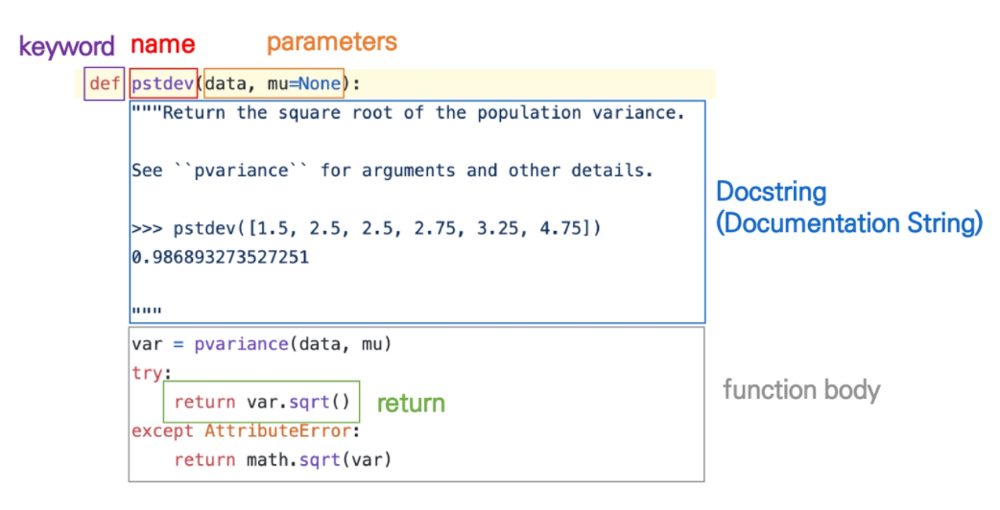

## 함수 기초

* 함수(Function)
  * **특정한 기능을 하는 코드의 조각(묶음)**
  * 하나의 큰 프로그램을 여러 부분으로 나누어 같은 함수를 여러 상황에서 호출하고(높은 재사용성), 일부분을 수정하기 쉽다(유지보수 용이)는 장점
  * 함수의 특징
    * 함수의 이름을 결정해야함
    * 매개변수가 들어감
    * 바디(boby)- `Docstring` (선택적)과 코드셋이 들어감
    * 반환 값(return)을 가짐

* 함수의 기본구조

  * 이름

  * 매개변수

  * 함수바디

  * 반환값

    

* Docstring

  + 함수나 클래스의 설명 
  + `print(함수이름.__ doc __)`하면 덕스트링 나옴

* 내장 함수

  + 파이썬 인터프리터에는 항상 사용할 수 있는 많은 함수와 형(type)이 내장되어 있음

* 함수의 선언 

  + 함수의 선언은 `def  `키워드를 활용함
  + 들어쓰기를 통해 함수 `body`(실행될 코드 블록)를 작성함
    + `Docstring` 은 함수 `body`  앞에 선택적으로 작성 가능
      + 작성시에는 반드시 첫번째 문장에 문장열 `'''` `'''`
  + 함수에는 **매개변수(parameter)**를 넘겨줄 수도 있음
  + 함수는 동작 후에 `return`을 통해 결과 값을 전달함
    + 반드시 하나의 객체를 반환

* 함수의 호출

  + 함수는 함수명()으로 호출

    + 매개변수가 있는 경우, 함수명(값1, 값2 ...)로 호출

    
    + 함수는 호출되면 코드를 실행하고 `return` 값을 반환하면 종료된다.
    

