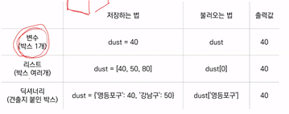
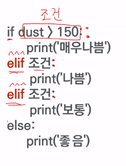
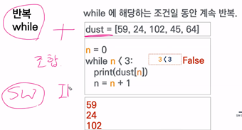
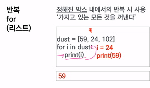
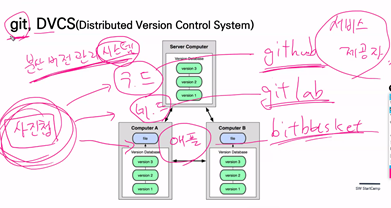

## ~0715 수업정리

박스들의 묶음 = 리스트 / 박스의 순서 = 인덱스 (첫번째 박스의 숫자는 0임. 1이 아니라) **

만약 7번째 박스에 접근하려면 dust[6]을 넣으면 됨(대괄호!) 

 인덱스가 헷갈릴 경우(?) = 견출지를 붙여보자! (각 박스에 이름을 갖다 붙임)

이것을 dictionary라고 부름 **

Key(박스 견출지) : value (박스안에 있는 값)

2조건 

If True(트루가 조건임):

(들여쓰기=인덴트?/보통4칸?/if랑 else같은 크기의 들여쓰기해야 됨)Print(‘조건문입니다’)

3반복

While True(조건이 참인 동안 반복):

  Print (‘계속해주세요.’)

For(반목문임)

For I in List:

  Print(‘정해진 범위 안에서 계속’)

반복되어지는 횟수만큼 반복됨 

문법 for [변수명(아무거나)) in [반복되는 값(리스트처럼 순회되는 거)]

뒤에 뭐 없어도 걍 담으로 넘어가나봄,,,,, 원소의 개수만큼만 반복함. 

 

While 조검 – 조건이 참인 동안 반복적으로 실해 되기에 종료조건이 반드시 필요

For I in dust -정해진 범위를 반복하기에 종료조건이 필요없음

 

함수

Input x(x는 재료) –> function f: -> output f(x) (f(x)는 제품)

함수: 특정한 용도의 동작하는 코드를 한 곳에 모아 놓은 것

함수는 built-in F(내장함수)/ Non-built-in F이 있음

 

Abs():절댓값 / len():길이를 구함/print는 반환값이 없고 할 일만 하고 끝냄 앞에 2개는 -3,’hi’를 입력하면 각각 3/2를 반환 값으로 내놓음 함수를 사용할 때는 함수를 호출한다라고 함 

 

내장함수는 빈번하게 사용함/ 파이썬모듈 – 랜덤사용?, 외장함순데 외장모듈이라고도 함 모듈을 사용할 때는 import를 사용해서 사용해야 함 상단에 import random이라고 써야함 모듈 = 함수와 변수의 집합체 

 

Random.choice(리스트) : 리스트에서 임의로 하나의 요소를 선택

 

Random.sample(리스트,개수): 리스트에서 특정 수의 요소를 임의적으로 비복원추출

GIT

Clone, init + add, commit, push

 

 

Init: 폴더안에 init을 선언하면 .git이라는 폴더가 생성되면서 공간이 생김 이것은 이제 git이 관리한다는 뜻. 3개의 영역이 생김 working directory, staging area, commit 워킹 디렉토리에서 작업하는 파일이 저장됨 파일들이 git에서 관리 됨 워킹디렉토리에서  스테이징 에어리어로 옮기는 명령어는 git add임 왜 옮기냐면 버전 히스토리를 보기위해? 이렇게 올라온 파일의 상태를 보기 위해 git status를 입력하면 볼 수 있음 잘올라왔는지 안올라왓는지 확인하는 거징ㅁ 스테이징 에어리어에서 커밋으로 옮기는 명령어 git commitdla 커밋은 히스토리 단계를 확인할 수 있음 이러한 커밋을 킷허브 킷랩으로 보내는 명령어 git push

 

깃스테이터스 했는데 Untracked files뜨면 워킹 디렉토리에 있음

 

Changes to be committed나오면 스테이진 에어리어에 올라져잇는거 ㅇㅇ

커밋은 할 때 뒤에 -m하고 ‘로그’ 남겨줘야 정상적으로 남겨짐

 

Author identity unknown-작가미상 누가 파일을 올린지몰름 최초로 설정해주며 됨 

 Git remote ‘ git주소’ – git push 할 때 장소정보

Git remote add 이름 ‘git 주소’

git add . 하면 .이 현재 위치라는 의미라서 현재위치에 잇는 모든 파일을 에드해라 라는 뜻

올린 파일중에 삭제하려면 git restore --staged '참고하는 파일.txt' 중간에 띄어쓰기 있어서 따옴표씀 아니면 그냥 써도 됨

 

절대로 깃에 안올릴라면 .gitignore 파일에 올리면됨 특히 무시 untracked 상황에서 적용됨 

 

Git log 하면 이때까지 한거 나옴 빠져나올라면 q누릐기 git log -- onelog하면 한줄로 나옴

 

 

Pip install requests 함수는 내부,외부 함수도 아니라서 설치가 필요함

뭐라는 건지 하나도모르겟네 자괴감지림,,,,사진은 왜 안보이지,,,,,???

Python 기초 

1. 저장   

   1.1 저장이란?   

   dust = 60   

   dust는 60이다(X)   

   dust에 60을 저장(할당)한다(O)   

   dust == 60 

    dust에 저장된 값은 60과 같다   

   1.2 무엇을 저장할 수 있을까?   

   1.2.1 숫자   

   현실세계에 존재하는 모든 숫자   

   기본적인 연산 가능   

   O : 12, -365, 3.141592   

   X : 23ab, ba123   

   1.2.2 글자   

   현실세계에 존재하는 모든 글자   

   따옴표로 둘러싼 글자 혹은 숫자   

   '미세먼지'   

   '58도 글자입니다'   

   '글자는 반드시 따옴표를 붙여야 합니다!'   

   1.2.3 참/거짓   

   True 혹은 False   

   주로 조건 및 반복에 사용됨   

   300 > 20 => True   

   150 == 161 => False   

   1.3 어떻게 저장할 수 있을까?   

   1.3.1 변수(Variable)   

   저장된 값을 변경할 수 있는 박스   

   숫자, 글자, 참거짓을 담을 수 있다   

   dust = 58   

   dust = 60   

   print(dust) vs print('dust')   

   1.3.2 리스트(List)   

   박스의 목록   

   여러 개의 박스가 순서대로 붙어있다  

   dust = [58, 40, 70]   

   print(dust[1])   

   1.3.3 딕셔너리(Dictionary)   

   견출지를 붙인 박스들의 묶음   

   dust = {'영등포구': 58, '강남구': 40}   

   print(dust['영등포구'])

   2. 조건   

      특정 조건일 때 코드를 실행할 수 있다  

      if 조건식1:   코드1   

      elif 조건식2:   

      코드2   else:   

      코드

      3 3. 반복   3

      .1 while   while에 해당하는 조건일 동안 계속 반복한다.   

      조건식을 만족하면 계속 반복하고, 만족하지 않으면 반복을 끝낸다.   

      종료 조건이 반드시 필요하다.   

      n = 0   

      while n < 3:   

      print('출력')   

      n = n+1   

      3.2 for   

      정해진 박스 내에서의 반복 시 사용한다.   

      '가지고 있는 모든 것을 꺼낸다'   

      종료 조건이 필요없다.   

      dust = [59, 24, 102]   

      for i in dust:   

      print(i)

