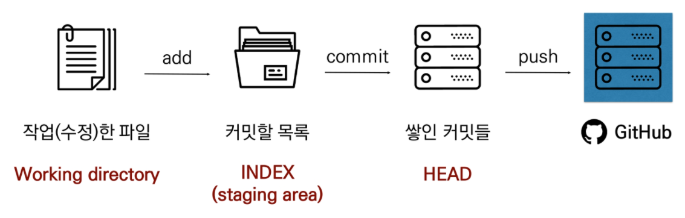

## ~0715 GIT, Web Crawling, API

---

### 저장, 조건, 반복

* 주의할 것 

  1. 대/소문자
  2. 띄어쓰기
  3. 스펠링

* 저장

  * dust = 60 은 dust는 60이다(x) / dust 에 60을 저장(할당)한다.라는 의미

  * dust == 60 은 dust 에 저장된 값을 60과 같다.라는 의미

  * 컴퓨터에 저장할 수 있는 것

    1. 숫자 - 모든 숫자. 글자는 안됨. 연산이 가능
    2. 글자 - 따옴표로 둘러싼 글자 혹은 숫자.
    3. 참/거짓 - 조건 /반복에서 사용됨.

  * 변수 = 저장된 값을 변경할 수 있는 박스. 숫자, 글자, 참거짓을 담을 수 있음.

    * dust = 58 / dust = 60 / print(dust) / 60나옴 0이 58을 덮음.
    
    * 리스트 첫번째 있는 것의 인덱스는 0임. 1이 아님.
    
    * dictionary : {Key : Value}
    
    * |          | 저장하는 법                          | 불러오는 법      | 출력값 |
      | -------- | ------------------------------------ | ---------------- | ------ |
      | 변수     | dust = 40                            | dust             | 40     |
      | 리스트   | dust = [40, 50, 80]                  | dust[0]          | 40     |
      | 딕셔너리 | dust = {'영등포구': 40 '강남구': 50} | dust['영등포구'] | 40     |

* 조건

  * if dust > 150:

    (보통 4칸정도 들여쓰기)print('매우나쁨')

    elif 조건:

    (위에랑 똑같이)print('나쁨')

  ​      else:

  ​       (위에랑 똑같이)print('50이하')

* 반복

  * while에 해당하는 조건일 동안 계속 반복/ 따라서 종료조건이 반드시 필요

    * n= 0

      while n < 3:

      print('출력')

      n= n +1

  * for 정해진 박스 내에서의 반복 시 사용 '가지고 있는 모든 것을 꺼낸다'/ 정해진 범위를 반복하기에 종료조건이 필요없음.

    * dust = [59, 24, 102]

      for i in dust: 

      ​       print(i)

- 함수: 특정한 용도의 동작하는 코드를 한 곳에 모아 놓은 것. 
  - Built in Functions(내장함수)
  - Non built in functions
    - 모듈 : 함수가 포함된 코드를 불러오고(import) 함수를 사용.
  - Abs():절댓값 / len():길이를 구함 / print 는 반환값이 없고 할 일만 하고 끝냄 .

---

### GIT

- GIT 
  - (분산)버전 관리 시스템. 코드의 히스토리를 관리하는 도구. 
  - 개발된 과정과 역사를 볼 수 잇으며 프로젝트의 이전 버전을 복원하고 변경 사항을 비교,분석 및 병합도 가능. 
  - Git을 활용하여 차이(diff)가 무엇이고 수정 이유를 log로 남길 수 있음. 
  - 현재 파일들을 안전한 상태로 과거 모습 그대로 복원가능. 반대도 마찬가지
- 작업흐름
  - add 커밋할 목록에 추가
  - Commit 커밋(create a snapshot) 만들기
  - push 현재까지의 역사 (commits)가 기록되어 있는 곳에 새로 생성한 커밋들 반영하기
  - 
- 기본 명령어
  - git init : 폴더안에 init을 선언하면 .git이라는 폴더가 생성되면서 공간이 생김. 이것은 이제 git이 관리한다는 뜻
  
  - git status : 파일의 상태를 확인
  
  - git add
  
  - git commit -m "log 이름"
  
  - git push origin master : 원격 저장소 업로드
  
  - git clone : 아무것도 없는데 파일을 옮길때
  
  - git pull origin master : 파일을 옮길때
  
  - Untracked files : working directory 에 파일이 있는 상태.
  
  - Changes to be committed : staging area 에 파일이 있는 상태.
  
  - git restore --staged '참고하는 파일.txt' : 올린 파일 중에 삭제하길 원하는 경우.
  
  - .gitignore : 절대로 올리고 싶지 않을 때 gitignore에 올리면 됨.
  
  - git log : 지금까지 한 거 나옴. 빠져나오려면 q누르기. git log -- onelog 하면 한 줄로 나옴.
  
    
    
    

-----

### Web crawling

* Web crawling: 조직적, 자동화된 방법으로 웹을 탐색하는 것.

+ import requests

  + requests.get('주소'): '주소'에 요청을 보내서 정보를 받아줘
  + requests.get('주소').text: 글(text)만 뽑아줘
  + requests.get('주소').status_code:상태만 뽑아줘

+ from bs4 import BeautifulSoup

  + BeatifulSoup(문서): 받은 문서를 예쁘게 만들어줌 ex)data = BeautifulSoup(response)
  + .select(selector): 문서 안에 있는 특정 내용을 뽑아줌 ex)data.select(response)
  + .select_one(selector): 문서 안에 있는 특정 내용을 하나만 뽑아줘

+ 정보스크랩

  + 원하는 정보가 있는 주소로 요청을 보내 응답을 저장하고 출력한다.

    + import requests

      response = requests.get(url).text

      print(response)

  + 파이썬이 주소에 대한 요청을 보내고 그 응답 결과를 예쁘게 관리한다. 

  + 정보를 조작하기 편하게 바꾸고 바꾼 정보 중 원하는 것만 뽑아서 출력한다. 

    + from bs4 import BeautifulSoup

      data = BeautifulSoup(response)

      kopsi = data.select_one('response 경로')

      print(kospi.text)

  + import requests

    from bs4 import BeautifulSoup

    url = 'https://~~'

    response = requests.get(url).text

    data = BeautifulSoup(response, 'htmlparser')

    kopsi = data.select_one('#KOSPI_now')

    result = kospi.text

+ JSON

  + 데이터만을 주고 받기 위한 표기법. 파이썬의 딕셔너리와 리스트구조로 쉽게 변환하여 활용할 수 있다.
  + response = requests.get(url).json

+ API

  + 응용 프로그램에서 사용할 수 있도록 운영 체제나 프로그래밍 언어가 제공하는 기능을 제어할 수 있게 만든 인터페이스
  + 서비스와 서비스간의 프로그래밍을 통한 대화 방식
  + 요청을 받는 측에서 일정한 방식으로 명세 =>해당 방식대로 요청을 하면 정보 제공
    1. API key 값을 확인한다.
    2. 요청변수에 맞춰 값을 채워넣는다.
    3. 결과를 확인한다.

+ | 크롤링                                                  | API                                                |
  | ------------------------------------------------------- | -------------------------------------------------- |
  | 브라우저를 통해 사용하던 웹문서(HTML)를 파이썬으로 요청 | 데이터를 교환하기 위한 JSON 파일을 파이썬으로 요청 |
  | BeautifulSoup으로 웹 문서 구조 형태로 변형              | JSON을 쉽게 파이썬 문법(LIST/Dictionary)로 변형    |
  | 선택자를 활용하여 원하는 데이터 활용                    | 데이터 구조를 활용하여 원하는 데이터 활용          |
  |                                                         | 나중에는 요청을 통해 특정 기능을 제어하기도 한다   |

>touch 파일명 => 파일생성
>
>mkdir => 폴더생성
>
>cd v .. =>상위폴더로 이동
>
>cd 파일이름 => 하위로 이동
>
>ls => 어떤 파일이 있는지 확인
>
>복사 붙여넣기가 안되면 shift + insert
>
>화면 캡쳐 = 윈도우 +shift + s

